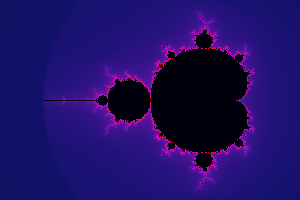
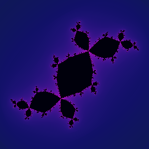
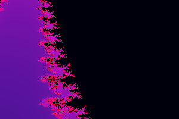
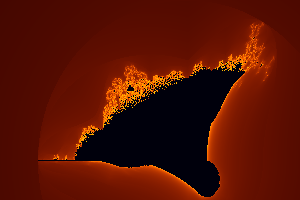

# Fractal Explorer

> *Infinite complexity, terminal-rendered beauty.*  
> A pure-Python CLI for exploring Mandelbrot, Julia, and Burning Ship fractals — rendered live in your terminal with true-colour Unicode art and exported as scalable SVG.

---

## Gallery

<table>
<tr>
  <td align="center"><br/><sub><b>Mandelbrot Set — cosmic palette</b></sub></td>
  <td align="center"><br/><sub><b>Douady Rabbit Julia Set</b></sub></td>
</tr>
<tr>
  <td align="center"><br/><sub><b>Seahorse Valley — deep zoom</b></sub></td>
  <td align="center"><br/><sub><b>Burning Ship — fire palette</b></sub></td>
</tr>
</table>

---

## What's inside

```
fractal-explorer/
├── fractal_explorer.py   ← single-file CLI, zero dependencies
└── examples/
    ├── mandelbrot_full.svg
    ├── julia_rabbit.svg
    ├── seahorse_valley.svg
    └── burning_ship.svg
```

**No external libraries required.** Everything runs on the Python standard library (`math`, `multiprocessing`, `argparse`).

---

## Features

| Feature | Details |
|---|---|
| **3 fractal types** | Mandelbrot · Julia sets · Burning Ship |
| **Smooth colouring** | Normalised iteration count with gamma correction — no banding |
| **6 colour palettes** | `cosmic` · `fire` · `ocean` · `neon` · `gold` · `ice` |
| **Half-block rendering** | Unicode `▀` + 24-bit ANSI gives 2× vertical resolution |
| **10 named presets** | Seahorse Valley · Douady Rabbit · Triple Spiral · Deep Zoom … |
| **SVG export** | Run-length-encoded vectors — scalable to any resolution |
| **Multiprocessing** | Parallel row rendering — scales with CPU cores |
| **Custom bounds** | Zoom into any coordinate region you choose |

---

## Quickstart

```bash
# Clone and run — no install needed
git clone https://github.com/kareemrt/clauder.git
cd clauder
python fractal_explorer.py
```

Requires Python 3.8+. That's it.

---

## Usage

```
usage: fractal_explorer [-h] [-p PRESET] [-l] [--mode {mandelbrot,julia,burning_ship}]
                        [-c RE IM] [-W WIDTH] [-H HEIGHT] [-i MAX_ITER]
                        [--palette {cosmic,fire,ocean,neon,gold,ice}]
                        [--bounds XMIN XMAX YMIN YMAX] [-s FILE]
                        [--svg-size W H] [--svg-scale N] [-j JOBS]
```

### Common invocations

```bash
# Classic overview — all defaults
python fractal_explorer.py

# Named zoom preset
python fractal_explorer.py -p seahorse
python fractal_explorer.py -p julia_rabbit
python fractal_explorer.py -p triple_spiral

# Specific Julia constant with fire palette
python fractal_explorer.py --mode julia -c -0.7 0.27015 --palette fire

# Burning Ship in ice blue
python fractal_explorer.py -p burning_ship --palette ice

# Export high-resolution SVG (1920×1080)
python fractal_explorer.py -p seahorse -s seahorse.svg --svg-size 1920 1080 -i 512

# Wide terminal render with more iterations
python fractal_explorer.py -W 180 -H 50 -i 512 --palette neon

# List all presets
python fractal_explorer.py --list-presets
```

---

## Presets

```
full              Classic Mandelbrot overview
seahorse          Seahorse Valley — swirling spirals
elephant          Elephant Valley — fractal proboscises
triple_spiral     Triple Spiral — mesmerising whorls
deep_zoom         Deep zoom near a Misiurewicz point
julia_siegel      Julia — Siegel disc  c = -0.391 - 0.587i
julia_rabbit      Douady Rabbit  c = -0.123 + 0.745i
julia_dragon      Dragon flame  c = -0.4 + 0.6i
julia_dendrite    Dendrite  c = i  (tree-like)
burning_ship      Full Burning Ship fractal
```

---

## The maths

### Mandelbrot set

A complex number **c** is in the Mandelbrot set if the orbit of 0 under iteration of `f(z) = z² + c` remains bounded:

```
z₀ = 0
zₙ₊₁ = zₙ² + c
```

Points that never escape |z| > 2 after `max_iter` steps are coloured black.  
Escaping points receive a **smooth (normalised) iteration count**:

```
smooth = n + 1 − log₂(log₂|zₙ|)
```

This eliminates the banding that raw integer counts produce and gives the
continuous gradients you see in the gallery above.

### Julia sets

Julia sets swap the roles of `c` and `z₀`: the constant `c` is fixed,
and we iterate `f(z) = z² + c` from every starting point `z₀ = x + iy`
in the plane. Choosing different `c` values produces dramatically different shapes — from the trifoliate Douady Rabbit at `c = −0.123 + 0.745i` to the fractal dendrite at `c = i`.

### Burning Ship

A twist on Mandelbrot that takes absolute values of both components
before squaring:

```
zₙ₊₁ = (|Re(zₙ)| + i|Im(zₙ)|)² + c
```

The asymmetry creates ship-like silhouettes and a distinctly alien aesthetic.

---

## Colour palettes

Each palette maps the normalised escape time `t ∈ [0, 1]` through an HSV curve.
A gamma correction (`t^0.42`) is applied before palette lookup so detail
is visible in both bright outer bands and the dark interior fringes.

| Palette | Description |
|---|---|
| `cosmic` | Deep indigo → violet → gold — the default |
| `fire`   | Black → deep red → orange → yellow |
| `ocean`  | Dark teal → cyan → bright seafoam |
| `neon`   | Full hue rotation at full saturation — vivid |
| `gold`   | Burnt amber → bright gold |
| `ice`    | Midnight blue → pale cerulean → white |

---

## Terminal rendering — how it works

Standard terminals show one colour per character cell, which limits vertical
resolution. Fractal Explorer uses the **Unicode half-block** character `▀`
(UPPER HALF BLOCK, U+2580) together with 24-bit ANSI colour codes:

- **Foreground colour** → top half of the cell
- **Background colour** → bottom half of the cell

Each terminal row therefore encodes **two rows of pixels**, doubling
vertical resolution without changing the row count. On a 110 × 36 terminal
that's an effective resolution of **110 × 72 pixels** — enough to see fine
spiral tendrils in zoom regions.

```
Terminal cell (one character):
  ┌──────────┐
  │  ▀▀▀▀   │  ← foreground colour = top pixel
  │          │  ← background colour = bottom pixel
  └──────────┘
```

---

## Performance

Row rendering is distributed across CPU cores via `multiprocessing.Pool`.
On a quad-core machine, a 110 × 36 terminal render at 256 iterations completes in roughly 8–12 seconds — pure Python, no native extensions needed.

For higher-quality SVG exports, iteration counts of 512–1024 are recommended. A 1920 × 1080 SVG at 512 iterations takes a few minutes in Python; if you need speed, install PyPy or use the SVG as a starting point to build a Cython/Numba version.

```bash
# Maximise core usage (default: all logical CPUs)
python fractal_explorer.py -p seahorse -s out.svg -j 8 -i 512
```

---

## Tips & tricks

**Find interesting Julia parameters** — set the real and imaginary parts to
values near the boundary of the Mandelbrot set (where the colours are most
varied). The boundary lies roughly along the cardioid and period-2 bulb.

**Explore deep** — combine `--bounds` with high `--max-iter`. Each extra
iteration doubling resolves roughly one more level of detail:

```bash
python fractal_explorer.py \
  --bounds -0.7479 -0.7470 0.1000 0.1010 \
  -i 1024 --palette neon -W 160 -H 60
```

**Use SVG for wallpapers** — SVG is infinitely scalable. Open the exported
file in a browser or Inkscape and render to any resolution you need.

---

## Project background

This project was conceived and coded in one session by an autonomous Claude
Code agent as an experiment in generative mathematical art.  The goal was a
**zero-dependency**, **pure-Python** tool that nevertheless produces genuinely
beautiful output through careful colour science (HSV curves, gamma correction,
smooth iteration counts) and Unicode rendering tricks.

The three fractal types were chosen for their complementary characters:
Mandelbrot for its iconic map-like structure, Julia sets for the way a single
complex parameter governs the entire fate of the plane, and Burning Ship for
its eerie asymmetric beauty that hints at something slightly *wrong* with the
familiar Mandelbrot recipe.

---

## Licence

MIT — use it, modify it, render it on a 20-metre LED wall.
