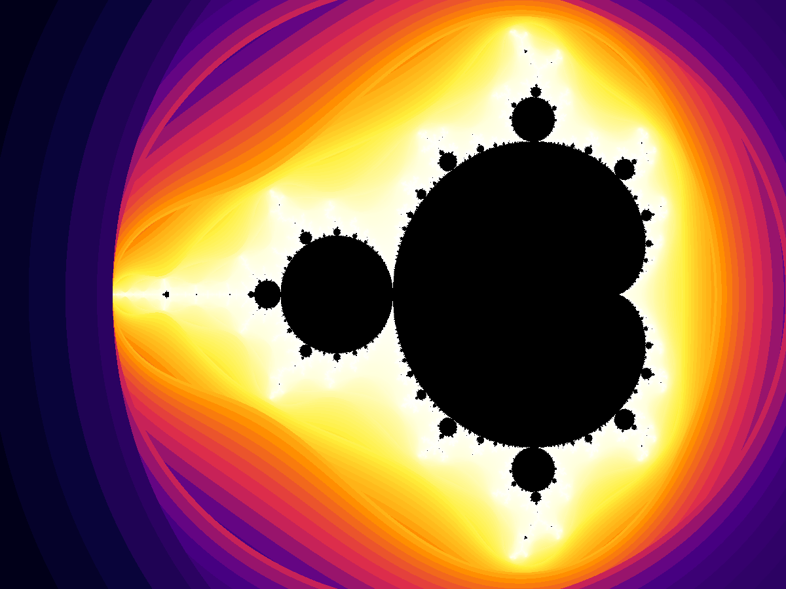
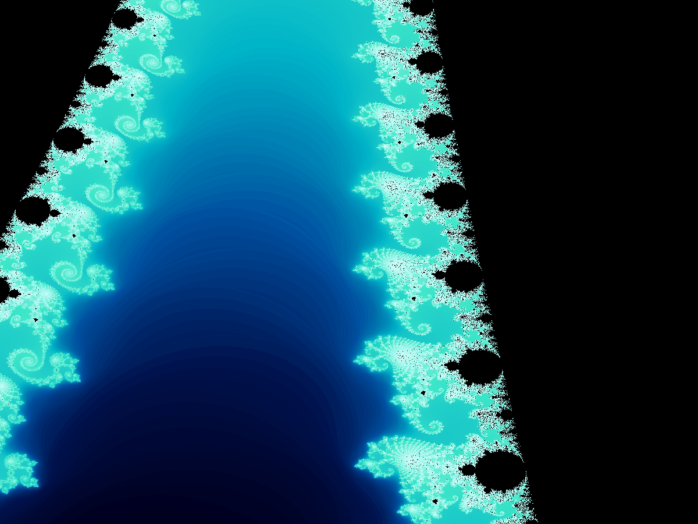
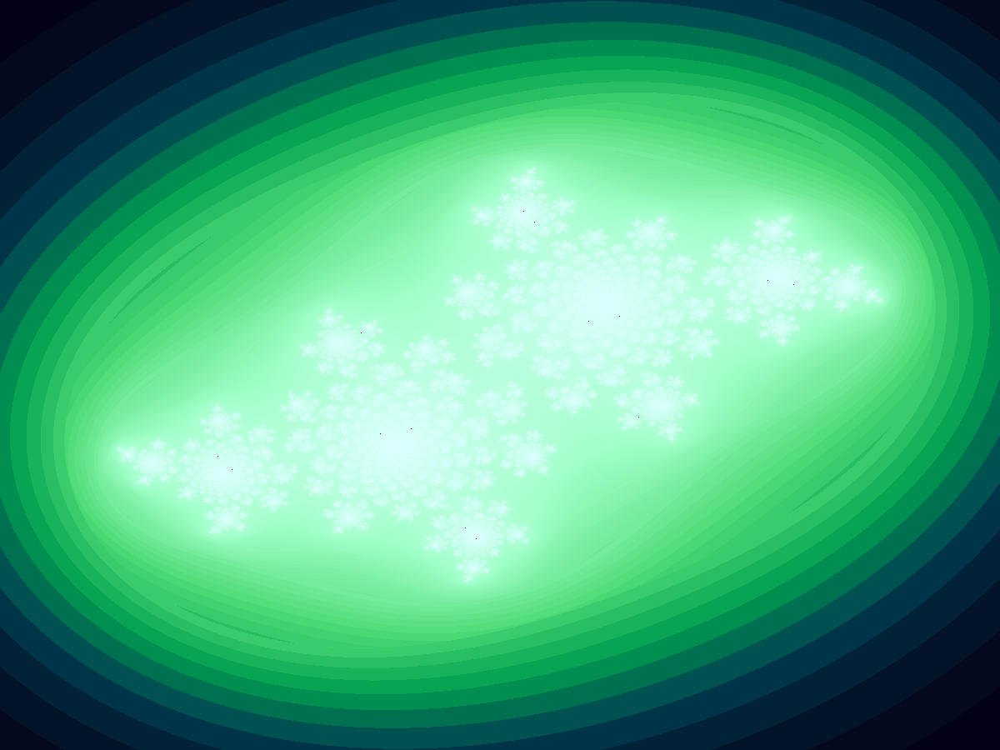
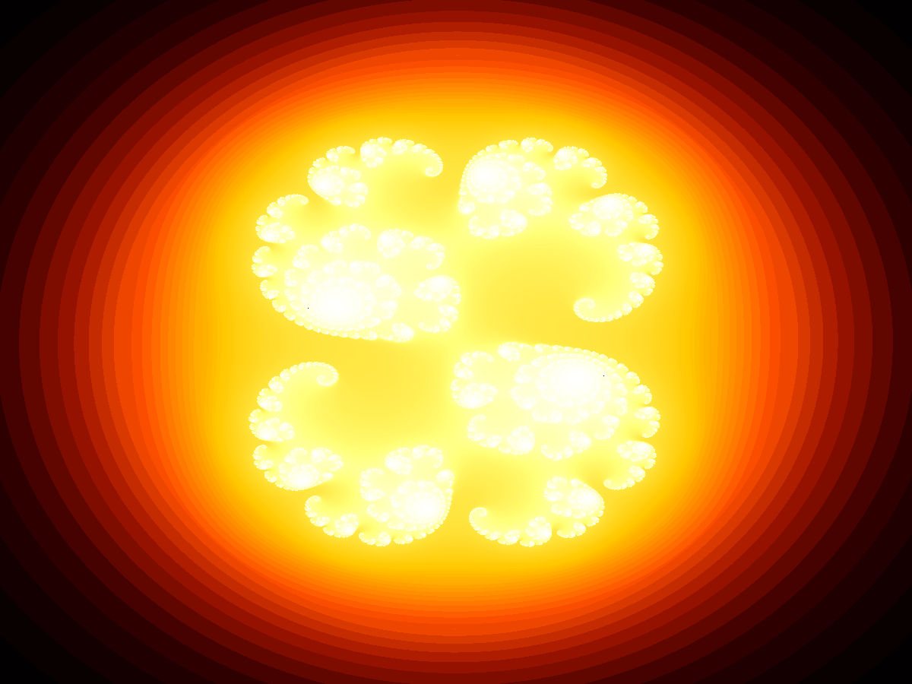
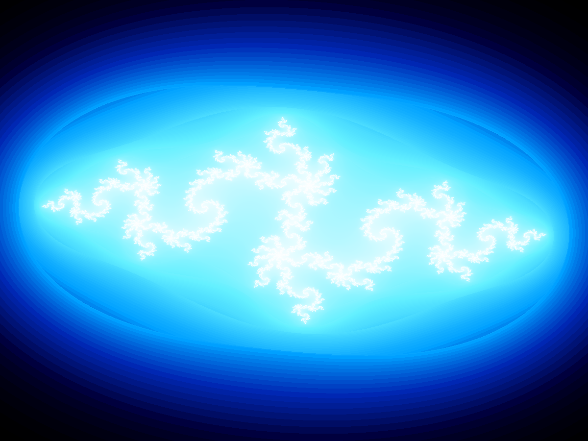
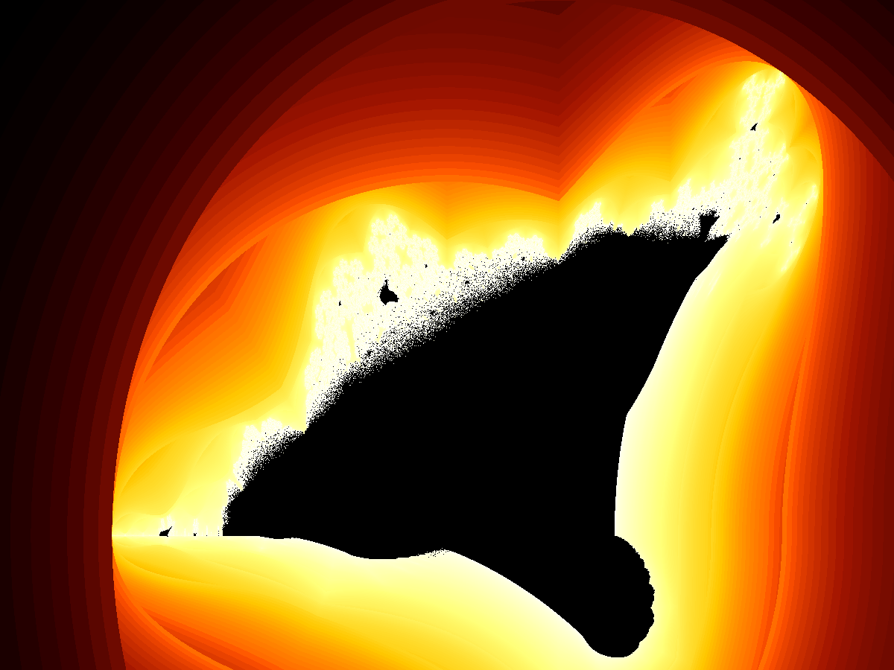
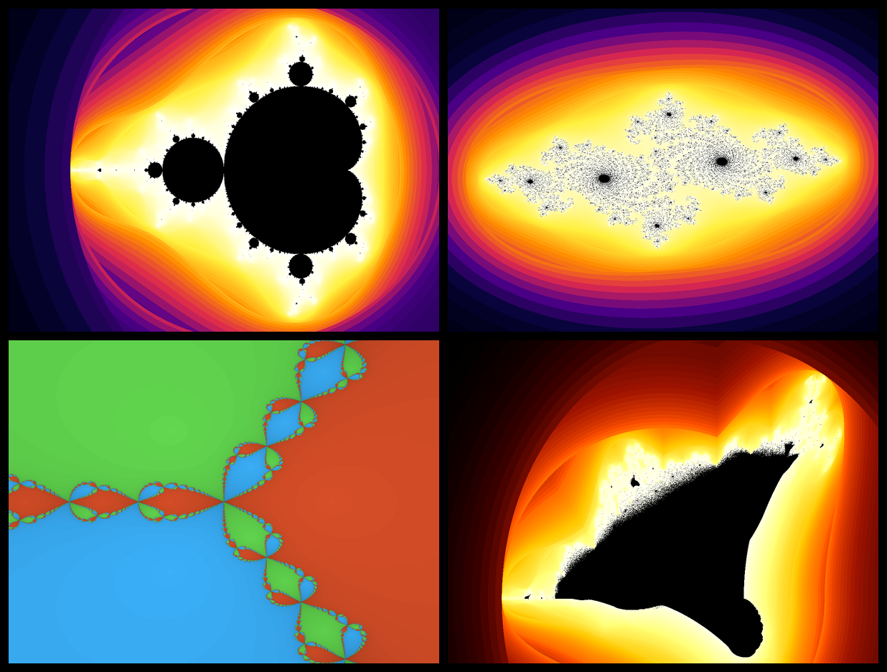

# 🌌 Fractal Universe

> *"The boundary of the Mandelbrot set is a fractal curve of infinite length, and its dimension is 2."*  
> — Benoit Mandelbrot

**Fractal Universe** is a Python mathematical art engine that renders stunning, high-resolution fractals using smooth iteration-count coloring and histogram equalization. Every image is a window into infinite complexity arising from the simplest possible rules.

---

## Gallery

### Mandelbrot Set — Cosmic Palette



*The classic Mandelbrot set: the heart-shaped cardioid and its infinite chain of bulbs, painted with smooth-escape coloring and histogram equalization for maximum tonal range.*

---

### Seahorse Valley — Deep Zoom



*A 625× zoom into the boundary of the Mandelbrot set at the "Seahorse Valley" (Re ≈ −0.75, Im ≈ 0.10). Each miniature structure at the boundary is a self-similar echo of the whole set.*

---

### Julia Sets — Four Flavors

| Spiral | Dendrite |
|--------|----------|
|  |  |
| *c = −0.7269 + 0.1889i* | *c = −0.4 + 0.6i* |

| Lava | Electric |
|------|----------|
|  |  |
| *c = 0.285 + 0.01i* | *c = −0.835 − 0.2321i* |

*Julia sets are the "sibling" of the Mandelbrot set — each point c in the Mandelbrot set corresponds to a connected Julia set; points outside produce disconnected "Fatou dust."*

---

### Newton Fractal — Cube Roots of Unity


*Newton's method applied to f(z) = z³ − 1. The three basins of attraction (orange, cyan, green) converge to the three cube roots of unity. Brightness encodes convergence speed — lighter means fewer iterations.*

---

### Burning Ship Fractal



*A variant of the Mandelbrot iteration where absolute values are taken before squaring: z_{n+1} = (|Re z| + i|Im z|)² + c. The result resembles a fleet of burning galleons on a dark sea.*

---

### Contact Sheet



---

## How It Works

### The Core Iteration

Every escape-time fractal follows the same blueprint:

```
Z₀ = 0                      (or Z₀ = pixel for Julia)
Z_{n+1} = f(Z_n, C)         (iterate until |Z| > 2 or n = max_iter)
```

| Fractal        | Iteration rule                              |
|----------------|---------------------------------------------|
| Mandelbrot     | `Z² + C`                                    |
| Julia (c)      | `Z² + c`  (c fixed, Z varies per pixel)     |
| Burning Ship   | `(|Re Z| + i|Im Z|)² + C`                  |
| Newton (z³−1)  | `Z − (Z³−1) / (3Z²)`  (Newton's method)    |

### Smooth Coloring

Raw escape counts produce harsh "rings." Smooth coloring removes banding with the *potential function* formula:

```python
smooth_iter = n + 1 - log(log(|Z|)) / log(2)
```

This exploits the fact that `|Z|` grows exponentially between iterations — the fractional part of `n` tells you exactly where in the escape cycle you are.

### Histogram Equalization

Even smooth counts cluster near the boundary. Histogram equalization spreads the distribution of values uniformly before palette mapping, giving every color equal visual weight across the image.

```
count = value
normed = CDF(count)          # maps to [0, 1] using cumulative distribution
color  = palette(normed)     # linear interpolation through gradient stops
```

---

## Project Structure

```
fractal-universe/
├── generate.py                  # CLI entry point
├── requirements.txt
├── fractal_universe/
│   ├── __init__.py
│   ├── coloring.py              # Palettes + histogram equalization
│   ├── renderer.py              # PNG + contact-sheet output
│   └── fractals/
│       ├── mandelbrot.py        # Smooth Mandelbrot iteration (NumPy vectorized)
│       ├── julia.py             # Smooth Julia set iteration
│       ├── newton.py            # Newton fractal (z³−1)
│       └── burning_ship.py      # Burning Ship variant
└── gallery/
    ├── mandelbrot.png
    ├── mandelbrot_zoom.png
    ├── julia_spiral.png
    ├── julia_dendrite.png
    ├── julia_lava.png
    ├── julia_electric.png
    ├── newton.png
    ├── burning_ship.png
    └── contact_sheet.png
```

---

## Quick Start

```bash
# Install dependencies
pip install -r requirements.txt

# Render the full gallery (~30 s on a modern CPU)
python generate.py

# Render individual fractals
python generate.py mandelbrot
python generate.py julia
python generate.py newton
python generate.py burning_ship

# Assemble a contact sheet from existing gallery images
python generate.py contact
```

---

## Palettes

Five built-in gradient palettes, each defined as a list of `(position, RGB)` stops:

| Name       | Character                                   |
|------------|---------------------------------------------|
| `cosmic`   | Deep indigo → violet → amber → white        |
| `ocean`    | Midnight navy → teal → arctic cyan          |
| `lava`     | Black → deep red → orange → yellow-white    |
| `electric` | Black → cobalt → sky blue → white           |
| `aurora`   | Dark violet → forest green → icy white      |

To use a different palette, pass `palette_name` to `histogram_coloring()`:

```python
from fractal_universe.fractals import mandelbrot
from fractal_universe.coloring import histogram_coloring
from fractal_universe.renderer import save_rgb

data = mandelbrot(1920, 1080, x_min=-2.5, x_max=1.0, y_min=-1.25, y_max=1.25)
rgb  = histogram_coloring(data, palette_name="lava", max_iter=512)
save_rgb(rgb, "my_mandelbrot.png")
```

---

## Performance

All computation is fully vectorized over NumPy arrays — no Python loops over pixels. Typical render times on a single CPU core:

| Fractal              | Resolution  | Iterations | Time  |
|----------------------|-------------|------------|-------|
| Mandelbrot           | 1200 × 900  | 512        | ~4 s  |
| Mandelbrot deep zoom | 1200 × 900  | 1024       | ~8 s  |
| Julia set            | 1200 × 900  | 512        | ~3 s  |
| Newton               | 1200 × 900  | 64         | ~2 s  |
| Burning Ship         | 1200 × 900  | 256        | ~3 s  |

---

## The Mathematics

### Why is the Mandelbrot set connected?

A theorem by Douady and Hubbard (1982) proves that the Mandelbrot set **M** is the set of parameters c for which the filled Julia set J_c is connected. Equivalently, c ∈ M iff the orbit of 0 under `z ↦ z² + c` does *not* escape to infinity.

### Fractal dimension

The boundary of the Mandelbrot set has **Hausdorff dimension 2** (Shishikura, 1998) — the most complex possible for a plane curve. Yet the set itself has **area 0** in the sense that it is measure-theoretically thin.

### Self-similarity

The Mandelbrot set contains infinitely many miniature copies of itself, called *satellite Mandelbrot sets*, attached at every period-k bulb. Zooming in at any scale reveals new structures that echo the whole.

---

## License

MIT — do whatever you like with the code and the images.
