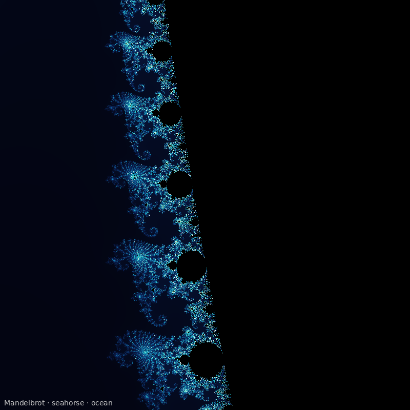
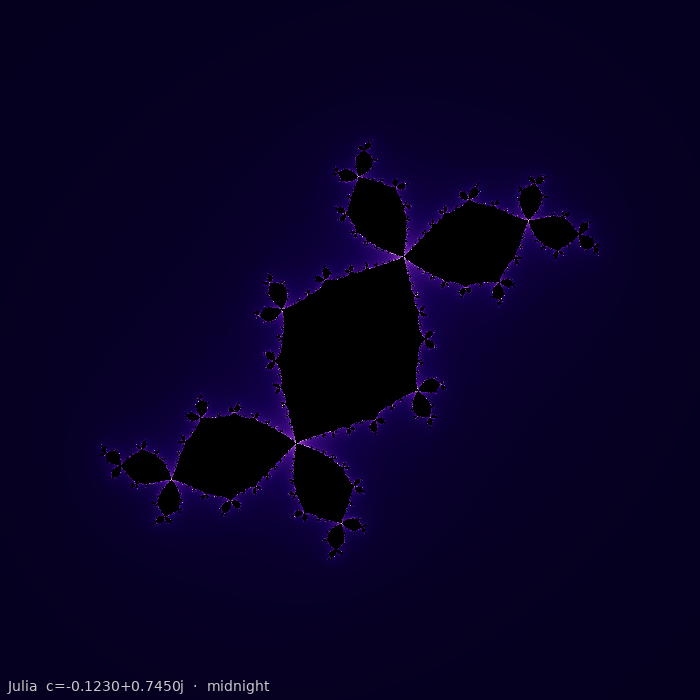
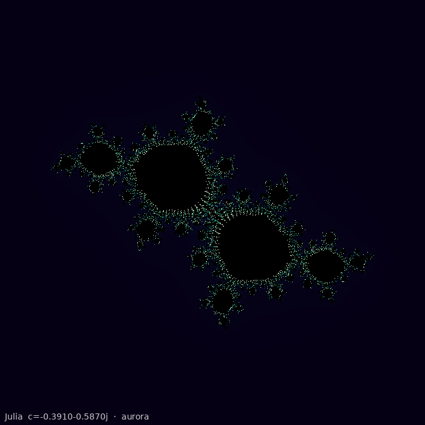
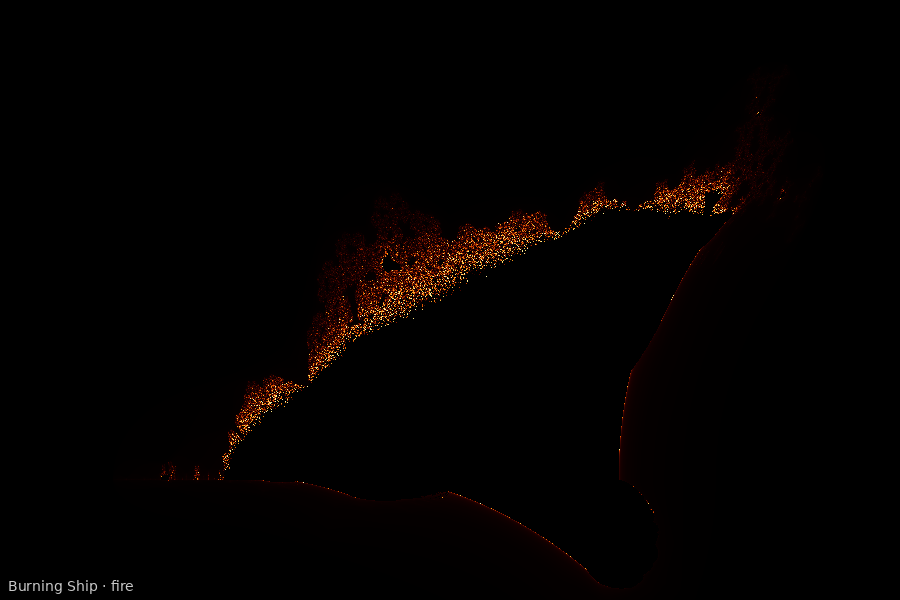
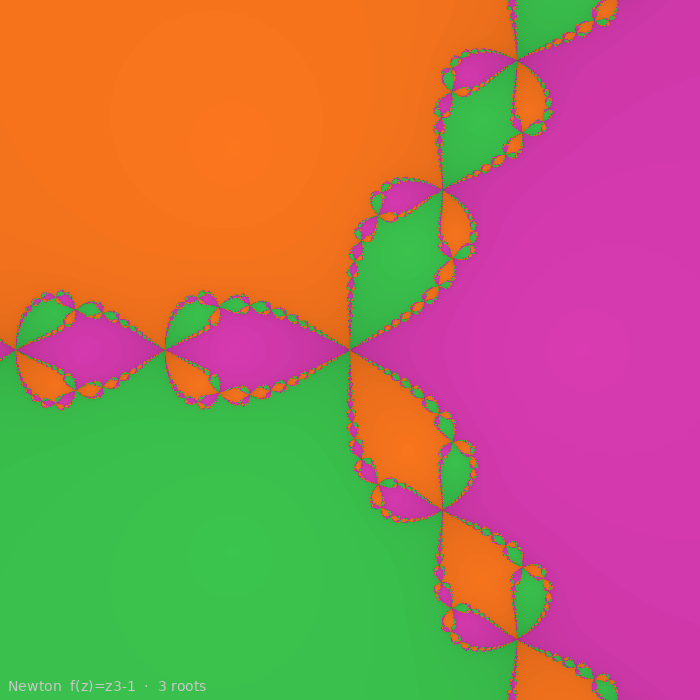
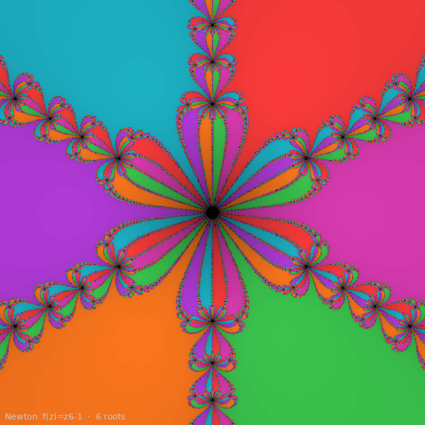
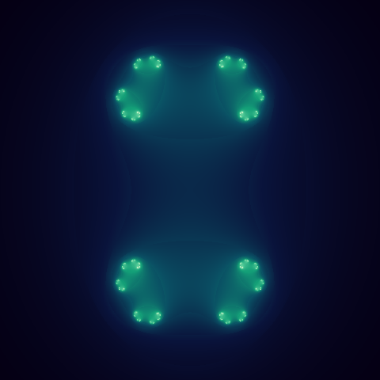
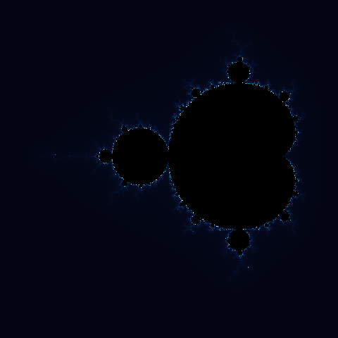

# FractalDreams

> **Infinite mathematical beauty, one pixel at a time.**

FractalDreams is a Python CLI that renders stunning fractal art — Mandelbrot sets, Julia sets, the Burning Ship fractal, and Newton fractals — as high-resolution PNGs and animated GIFs, all from a single command.

```
███████╗██████╗  █████╗  ██████╗████████╗ █████╗ ██╗
██╔════╝██╔══██╗██╔══██╗██╔════╝╚══██╔══╝██╔══██╗██║
█████╗  ██████╔╝███████║██║        ██║   ███████║██║
██╔══╝  ██╔══██╗██╔══██║██║        ██║   ██╔══██║██║
██║     ██║  ██║██║  ██║╚██████╗   ██║   ██║  ██║███████╗
╚═╝     ╚═╝  ╚═╝╚═╝  ╚═╝ ╚═════╝   ╚═╝   ╚═╝  ╚═╝╚══════╝
██████╗ ██████╗ ███████╗ █████╗ ███╗   ███╗███████╗
██╔══██╗██╔══██╗██╔════╝██╔══██╗████╗ ████║██╔════╝
██║  ██║██████╔╝█████╗  ███████║██╔████╔██║███████╗
██║  ██║██╔══██╗██╔══╝  ██╔══██║██║╚██╔╝██║╚════██║
██████╔╝██║  ██║███████╗██║  ██║██║ ╚═╝ ██║███████║
╚═════╝ ╚═╝  ╚═╝╚══════╝╚═╝  ╚═╝╚═╝     ╚═╝╚══════╝
```

---

## Table of Contents

- [Features](#features)
- [Gallery](#gallery)
- [How It Works](#how-it-works)
- [Installation](#installation)
- [Usage](#usage)
  - [Render a static image](#render-a-static-image)
  - [Animate a fractal](#animate-a-fractal)
  - [Generate a full gallery](#generate-a-full-gallery)
  - [ASCII preview in terminal](#ascii-preview-in-terminal)
- [Fractal Types](#fractal-types)
- [Colour Palettes](#colour-palettes)
- [Project Structure](#project-structure)
- [The Mathematics](#the-mathematics)
- [License](#license)

---

## Features

| Feature | Detail |
|---|---|
| **4 Fractal Engines** | Mandelbrot, Julia, Burning Ship, Newton |
| **7 Colour Palettes** | inferno, ocean, fire, midnight, forest, copper, aurora |
| **Named Presets** | 5 Mandelbrot regions, 6 Julia constants |
| **Animated GIFs** | Julia orbit, Mandelbrot deep-zoom, palette cycle |
| **ASCII Preview** | Live terminal preview without opening a file |
| **Gallery Mode** | One command renders the entire preset collection |
| **Smooth Colouring** | Fractional escape counts eliminate banding |
| **Fast Rendering** | Fully vectorised via NumPy — no Python loops over pixels |

---

## Gallery

### Mandelbrot Set — *classic view, inferno palette*


---

### Mandelbrot Set — *seahorse valley, ocean palette*



---

### Julia Set — *Douady's Rabbit (c = −0.123 + 0.745i), midnight palette*



---

### Julia Set — *Siegel Disk (c = −0.391 − 0.587i), aurora palette*



---

### Burning Ship Fractal — *fire palette*



---

### Newton Fractal — *f(z) = z³ − 1, three roots*



---

### Newton Fractal — *f(z) = z⁶ − 1, six roots*



---

### Animated: Julia Orbit (36 frames)



*The parameter c traces a circle of radius 0.7885 in the complex plane.*

---

### Animated: Mandelbrot Deep Zoom (30 frames)



*Zooming into the Douady-rabbit bulb near (−0.745, 0.113).*

---

### ASCII Preview in Terminal

```
                                                  .,..                        
                                                 ...,,,.                      
                                                ..,, %,..                     
                                             .....;    :...                   
                                         ........,S    ,.......,              
                                       ...,  :             :,+,%,             
                                     .....,:                   ,.             
                          .,............,                      ,..            
                          ..,,,.,,.....,                        %,            
                         ...,;       ,,@                        ?.            
                     ...:..,+         ;                         ,.            
               .........,+                                     ..             
               .........,+                                     ..             
                     ...:..,+         ;                         ,.            
                         ...,;       ,,#                        ?.            
                          ..,,,.,,.....,                        %,            
                          .,............,                      ,..            
                                     .....,:                   ,.             
                                       ...,  :             :,+,%,             
                                         ........,S    ,.......,              
                                             .....;    :...                   
                                                ..,, %,..                     
                                                 ...,,,.                      
                                                  .,..</pre>
```

---

## How It Works

```
┌─────────────────────────────────────────────────────────────────────┐
│                         FractalDreams Pipeline                      │
│                                                                     │
│  CLI args                                                           │
│     │                                                               │
│     ▼                                                               │
│  ┌──────────┐     ┌──────────────┐     ┌────────────┐              │
│  │ Renderer │────▶│ Fractal Core │────▶│ Colorizer  │              │
│  │ (cli.py) │     │(fractals.py) │     │(colorizer) │              │
│  └──────────┘     └──────────────┘     └─────┬──────┘              │
│       │                                       │                     │
│       │           NumPy vectorised            ▼                     │
│       │           escape-time maps     PIL Image object             │
│       │                                       │                     │
│       ▼                                       ▼                     │
│  GIF frames ◀──── animator loop         PNG / GIF file             │
└─────────────────────────────────────────────────────────────────────┘
```

**Key design decisions:**

- **Vectorised math** — the entire complex-number grid is computed as NumPy arrays. A 900×600 Mandelbrot at 512 iterations renders in ~1.4 s on a single CPU core.
- **Smooth colouring** — uses the fractional escape formula `i + 1 − log₂(log₂|Z|)` to eliminate harsh colour banding between iteration bands.
- **Interpolated palettes** — sparse 8-stop palettes are upsampled to 2048-colour LUTs for silky gradients.
- **Newton colouring** — root basins are coloured by attractor index; brightness encodes convergence speed.

---

## Installation

```bash
# Clone
git clone https://github.com/kareemrt/clauder.git
cd clauder

# Install dependencies
pip install -r requirements.txt

# Optional: install as a CLI tool
pip install -e .
```

**Requirements:** Python ≥ 3.10, NumPy ≥ 1.24, Pillow ≥ 9.0, Click ≥ 8.0

---

## Usage

### Render a static image

```bash
# Mandelbrot — classic view, inferno palette
python main.py render mandelbrot

# Mandelbrot — seahorse valley zoom, ocean palette, 4K
python main.py render mandelbrot --preset seahorse --palette ocean -W 3840 -H 3840

# Julia — Douady's Rabbit
python main.py render julia --preset douady-rabbit --palette midnight

# Julia — custom constant
python main.py render julia --julia-c "-0.7+0.27j" --palette fire -W 1024 -H 1024

# Burning Ship
python main.py render burning-ship --palette fire

# Newton fractal  (z⁶ − 1)
python main.py render newton --poly z6-1
```

### Animate a fractal

```bash
# Julia orbit animation (c sweeps a circle)
python main.py animate julia-orbit --frames 60 --palette aurora

# Mandelbrot deep zoom
python main.py animate mandelbrot-zoom --frames 50 --palette ocean

# Palette cycle on the Mandelbrot
python main.py animate palette-cycle
```

### Generate a full gallery

```bash
# Render every preset × palette combination (~26 images)
python main.py gallery --outdir my_gallery -W 800 -H 600
```

### ASCII preview in terminal

```bash
# Show Mandelbrot in text art without saving a file
python main.py render mandelbrot --ascii
python main.py render julia --preset siegel-disk --ascii
```

### List all presets and palettes

```bash
python main.py info
```

---

## Fractal Types

### 1. Mandelbrot Set

The classic. A point `c` belongs to the set if the iteration `Zₙ₊₁ = Zₙ² + c` (starting at Z₀ = 0) never escapes |Z| > 2.

**Named presets:**

| Preset | Region | Character |
|---|---|---|
| `classic` | Full view (−2.5 → 1.0, −1.25 → 1.25) | The iconic silhouette |
| `seahorse` | Near (−0.74, 0.11) | Spiralling seahorse tails |
| `elephant` | Near (0.27, 0.01) | Elephant valley spirals |
| `triple-spiral` | Near (−0.08, 0.655) | Three intertwined spirals |
| `lightning` | Near (−1.75, 0.0) | Lightning-bolt dendrites |

### 2. Julia Sets

For a fixed complex constant `c`, the Julia iteration is `Zₙ₊₁ = Zₙ² + c` starting at each pixel position.

**Named presets:**

| Preset | c value | Shape |
|---|---|---|
| `douady-rabbit` | −0.123 + 0.745i | Three-lobed rabbit ears |
| `san-marco` | −0.75 + 0.1i | Dragon-like cauliflower |
| `siegel-disk` | −0.391 − 0.587i | Smooth swirling disk |
| `dentrite` | 0 + 1i | Branching lightning tree |
| `airplane` | −1.755 + 0i | Fat airplane silhouette |
| `basilica` | −1 + 0i | Twin basilica domes |

### 3. Burning Ship Fractal

A variant that takes the absolute value of real and imaginary parts before squaring: `Zₙ₊₁ = (|Re(Zₙ)| + i|Im(Zₙ)|)² + c`. The result resembles a burning medieval ship.

### 4. Newton Fractal

Applies Newton's root-finding method `Zₙ₊₁ = Zₙ − f(Zₙ)/f′(Zₙ)` to polynomials. Each pixel is coloured by which root it converges to, and brightness by convergence speed.

**Available polynomials:** `z3-1` (z³ − 1), `z4-1` (z⁴ − 1), `z6-1` (z⁶ − 1)

---

## Colour Palettes

| Palette | Character |
|---|---|
| `inferno` | Deep purple → orange → white — perceptually uniform |
| `ocean` | Midnight navy → bright teal → white |
| `fire` | Black → deep red → orange → pale yellow |
| `midnight` | Dark navy → violet → lavender |
| `forest` | Near-black → emerald → lime green |
| `copper` | Black → rich brown → warm gold |
| `aurora` | Dark indigo → teal → mint → pale white |

All palettes use 8 hand-tuned anchor stops linearly interpolated to a 2048-colour LUT.

---

## Project Structure

```
fractal_dreams/
├── __init__.py          Package init and version
├── fractals.py          Core math: Mandelbrot, Julia, Burning Ship, Newton
├── colorizer.py         Palette LUTs and image colourisation
├── renderer.py          High-level render/animate functions + ASCII preview
└── cli.py               Click CLI: render, animate, gallery, info commands

examples/                Pre-rendered sample outputs
main.py                  Entry point (python main.py ...)
requirements.txt
setup.py
README.md
```

---

## The Mathematics

### Escape-Time Algorithm

For each pixel position `c` in the complex plane:

```
Z₀ = 0
Zₙ₊₁ = Zₙ² + c

Escape condition: |Zₙ| > 2  →  point escapes at iteration n
```

Points that never escape (after `max_iter` steps) are **inside the set** — rendered black.

### Smooth Colouring

Raw integer escape counts produce harsh "bands". The smooth formula:

```
smooth_n = n + 1 − log₂(log₂(|Zₙ|))
```

gives a continuous floating-point value that creates the silky colour gradients seen in the renders.

### Newton's Method

For a polynomial `f(z)`:

```
Zₙ₊₁ = Zₙ − f(Zₙ) / f′(Zₙ)

For f(z) = zⁿ − 1:
Zₙ₊₁ = ((n−1)·Zₙⁿ + 1) / (n · Zₙⁿ⁻¹)
```

The `n` roots of unity are the attractors. Each pixel converges to one of them — or diverges.

---

## License

MIT © FractalDreams — built with NumPy, Pillow, and a love of complex numbers.
