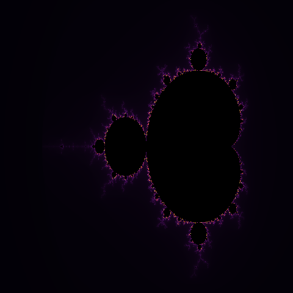
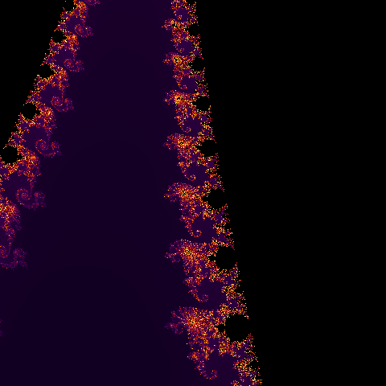
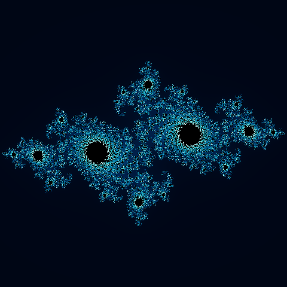
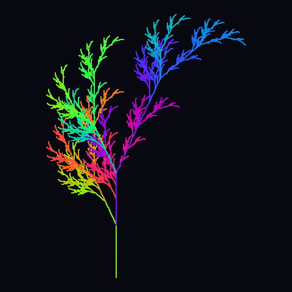
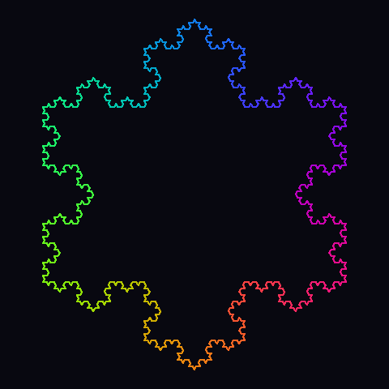
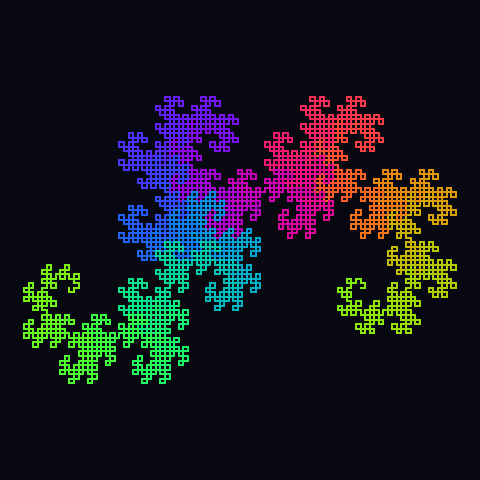

# Clauder · fractalis


**fractalis** is a fractal generation toolkit that renders escape-time fractals
(Mandelbrot, Julia, Burning Ship) and L-system curves (Koch snowflake,
Sierpinski triangle, dragon curve, fractal plant, Lévy C curve) straight to
PNG — using nothing but the Python standard library. No NumPy, no Pillow, no
SciPy. The PNG encoder itself is hand-rolled on top of `zlib` and `struct`.

## Gallery

| | | |
|---|---|---|
|  |  |  |
| Mandelbrot set | Seahorse valley (zoom) | Burning Ship |
|  |  |  |
| Julia set (classic) | Julia set (spiral) | Fractal plant (L-system) |
|  |  |  |
| Koch snowflake | Sierpinski triangle | Dragon curve |

Regenerate every image above with:

```bash
python3 -m scripts.generate_gallery
```

## How it works

Two independent rendering pipelines share one PNG encoder:

```
                         ┌────────────────────┐
                         │   png_writer.py     │  zlib + struct only
                         │ (raw RGB -> PNG)    │
                         └─────────▲──────────┘
                                   │
            ┌──────────────────────┴───────────────────────┐
            │                                               │
  ┌─────────────────────┐                       ┌─────────────────────┐
  │   escape_time.py     │                       │     lsystem.py       │
  │  smooth-coloring walk │                      │ string rewriting +   │
  │  over the complex     │                      │ turtle graphics +    │
  │  plane (z -> f(z)+c)  │                      │ line rasterization   │
  └─────────▲────────────┘                       └─────────▲────────────┘
            │                                               │
   ┌────────┴────────┬──────────────┐                       │
   │                 │              │                       │
mandelbrot.py     julia.py   burning_ship.py            PRESETS:
                                                  koch · sierpinski · dragon
                                                  fractal_plant · levy_c
```

* **`escape_time.py`** iterates `z_{n+1} = f(z_n) + c` per pixel and uses
  smooth (continuous) iteration-count coloring so gradients don't band.
* **`lsystem.py`** rewrites a seed string against production rules, walks the
  result with a turtle (`F` draw, `+`/`-` turn, `[`/`]` push/pop state), then
  rasterizes the resulting line segments with Bresenham's algorithm.
* **`png_writer.py`** writes the `IHDR`/`IDAT`/`IEND` chunks directly —
  `zlib.compress` handles the DEFLATE stream, everything else is ~40 lines.

## Project structure

```
Clauder/
├── fractalis/
│   ├── cli.py            # argparse subcommands: mandelbrot, julia,
│   │                      #   burningship, lsystem, gallery
│   ├── escape_time.py    # shared smooth-coloring escape-time renderer
│   ├── mandelbrot.py     # z^2 + c, seeded at 0
│   ├── julia.py          # z^2 + c, fixed c, seeded at the pixel
│   ├── burning_ship.py   # (|Re z| + i|Im z|)^2 + c
│   ├── lsystem.py        # L-system engine, turtle, rasterizer, presets
│   ├── colormaps.py      # fire / ocean / inferno / grayscale / psychedelic
│   └── png_writer.py     # zero-dependency PNG encoder
├── gallery/               # sample output, embedded above
├── scripts/
│   └── generate_gallery.py
├── tests/                 # unittest suite (stdlib only)
└── pyproject.toml
```

## Installation

```bash
git clone <this repo>
cd Clauder
pip install -e .   # optional — fractalis has no runtime dependencies
```

## CLI usage

```bash
# Mandelbrot set, full view
python3 -m fractalis mandelbrot -o mandelbrot.png -W 800 -H 800 --max-iter 300

# A zoomed-in view with a different colormap
python3 -m fractalis mandelbrot -o seahorse.png --view seahorse --cmap fire --max-iter 500

# Julia set
python3 -m fractalis julia -o julia.png --c spiral --cmap psychedelic

# Burning Ship
python3 -m fractalis burningship -o ship.png --cmap inferno

# L-system curves
python3 -m fractalis lsystem fractal_plant -o plant.png --stroke 2
python3 -m fractalis lsystem dragon_curve -o dragon.png --iterations 14

# Regenerate the whole README gallery
python3 -m fractalis gallery
```

Run `python3 -m fractalis <command> --help` for the full flag list. Available
colormaps: `fire`, `ocean`, `inferno`, `grayscale`, `psychedelic`. Available
L-system presets: `koch_snowflake`, `sierpinski_triangle`, `dragon_curve`,
`fractal_plant`, `levy_c_curve`.

## Library usage

```python
from fractalis.mandelbrot import render_mandelbrot
from fractalis.png_writer import write_png

pixels = render_mandelbrot(width=800, height=800, max_iter=300, cmap="inferno")
write_png("mandelbrot.png", 800, 800, pixels)
```

## Testing

```bash
python3 -m unittest discover -s tests -v
```

16 tests cover the PNG encoder's chunk structure and zlib round-trip, every
colormap's output range, escape-time edge cases (set membership, buffer
sizing), and the L-system engine (string rewriting, turtle geometry,
preset rasterization).
