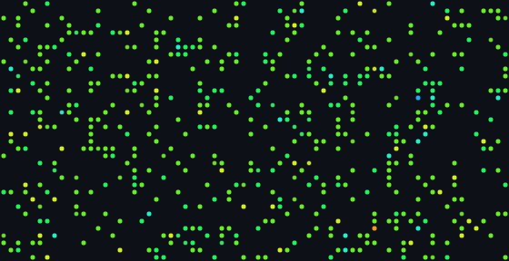
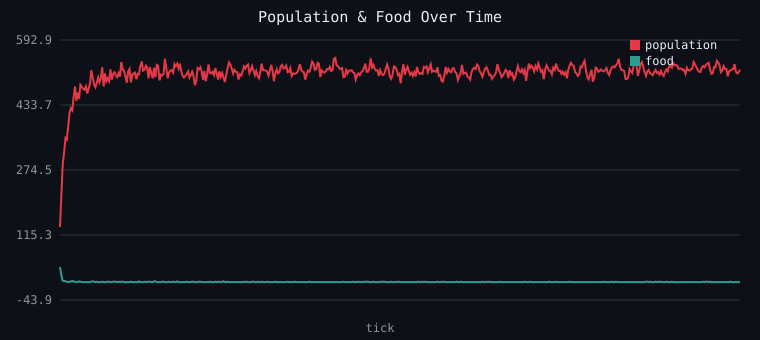
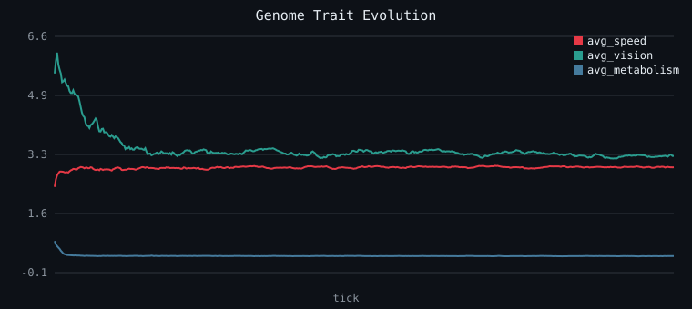

# Genesis

**A zero-dependency artificial life simulator — watch natural selection happen in your terminal.**


Genesis seeds a grid with simple organisms — each with a randomly generated
genome controlling **speed**, **vision**, **metabolism**, and **reproduction
threshold** — then lets them loose to forage, eat, reproduce, and die. There
is no fitness function and no scripted behavior. Whatever traits help an
organism survive long enough to reproduce simply become more common over
time. Everything you see below — the population curve, the drifting trait
averages, the colorful dot field — is the *output* of a few hundred lines of
plain Python, not a canned animation.



*A live snapshot after 2,500 ticks: each dot is an organism, colored by its
vision genome (blue → low, red → high) and sized by its speed.*

## How it works

Every tick, each organism runs the same simple loop:

```
 ┌──────────┐    ┌──────────┐    ┌─────────────┐    ┌──────────┐    ┌──────────────┐
 │  sense   │ →  │   move   │ →  │  metabolize │ →  │   eat    │ →  │ reproduce /  │
 │ (vision) │    │ (speed)  │    │  (upkeep)   │    │ (if food)│    │     die      │
 └──────────┘    └──────────┘    └─────────────┘    └──────────┘    └──────────────┘
```

1. **Sense** — look for the nearest food within its `vision` radius.
2. **Move** — step toward food if any was found, otherwise wander randomly,
   covering `speed` cells per tick.
3. **Metabolize** — pay an energy cost that scales with `speed` and
   `vision`. Sharper senses and faster legs aren't free.
4. **Eat** — gain energy if it ends the tick standing on food.
5. **Reproduce or die** — spawn a mutated offspring once energy crosses its
   `repro_threshold`; starve if energy drops to zero, or die of old age.

There is no central controller deciding who survives — population dynamics
and trait drift are entirely emergent from those five rules repeated
thousands of times.

## What actually happens when you run it

Starting from 60 organisms with random genomes on a 70×36 grid with scarce
food, the population overshoots and then settles at its environment's
carrying capacity:



Meanwhile, selection pressure reshapes the gene pool in real time. Once food
is scarce, cheap, efficient bodies out-compete expensive ones — average
vision and metabolism both collapse within a few hundred ticks:



(Both charts above — and the snapshot up top — were generated by an actual
run, not mocked up. Reproduce them exactly with:)

```bash
python3 -m genesis run --width 70 --height 36 --population 60 \
    --food-density 0.03 --ticks 2500 --seed 42 --record-every 5
```

## Project structure

```
genesis/
├── genome.py         # Heritable traits + mutation rules
├── organism.py       # A single agent: genome + energy + age
├── world.py          # Toroidal grid: food, occupancy, spatial queries
├── simulation.py     # The tick loop that ties it all together
├── svgchart.py       # Pure-stdlib SVG line charts & world snapshots
├── render_ansi.py    # Live ANSI terminal renderer for `watch`
└── cli.py            # `genesis run` / `genesis watch` entrypoints

tests/
├── test_genome.py      # Mutation stays within bounds, tradeoffs hold
└── test_simulation.py  # Determinism, invariants, starvation behavior

assets/                 # Generated stats.csv + SVGs (checked in as a demo)
```

## Usage

No dependencies to install — just Python 3.10+.

```bash
# Run headless for 1500 ticks and write stats.csv + SVG charts to ./assets
python3 -m genesis run --seed 42

# Watch it live, right in your terminal (Ctrl+C to stop)
python3 -m genesis watch --width 80 --height 30 --population 100
```

Useful flags for `run` (also available on `watch`):

| Flag              | Default | Meaning                                   |
|-------------------|---------|--------------------------------------------|
| `--width/--height`| 60 / 30 | Grid size                                 |
| `--population`    | 80      | Starting population                        |
| `--food-density`  | 0.12    | Fraction of cells kept stocked with food   |
| `--seed`          | random  | Seed for fully reproducible runs           |
| `--ticks`         | 1500    | How long to simulate                       |
| `--out-dir`       | assets  | Where `run` writes CSV + SVG output        |

## Testing

```bash
python3 -m unittest discover -s tests -v
```

Tests cover genome bounds/mutation, deterministic seeded runs, the
no-two-organisms-per-cell invariant, and that a foodless world reliably goes
extinct.

## Design notes

Genesis is intentionally **dependency-free** — no numpy, no matplotlib, no
curses. The grid, the genetics, the SVG charts, and the terminal renderer are
all built on the Python standard library alone, so the whole project runs
anywhere `python3` does, with nothing to `pip install`.
