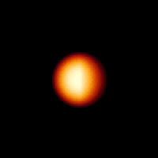
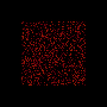
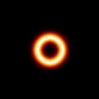

# Bloom

A continuous cellular automaton — in the Lenia/SmoothLife family — where
every cell holds a real number instead of a boolean. A single update rule
turns soft, glowing blobs into self-dividing organisms and self-organizing
colonies, entirely on a CPU with NumPy.

| `mitosis` | `colony` | `pulsar` |
| --- | --- | --- |
|  |  |  |
| one seed divides until the grid is tiled | random noise self-organizes into a lattice | a ring blooms into a mosaic of diamonds |

## Why this is interesting

Conway's Game of Life is discrete: every cell is dead or alive, and the
update rule is a lookup table. Bloom keeps the same spirit — local rules,
global emergence — but makes every quantity continuous:

- Each cell holds a value in `[0, 1]`, not a bit.
- "Neighbors" are computed by convolving the whole grid with a smooth radial
  kernel (done in one shot via FFT, so the cost is `O(n log n)` regardless of
  the kernel's radius).
- Instead of birth/death rules, a bell-shaped **growth function** nudges each
  cell up or down based on how much "mass" its neighborhood holds.

That's it — two functions and one update loop — yet it's enough for stable,
glider-like organisms to emerge, divide, and tile the plane, depending only
on the kernel shape and the growth function's center (`mu`) and width
(`sigma`).

## How it works

```
   seed pattern                    every step
  ┌───────────┐       ┌─────────────────────────────────────┐
  │  ◐         │  -->  │ state ──FFT──> ⊗ kernel ──IFFT──> U  │
  │   (place   │       │                                      │
  │   on grid) │       │ U ──growth(mu, sigma)──> ΔA           │
  └───────────┘       │                                      │
                       │ state = clip(state + dt·ΔA, 0, 1)    │
                       └─────────────────────────────────────┘
```

`U`, the "neighborhood potential", is the convolution of the grid with a
kernel built from one or more Gaussian rings (`bloom/kernel.py`). The growth
function

```
G(u) = 2 * exp( -(u - mu)^2 / (2 * sigma^2) ) - 1
```

is +1 where the potential matches `mu` exactly and approaches -1 far from
it, so cells in a "just right" neighborhood grow while overcrowded or empty
ones decay. Repeating `state = clip(state + dt * G(U), 0, 1)` thousands of
times is the entire simulation.

## Project structure

```
bloom/
├── kernel.py     radial kernels (ring_kernel, build_kernel) + growth()
├── world.py       World: the grid, step(), seed_random(), place()
├── creatures.py   seed-pattern generators (blob/comet/ring) + tuned presets
├── render.py      float grid -> ember colormap -> PNG / animated GIF
├── cli.py         `bloom list|run|snapshot`
└── __main__.py     `python -m bloom ...`
tests/
├── test_kernel.py  kernel normalization, symmetry, growth bounds
└── test_world.py   shape/range invariants, edge wraparound, preset survival
examples/           pre-rendered GIFs used in this README
```

## Usage

```bash
pip install -r requirements.txt

# see what's available
python -m bloom list

# render an animated GIF
python -m bloom run --preset mitosis --size 120 --steps 220 --out mitosis.gif

# render a single PNG after N steps
python -m bloom snapshot --preset colony --steps 150 --out colony.png
```

Every preset can be tuned from the CLI:

| flag | meaning | default |
| --- | --- | --- |
| `--preset` | `mitosis`, `colony`, or `pulsar` | `mitosis` |
| `--size` | grid side length (toroidal) | `120` |
| `--steps` | simulation steps to run | `220` |
| `--stride` | steps between captured GIF frames | `2` |
| `--scale` | pixel scale factor for the output image | `3` |
| `--seed` | RNG seed (matters for `colony`'s random noise) | `0` |

## Presets

- **`mitosis`** — a single comet-shaped seed grows past a critical mass and
  splits, then each child splits again, cascading until the whole (toroidal)
  grid is tiled with ring-shaped organisms.
- **`colony`** — start from uniform random noise instead of a seed; the same
  ring-shaped organisms condense directly out of the noise into an evenly
  spaced lattice.
- **`pulsar`** — a two-shell kernel grown from a ring seed, blooming into a
  mosaic of pulsing diamonds rather than circles.

Building a new one is just a kernel/growth/seed-pattern triple — see
`bloom/creatures.py` for the `Preset` dataclass and the `blob`/`comet`/`ring`
seed generators.

## Testing

```bash
pip install -r requirements-dev.txt
pytest
```

Tests check kernel normalization and symmetry, that the growth function
stays bounded in `[-1, 1]`, that the world's state never leaves `[0, 1]` or
produces `NaN`/`inf`, that `place()` wraps correctly at the grid's edges,
and that every shipped preset is still "alive" (non-zero mass) after 200
steps.
