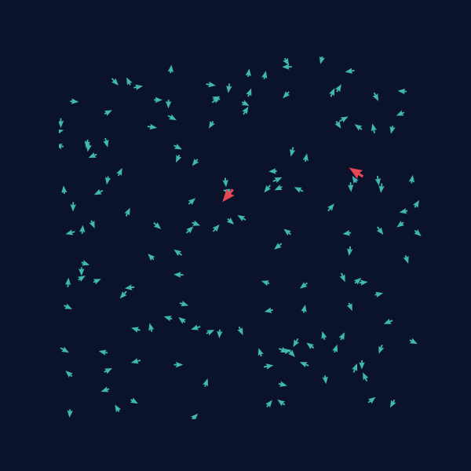

# Boids — Emergent Flocking, Vectorized

Thousands of starlings turn as one with no leader, no plan, and no
communication beyond "what are my neighbors doing right now." This project
is a small, fast simulation of that phenomenon: a few local rules, applied
to every individual at once, produce a swarm that looks alive.



*150 boids (teal) and 2 predators (red) on a wrap-around plane — the same
three local rules, with nobody in charge, fold the swarm into a drifting ring.*

## Why this is fascinating

No boid knows the shape of the flock. Each one only asks three questions
about the handful of neighbors it can see:

1. *Am I too close to someone? Back off.* (**separation**)
2. *Which way is everyone near me heading? Match it.* (**alignment**)
3. *Where is the middle of my local group? Drift toward it.* (**cohesion**)

That's the entire model — no global coordinator, no path planning, no
notion of "flock" anywhere in the code. Run it, and the swarm spontaneously
organizes into rings, streams, and splitting/merging clusters, the same
shapes seen in real starling murmurations and fish schools. Drop in a
predator and the group develops panic, splintering away from the threat
before reorganizing. It's a clean demonstration of **emergence**: complex,
coordinated, almost intentional-looking behavior falling out of rules that
mention none of it.

## Features

- **Fully vectorized** with NumPy — every boid's neighbors, forces, and
  movement are computed in batched array operations, no per-boid Python
  loops, so simulating hundreds of agents stays real-time.
- **Toroidal world** — the plane wraps at the edges, so the swarm reads as
  one continuous flock with no walls pinning it in.
- **Predator/prey dynamics** — optional predators chase the nearest boid;
  boids flee any predator within range.
- **GIF / PNG export** — render a live simulation straight to an animated
  GIF or a single snapshot frame from the command line.
- **Tested steering math** — separation, alignment, cohesion, toroidal
  wraparound, and predator chase are each covered by unit tests.

## How it works

Every tick, each boid combines three steering vectors — computed from
neighbors within its `perception` radius — into one acceleration, which is
clamped and added to its velocity:

| Rule | Steers toward... | Code |
|---|---|---|
| Cohesion | the average position of nearby boids | `Flock._flocking_forces` |
| Alignment | the average heading of nearby boids | `Flock._flocking_forces` |
| Separation | away from boids closer than `separation_radius` | `Flock._flocking_forces` |
| Predator avoidance | away from any predator within `predator_perception` | `Flock._predator_interaction` |

Predators run their own simple rule: steer toward the nearest boid
(`Flock._step_predators`). All pairwise distances are computed as NumPy
broadcast tensors rather than nested loops, and positions wrap with `%`
instead of bouncing off walls.

## Project structure

```
Clauder/
├── boids/
│   ├── __init__.py     # package entry point, exposes Flock
│   ├── __main__.py     # `python -m boids` entry point
│   ├── flock.py         # the simulation: steering rules, physics, predators
│   ├── render.py        # matplotlib rendering -> GIF / PNG
│   └── cli.py            # argparse command-line interface
├── tests/
│   └── test_flock.py    # unit tests for the steering math
├── assets/
│   ├── demo.gif          # rendered flocking demo (shown above)
│   └── snapshot.png      # single-frame example
├── requirements.txt
└── README.md
```

## Installation

```bash
git clone <this-repo>
cd Clauder
pip install -r requirements.txt
```

Requires Python 3.10+. Dependencies: `numpy`, `matplotlib`, `pillow`.

## Usage

Run the simulation and export an animated GIF:

```bash
python -m boids --boids 150 --predators 2 --frames 200 --gif assets/demo.gif
```

Or export a single snapshot after letting the flock settle for a while:

```bash
python -m boids --boids 150 --predators 2 --warmup 95 --png assets/snapshot.png
```

### CLI options

| Flag | Default | Description |
|---|---|---|
| `--boids` | `150` | number of boids in the flock |
| `--predators` | `2` | number of predators |
| `--width`, `--height` | `640` | size of the (toroidal) simulation plane |
| `--frames` | `240` | frames to simulate/export |
| `--fps` | `30` | frames per second for the GIF |
| `--seed` | random | seed for reproducible runs |
| `--gif PATH` | — | export an animated GIF |
| `--png PATH` | — | export a single PNG snapshot |
| `--warmup N` | `0` | steps to simulate before taking the PNG snapshot |

### As a library

```python
from boids.flock import Flock

flock = Flock(n_boids=150, width=640, height=640, n_predators=2, seed=7)
for _ in range(200):
    flock.step()

print(flock.positions)   # (150, 2) array of boid positions
print(flock.velocities)  # (150, 2) array of boid velocities
```

## Testing

```bash
python -m pytest tests/ -v
```

The suite checks that positions stay within the toroidal bounds, velocities
never exceed `max_speed`, separation actively pushes overlapping boids
apart, the torus wraparound is seamless across edges, and predators chase
the nearest boid.

## License

MIT — see [LICENSE](LICENSE).
