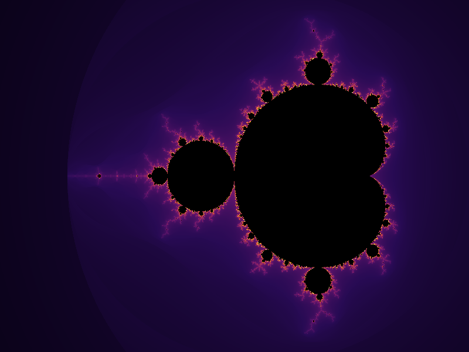
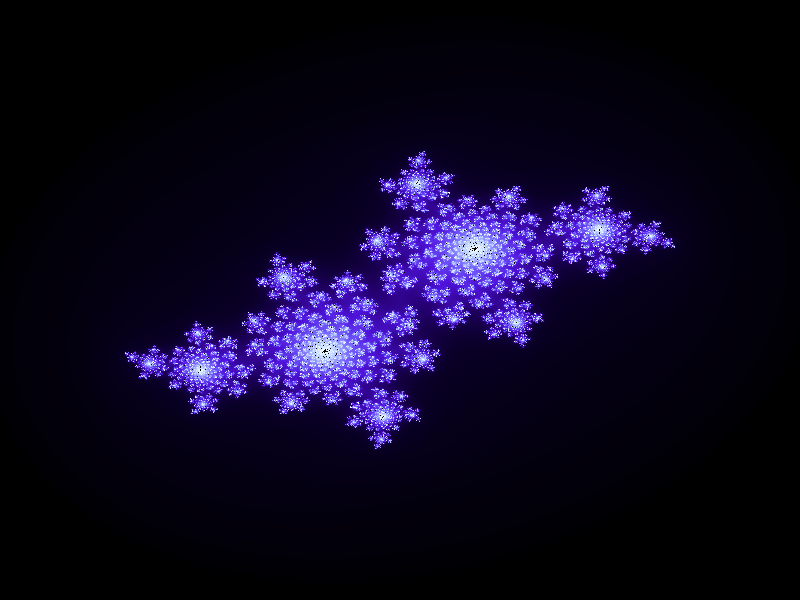
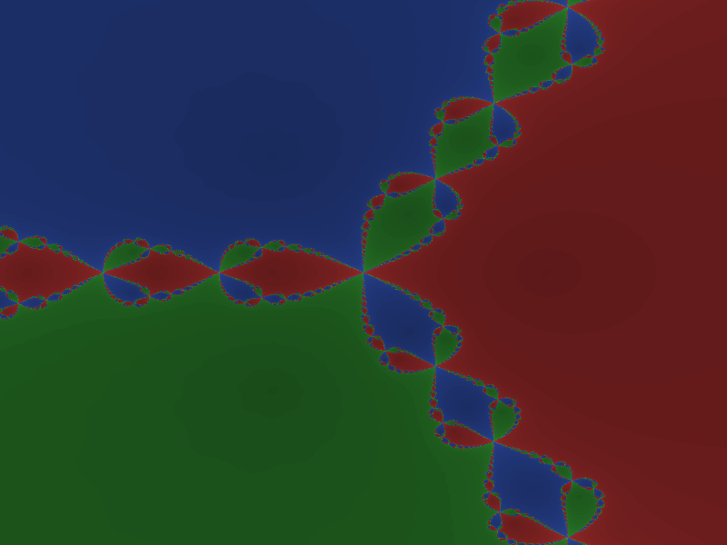
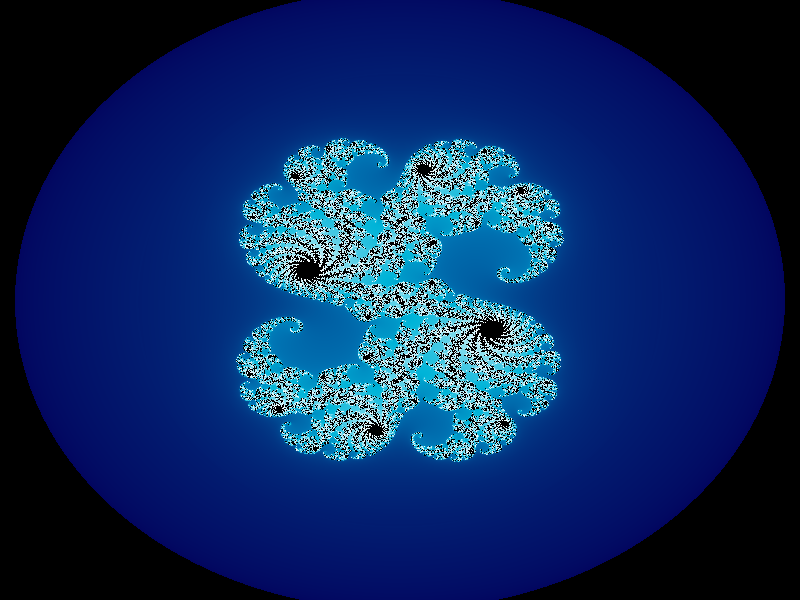
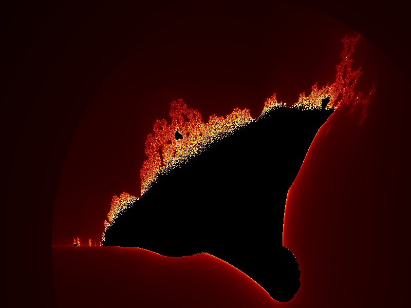
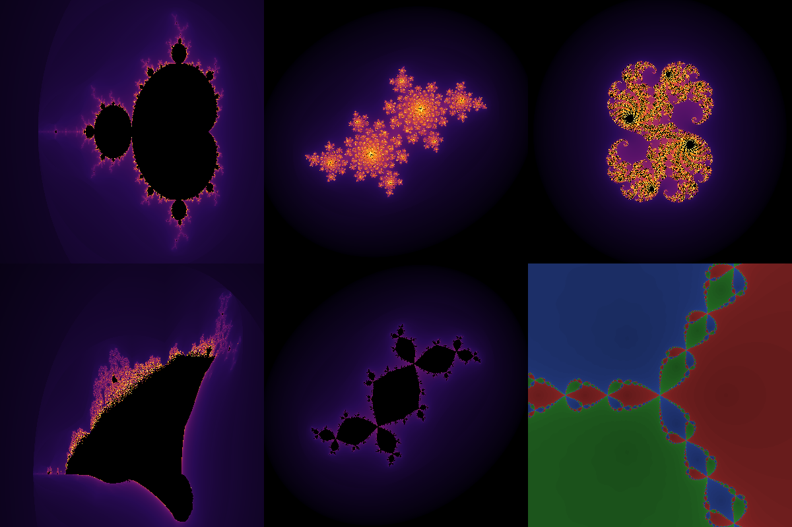

# ✦ Spectra — Terminal Fractal Explorer

> *Where mathematics meets art. Render Mandelbrot sets, Julia sets, Burning Ship fractals, and Newton basins — right in your terminal or as stunning high-resolution images.*

[](https://python.org)
[](LICENSE)
[](#testing)

---

## Gallery

| Mandelbrot · *inferno* | Julia Spiral · *electric* | Newton Basins |
|:---:|:---:|:---:|
|  |  |  |

| Julia Galaxy · *ocean* | Burning Ship · *fire* | Full Gallery |
|:---:|:---:|:---:|
|  |  |  |

---

## What Is Spectra?

**Spectra** is a Python CLI for exploring the infinite complexity of mathematical fractals. It computes escape-time fractals using **fully vectorized NumPy**, making renders blazing fast even at high resolutions. Choose your fractal, pick a color palette, and either admire the ASCII art right in your terminal or export a crisp PNG for your desktop wallpaper.

### Fractals Supported

| Fractal | Formula | Characteristic |
|---------|---------|----------------|
| **Mandelbrot** | `z ← z² + c`, `z₀ = 0` | The iconic set — infinite detail at every zoom level |
| **Julia** | `z ← z² + c`, `z₀ = pixel` | A family portrait: one unique set per complex constant `c` |
| **Burning Ship** | `z ← (|Re(z)| + i|Im(z)|)² + c` | Twisted cousin of Mandelbrot; a ship aflame at the boundary |
| **Newton** | Newton's method on `z³ − 1 = 0` | Three basins of attraction fight for each pixel |

---

## Project Structure

```
spectra/
├── spectra/
│   ├── __init__.py       # Package metadata & version
│   ├── fractals.py       # Vectorized fractal engines (NumPy)
│   ├── palettes.py       # 8 color palettes + smooth mapping
│   ├── renderer.py       # ASCII terminal + PNG export
│   └── cli.py            # Argparse CLI with subcommands
├── gallery/
│   ├── gallery.png       # Contact sheet of all fractal types
│   ├── mandelbrot_inferno.png
│   ├── julia_spiral.png
│   ├── julia_galaxy.png
│   ├── burning_ship_fire.png
│   └── newton.png
├── tests/
│   └── test_fractals.py  # 10 correctness tests
├── main.py               # Entry point
├── pyproject.toml
├── requirements.txt
└── README.md
```

---

## Installation

```bash
git clone https://github.com/kareemrt/clauder.git
cd clauder
pip install -r requirements.txt
```

Or install as a package:
```bash
pip install .
# Then use the `spectra` command directly
```

---

## Usage

### ASCII Art in the Terminal

```bash
python main.py mandelbrot
python main.py julia --preset spiral
python main.py burning-ship
python main.py newton
```

Example ASCII output (Mandelbrot set, 100×40 chars):

```
....                                                                                ....
   ....                                                                          ....
      ...                                                                      ...
        ....                                                                ....
           .....                                                        .....
               .......                                            .......
                     ......      . .......      . ......      ......
                          .....::::=====::::..::::=====:::::.....
                              ....:::::+*##%%##*+:::::....
                               ...::::-=+*#@#*+=-::::...
                              .....::::-=+++==-::::....
                                  ..::::-====::::..
                                     .:::-=:.::.
                                      .::-=:::.
                                       .:::.
                                        .::.
```

### Export as PNG

```bash
# Mandelbrot with inferno palette (800×600)
python main.py mandelbrot -o output.png

# Julia set — choose a named preset
python main.py julia --preset galaxy -o julia_galaxy.png --palette ocean

# Or specify the complex constant directly
python main.py julia --c="-0.4+0.6j" -o custom_julia.png

# Burning Ship with fire palette
python main.py burning-ship -o burning_ship.png --palette fire

# Newton fractal
python main.py newton -o newton.png
```

### Zoom Into a Region

```bash
# Zoom into seahorse valley of the Mandelbrot set
python main.py mandelbrot --zoom -0.743 0.127 0.005 -o seahorse.png -W 1920 -H 1080

# Any complex point and radius
python main.py mandelbrot --zoom CX CY RADIUS
```

### Generate All Examples at Once

```bash
python main.py gallery -o gallery/gallery.png -s 400
```

---

## Color Palettes

Spectra ships with **8 handcrafted palettes**:

| Palette | Description |
|---------|-------------|
| `inferno` | Deep purple → orange → yellow-white (default) |
| `ocean` | Navy → cyan → white |
| `fire` | Black → red → orange → yellow |
| `electric` | Black → violet → bright blue → white |
| `forest` | Dark green → bright green → pale mint |
| `psychedelic` | Cycling neon: pink → purple → cyan → green |
| `grayscale` | Black → grey → white |
| `gold` | Black → bronze → gold → white |

```bash
python main.py mandelbrot -o mandelbrot.png --palette ocean
python main.py julia --preset dendrite --palette psychedelic -o dendrite.png
```

---

## Julia Set Presets

| Preset | Constant `c` | Look |
|--------|-------------|------|
| `spiral` | `−0.4 + 0.6i` | Sweeping spirals |
| `galaxy` | `0.285 + 0.013i` | Galaxy-like swirls |
| `dendrite` | `−0.7269 + 0.1889i` | Tree-like branches |
| `lightning` | `−0.8 + 0.156i` | Jagged lightning bolts |
| `san-marco` | `−0.75` | Classic San Marco dragon |
| `double-spiral` | `0.45 + 0.1428i` | Two interlocked spirals |
| `rabbit` | `−0.123 + 0.745i` | Douady rabbit |
| `airplane` | `−1.755` | Airplane / basilica |

---

## Command Reference

```
usage: spectra {mandelbrot,julia,burning-ship,newton,gallery} [options]

Subcommands:
  mandelbrot      Classic Mandelbrot set
  julia           Julia set for a complex constant c
  burning-ship    Burning Ship fractal
  newton          Newton fractal for z³ − 1 = 0
  gallery         Generate a contact sheet of all types

Common options:
  -W, --width     Image width in pixels  [default: 800]
  -H, --height    Image height in pixels [default: 600]
  -i, --max-iter  Maximum iterations    [default: 256]
  -p, --palette   Color palette         [default: inferno]
  -o, --output    Save to PNG (omit for ASCII terminal output)
  --zoom CX CY R  Zoom to (cx, cy) with radius R

Julia-specific:
  --preset NAME   Named preset (see table above)  [default: spiral]
  --c COMPLEX     Explicit complex constant, e.g. "-0.4+0.6j"
```

---

## How It Works

### Escape-Time Algorithm

For Mandelbrot and Julia sets, Spectra uses the **smooth iteration count** method to eliminate ugly banding:

```python
# Smooth escape count for anti-banding
iteration_map[escaped] = i + 1 - log₂(log₂(|z|))
```

This fractional escape count interpolates smoothly between integer iterations, producing silky gradients instead of hard color bands.

### Vectorized with NumPy

All computation is done on full-resolution pixel arrays at once — no Python loops over individual pixels:

```python
# All pixels updated simultaneously each iteration
Z[mask] = Z[mask] ** 2 + C[mask]
newly_escaped = mask & (np.abs(Z) > 2.0)
```

This makes Spectra **10–100× faster** than a naive pixel-by-pixel implementation.

### Newton Basins

The Newton fractal applies Newton's root-finding method (`z ← z − f(z)/f'(z)`) to `f(z) = z³ − 1`. Each pixel is colored by **which of the three cube roots** it converges to, and how quickly. The result is a mesmerizing tricolor fractal with intricate boundary detail.

---

## Testing

```bash
python tests/test_fractals.py
```

```
  PASS  test_mandelbrot_shape
  PASS  test_mandelbrot_origin_escapes
  PASS  test_mandelbrot_interior
  PASS  test_julia_shape
  PASS  test_burning_ship_shape
  PASS  test_burning_ship_has_escapes
  PASS  test_newton_shape
  PASS  test_newton_three_roots
  PASS  test_palette_output_shape
  PASS  test_all_palettes_work

10 passed, 0 failed
```

---

## Technical Details

| Component | Technology |
|-----------|-----------|
| Language | Python 3.10+ |
| Computation | NumPy (fully vectorized) |
| Image Export | Pillow (PIL) |
| CLI | `argparse` stdlib |
| Color mapping | Custom multi-stop linear interpolation |
| Smooth coloring | Normalized iteration count (`log₂(log₂|z|)` correction) |

---

## Ideas for Future Exploration

- **Zoom animation** — render a sequence of frames zooming into a point, stitch to MP4
- **Buddhabrot** — histogram rendering of Mandelbrot trajectories
- **Lyapunov fractals** — chaos vs. stability in logistic maps
- **3D perspective renders** — use iteration count as height map
- **Interactive TUI** — arrow-key navigation with `curses` or `textual`

---

## License

MIT — do whatever you want with it. Make art.

---

*Built by [Claude Code](https://claude.ai/code) — an example of AI-assisted creative software development.*
