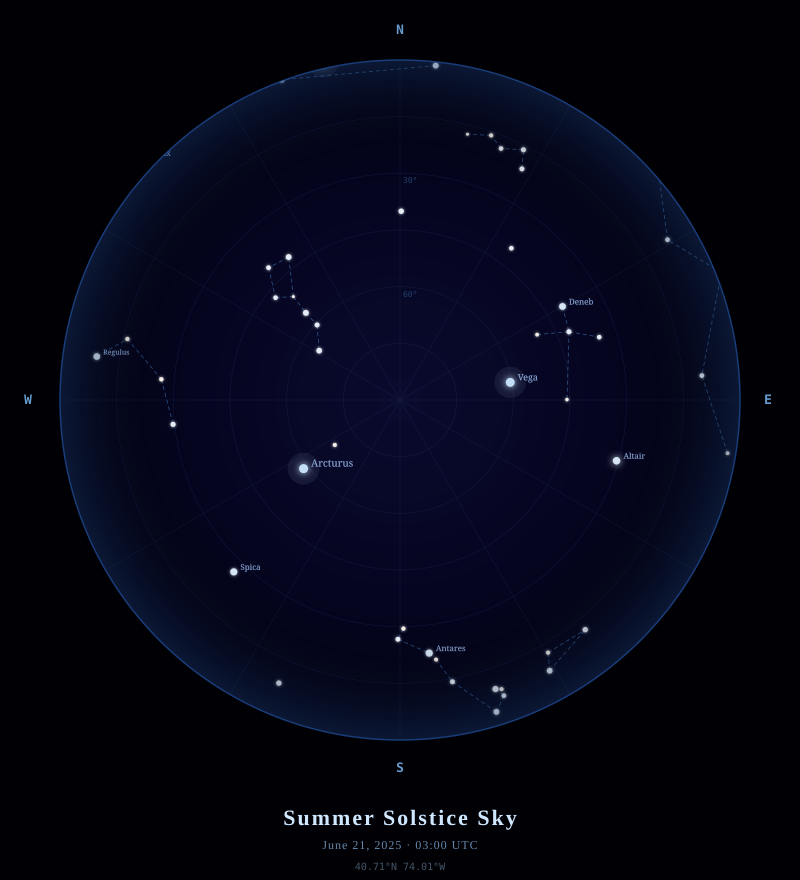
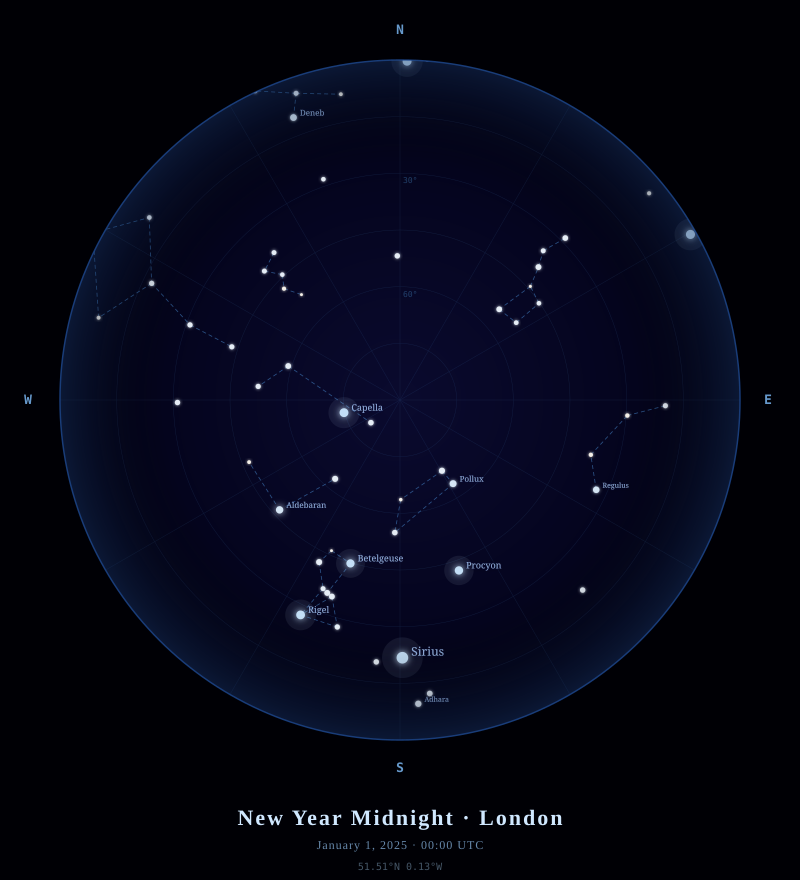
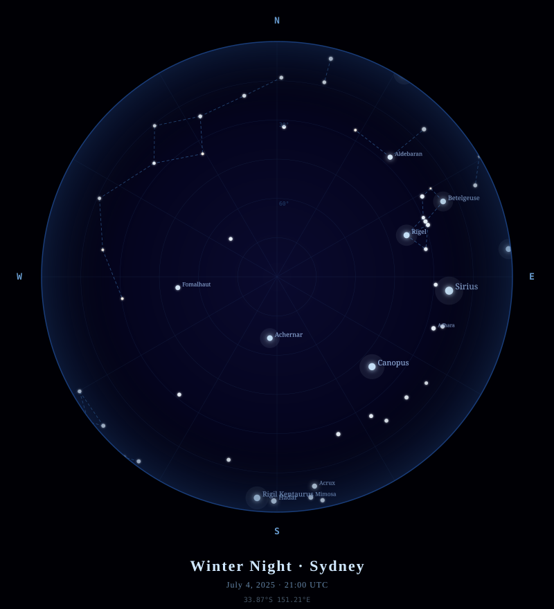

# 🌌 AstroMap

> **Your sky. Your moment. Your map.**

AstroMap is a pure-Python CLI tool that generates beautiful, astronomically accurate SVG star maps for any location on Earth at any date and time — with zero external dependencies.

---

## ✨ Example Maps

<table>
<tr>
<td align="center"><b>Summer Solstice · New York</b></td>
<td align="center"><b>New Year Midnight · London</b></td>
<td align="center"><b>Winter Night · Sydney</b></td>
</tr>
<tr>
<td></td>
<td></td>
<td></td>
</tr>
</table>

---

## 🚀 Quick Start

```bash
# No dependencies — just Python 3.7+
python astromap.py

# Custom location & time
python astromap.py --lat 48.85 --lon 2.35 --date "2025-12-24 21:30" --title "Christmas Eve · Paris"

# With custom output file
python astromap.py --lat 35.69 --lon 139.69 --title "Tokyo Midnight" --out tokyo.svg
```

The output is a self-contained `.svg` file you can open in any browser, print, or embed on a web page.

---

## 🛠️ How It Works

```
  Date + Location
       │
       ▼
  Julian Day Number (JD)
       │
       ▼
  Greenwich Mean Sidereal Time (GMST)
       │
       ▼
  Local Sidereal Time (LST) = GMST + longitude
       │
       ▼
  Hour Angle (HA) = LST − Right Ascension
       │
       ▼
  Altitude / Azimuth (horizontal coords)
       │
       ▼
  Azimuthal Equidistant Projection → SVG
```

### Astronomical Pipeline

| Step | Formula |
|------|---------|
| **Julian Day** | `JD = INT(365.25(Y+4716)) + INT(30.6001(M+1)) + D + UT/24 + B − 1524.5` |
| **GMST** | `280.46°+ 360.985647° × (JD − J2000)` |
| **Hour Angle** | `HA = LST − α` (LST = GMST + λ) |
| **Altitude** | `sin(alt) = sin(δ)sin(φ) + cos(δ)cos(φ)cos(HA)` |
| **Azimuth** | `cos(az) = (sin(δ) − sin(alt)sin(φ)) / cos(alt)cos(φ)` |
| **Projection** | `r = (90 − alt) / 90`, then polar → Cartesian |

---

## 🗂️ Project Structure

```
Clauder/
├── astromap.py        ← Main script (self-contained, ~310 lines)
├── sample_nyc.svg     ← Summer Solstice · New York
├── sample_london.svg  ← New Year Midnight · London
└── sample_sydney.svg  ← Winter Night · Sydney
```

**Inside `astromap.py`:**

```
astromap.py
├── STARS[]            — 85-star embedded catalog (vmag < 3.5)
├── CONSTELLATIONS{}   — 12 constellation line patterns
│
├── julian_day()       — UTC datetime → JD
├── gmst_degrees()     — JD → Greenwich Mean Sidereal Time
├── equatorial_to_horizontal()  — RA/Dec → Alt/Az
├── stereographic_project()     — Alt/Az → SVG pixel coords
│
├── star_color()       — Magnitude → blue-white CSS colour
├── star_radius()      — Magnitude → circle size (log scale)
│
└── build_svg()        — Assemble the complete SVG document
```

---

## 🌠 What's in the Map

### Star Catalog
- **85 named stars** from magnitude −1.46 (Sirius) to 3.5
- Positional data sourced from the **Hipparcos Catalogue** (ESA, 1997)
- Each star rendered with size and colour scaled to its **visual magnitude**

### Constellations
12 major patterns connected with dashed lines:

| Northern Sky | Equatorial | Southern Sky |
|---|---|---|
| Ursa Major | Orion | Scorpius |
| Cassiopeia | Gemini | Sagittarius |
| Perseus | Leo | — |
| Cygnus | Taurus | — |
| Pegasus | Andromeda | — |
| — | Aquarius | — |

### Visual Features
- **Radial sky gradient** — deep navy core fading to near-black at horizon  
- **Milky Way band** — soft luminous arc across the dome  
- **Altitude grid rings** — at 15°, 30°, 45°, 60°, 75°  
- **Azimuth spokes** — every 30°  
- **Cardinal labels** — N / S / E / W at the horizon  
- **Star glow filter** — brighter stars emit a diffuse halo  
- **Star labels** — for all stars brighter than magnitude 1.5

---

## ⚙️ CLI Reference

```
usage: astromap.py [-h] [--lat LAT] [--lon LON] [--date DATE]
                   [--title TITLE] [--out OUT]
                   [--min-alt MIN_ALT] [--mag-limit MAG_LIMIT]

options:
  --lat LAT           Observer latitude  (default 40.71 = New York)
  --lon LON           Observer longitude (default -74.01 = New York)
  --date DATE         UTC date/time 'YYYY-MM-DD HH:MM' (default: now)
  --title TITLE       Custom title printed below the map
  --out OUT           Output SVG filename  (default: starmap.svg)
  --min-alt MIN_ALT   Minimum altitude to plot  (default: -5°)
  --mag-limit LIMIT   Faintest magnitude to plot (default: 4.0)
```

---

## 💡 Inspiration & Use Cases

- 🎁 **Gifts** — *"The sky on the night we met"*
- 🎓 **Education** — Teach Alt/Az coordinates and sidereal time
- 🗺️ **Navigation** — Understand what's visible from any latitude
- 🖼️ **Art prints** — High-resolution SVG scales to any poster size

---

## 📐 Design Notes

The map uses **azimuthal equidistant projection** — the zenith is at the center, the horizon is the bounding circle, and distances from the center are proportional to zenith angle. This is the same projection used on the UN emblem and most classical planispheres.

Star colours approximate the **blackbody spectrum** of stellar surface temperatures:
- Blue-white (`#cce8ff`) → O/B-type stars like Rigel, Sirius
- Warm white (`#fffaf0`) → G/K-type stars like Arcturus, Capella
- Pale amber (`#ffeedd`) → faint or cooler background stars

---

## 📄 License

MIT — do whatever you like. The stars are free.

---

<p align="center">
  <i>Built with pure Python and a love for the night sky.</i><br/>
  <i>No API keys. No internet. No dependencies. Just astronomy.</i>
</p>
