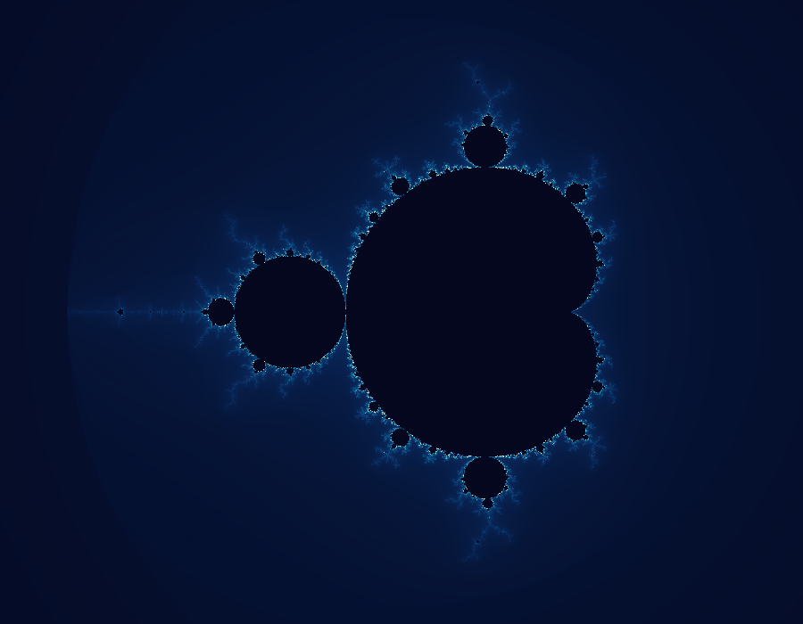
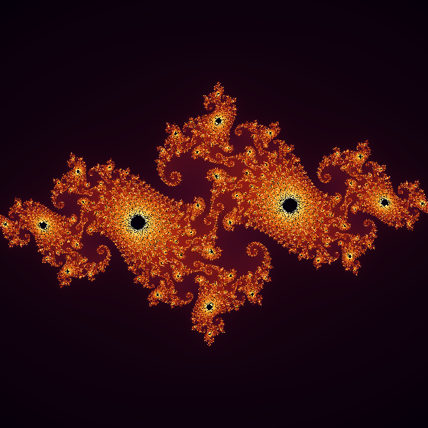
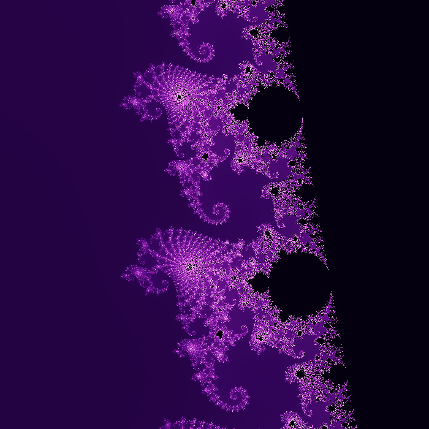
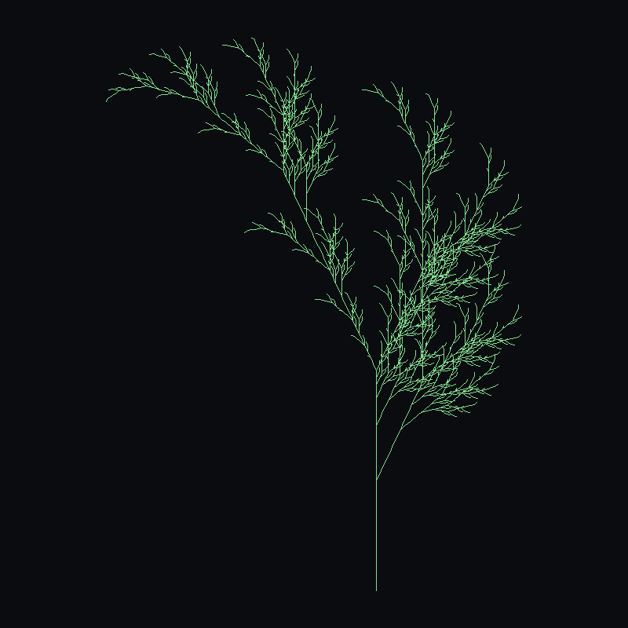
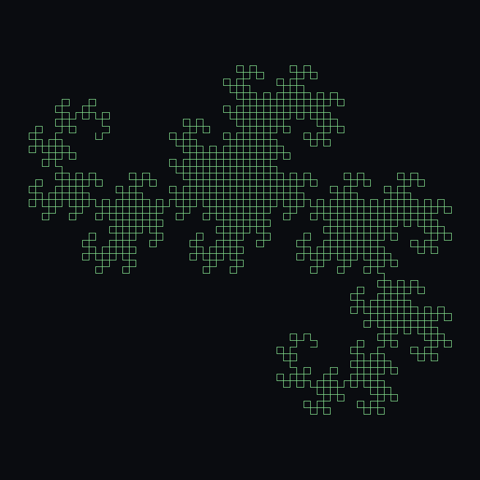
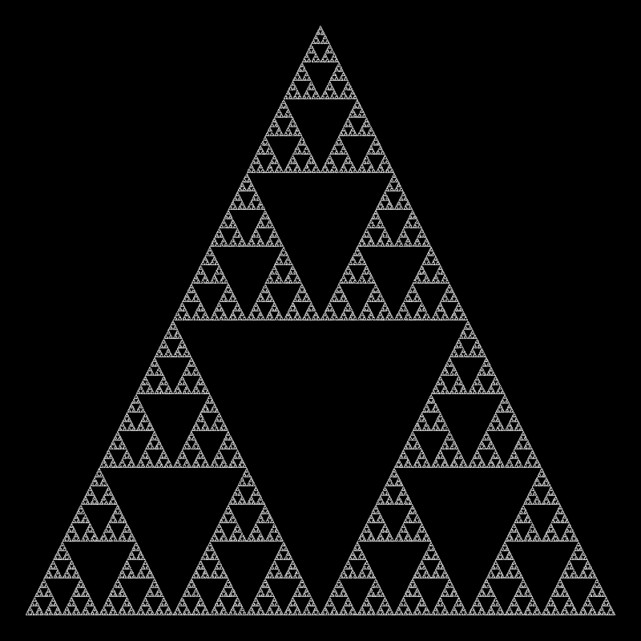

# Fracta

**A procedural fractal & generative art engine, built from first principles in pure Python.**

Fracta turns a handful of well-known mathematical recipes — escape-time iteration,
string-rewriting grammars, and randomized iterated function systems — into
high-resolution PNG art, all from one consistent command-line interface.

<p align="center">
  
  
  
</p>

---

## Why this exists

Three completely different branches of math — complex dynamics, formal
grammars, and random sampling of affine maps — all converge on the same
kind of output: infinitely detailed, self-similar images. Fracta implements
all three behind one shared rendering and coloring pipeline so you can
compare them side by side.

## Gallery

| Mandelbrot set | Mandelbrot (zoomed) | Julia set |
| :---: | :---: | :---: |
|  |  |  |

| L-system tree | Dragon curve | Sierpinski (chaos game) |
| :---: | :---: | :---: |
|  |  |  |

## Features

- **Escape-time fractals** — Mandelbrot and Julia sets with smooth (continuous)
  iteration coloring instead of banded levels, fully vectorized with NumPy.
- **L-systems** — string-rewriting grammars (axiom + production rules) walked
  by a turtle with a push/pop stack for branching. Includes presets for a
  fractal tree, a bushier shrub, the Koch curve, the dragon curve, and a
  Sierpinski arrowhead curve.
- **Chaos-game IFS fractals** — randomly sampled affine transforms that
  converge on an attractor, rendered as a log-scaled density map. Includes
  the classic Barnsley fern, Sierpinski triangle, and dragon curve presets.
- **Shared palette engine** — five hand-tuned gradients (`ocean`, `fire`,
  `forest`, `ultraviolet`, `mono`) usable across every generator.
- **One CLI for everything** — `python -m fracta <command>` with consistent
  flags for size, palette, and fractal-specific parameters.

## Architecture

```
fracta/
├── palette.py           # gradient definitions + value->RGB mapping
├── escape_fractals.py    # Mandelbrot / Julia (vectorized escape-time)
├── lsystem.py             # grammar expansion + turtle-graphics renderer
├── chaos_game.py          # affine-map IFS + chaos-game sampler
├── cli.py                 # argparse subcommands wiring it all together
└── __main__.py             # `python -m fracta` entry point

scripts/
└── generate_gallery.py   # regenerates the images embedded in this README

tests/                     # pytest suite covering math + rendering paths
```

Each generator module is independent and only depends on `palette.py` for
coloring — there's no shared mutable state, so any module can be imported
and used standalone.

## Installation

```bash
git clone <this-repo>
cd Clauder
pip install -r requirements.txt
```

Requires Python 3.10+. The only runtime dependencies are `numpy` and `pillow`.

## Usage

```bash
# Mandelbrot set
python -m fracta mandelbrot -o out.png --palette ocean --max-iter 400

# Julia set for a custom complex parameter
python -m fracta julia -o out.png --c="-0.745+0.113j" --palette fire

# Zoom into the Mandelbrot boundary
python -m fracta mandelbrot -o zoom.png --center -0.7453 0.1127 --scale 0.01 --palette ultraviolet

# L-system plant
python -m fracta lsystem -o tree.png --preset tree

# Chaos-game fern
python -m fracta chaos -o fern.png --preset barnsley_fern --palette forest --points 400000
```

Run `python -m fracta <command> --help` for the full flag list of any
subcommand. To regenerate every image in this README:

```bash
python scripts/generate_gallery.py
```

## Testing

```bash
pytest
```

The suite covers smooth-coloring correctness for escape-time fractals,
grammar expansion for L-systems, determinism of the seeded chaos-game
sampler, and palette interpolation — 13 tests, all fast (no rendering at
full resolution).

## License

MIT
