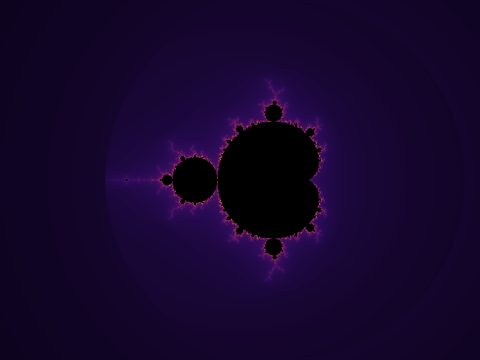
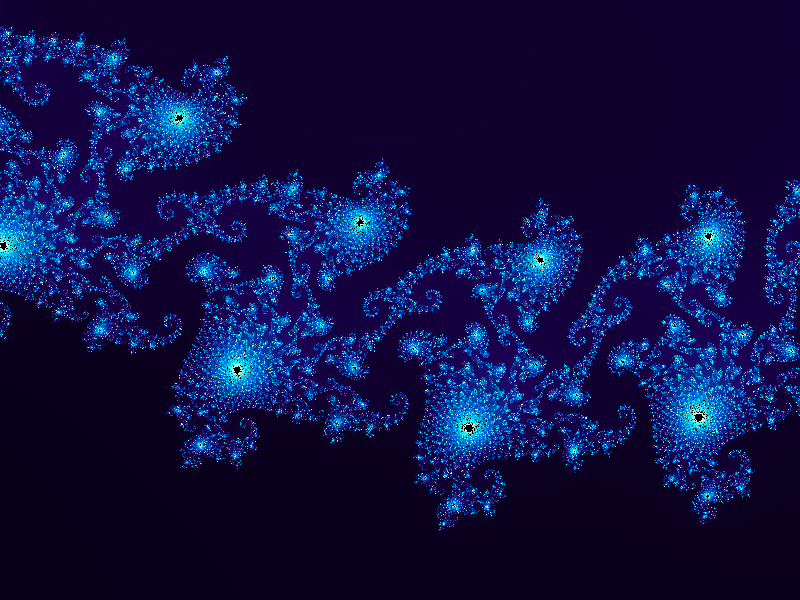
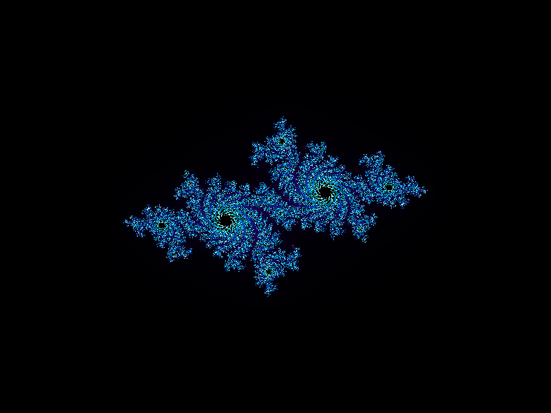
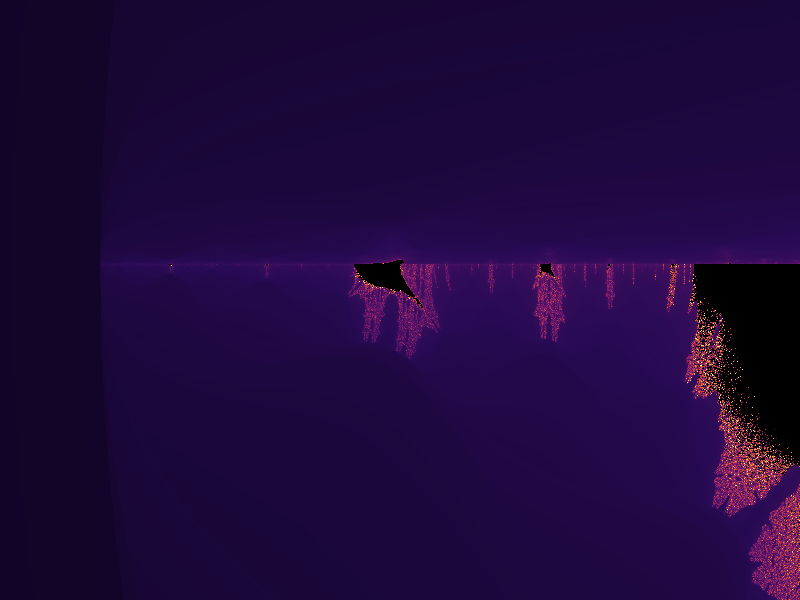
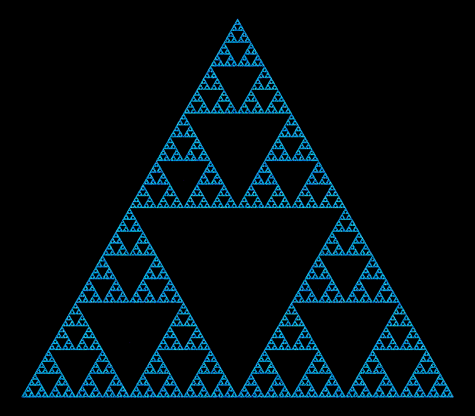
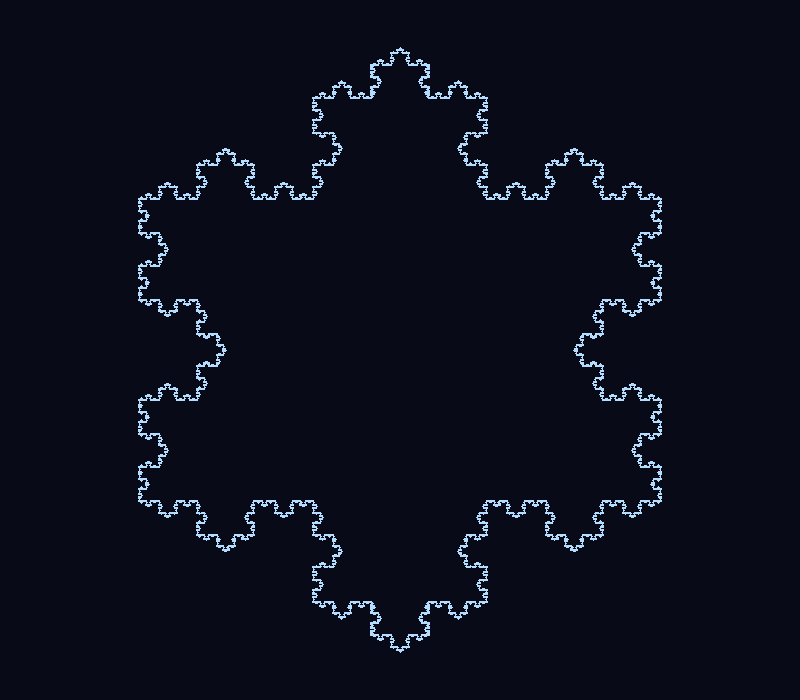
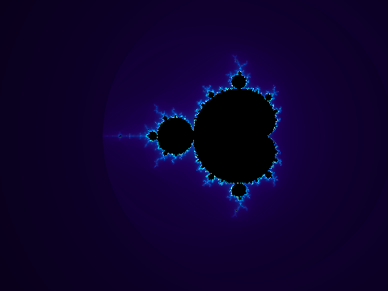

# Clauder — Fractal Forge



**Fractal Forge** is a small, dependency-light Python CLI for generating
fractal images and animations: the Mandelbrot and Julia sets, the Burning
Ship fractal, the Sierpinski triangle, the Barnsley fern, the Koch
snowflake — plus animated zoom GIFs into the Mandelbrot set.

Everything is rendered with `numpy` + `Pillow`, exposed through a single
`fractalforge` command, and fully covered by a `pytest` test suite.

## Gallery

| | |
|---|---|
| **Mandelbrot set** (`fire`) | **Deep zoom** (`electric`, zoom 5000×) |
|  |  |
| **Julia set** `c = -0.7 + 0.27015i` (`electric`) | **Burning Ship** (`fire`) |
|  |  |
| **Sierpinski triangle** (`electric`) | **Barnsley fern** (`forest`) |
|  |  |
| **Koch snowflake** | **Animated Mandelbrot zoom** |
|  |  |

## Features

- **Six fractal types**: Mandelbrot, Julia, Burning Ship, Sierpinski
  triangle, Barnsley fern, Koch snowflake.
- **Animated zooms**: render multi-frame GIFs that dive into any point of
  the Mandelbrot set, with iteration depth that automatically scales with
  zoom level for crisp detail.
- **Six color palettes**: `fire`, `ocean`, `twilight`, `forest`,
  `electric`, `grayscale` — easy to extend with your own gradients.
- **Smooth coloring**: escape-time fractals use the normalized iteration
  count algorithm with gamma correction for banding-free gradients.
- **Reproducible chaos-game fractals**: `--seed` for deterministic
  Sierpinski/fern output.
- **Small and fast**: pure `numpy` vectorized escape-time loops, no GPU or
  heavyweight dependencies required.

## Installation

```bash
git clone <this-repo>
cd Clauder
pip install -e .
```

This installs the `fractalforge` console command along with its
dependencies (`numpy`, `Pillow`).

## Usage

```bash
fractalforge --help
```

### Mandelbrot set

```bash
fractalforge mandelbrot -o mandelbrot.png \
    --width 800 --height 600 --max-iter 250 --palette fire
```

Zoom into a specific point:

```bash
fractalforge mandelbrot -o seahorse_valley.png \
    --center-x -0.7436438870371587 --center-y 0.13182590420533 \
    --zoom 5000 --max-iter 500 --palette electric
```

### Julia set

```bash
fractalforge julia -o julia.png \
    --c-real -0.7 --c-imag 0.27015 --palette electric
```

### Burning Ship

```bash
fractalforge burning-ship -o burning_ship.png \
    --center-x -1.75 --center-y -0.03 --zoom 8 --max-iter 300 --palette fire
```

### Sierpinski triangle

```bash
fractalforge sierpinski -o sierpinski.png --points 300000 --seed 42
```

### Barnsley fern

```bash
fractalforge fern -o fern.png --points 300000 --seed 42 --palette forest
```

### Koch snowflake

```bash
fractalforge koch -o koch.png --order 5
```

### Animated Mandelbrot zoom

```bash
fractalforge zoom -o zoom.gif \
    --width 480 --height 360 --frames 36 --zoom-factor 1.35 \
    --max-iter 120 --palette electric
```

### List palettes

```bash
fractalforge palettes
```

## Project structure

```
Clauder/
├── fractalforge/
│   ├── cli.py          # argparse-based command-line interface
│   ├── escape_time.py  # Mandelbrot, Julia, Burning Ship
│   ├── ifs.py           # Sierpinski, Barnsley fern, Koch snowflake
│   ├── palettes.py      # color gradient definitions
│   ├── render.py        # numpy/grid -> Pillow image helpers
│   └── animate.py       # Mandelbrot zoom GIF generation
├── tests/                # pytest suite
├── assets/               # sample images used in this README
├── pyproject.toml
└── requirements.txt
```

## Running tests

```bash
pip install -e ".[dev]"
pytest
```

## How it works

- **Escape-time fractals** (Mandelbrot, Julia, Burning Ship) iterate
  `z = f(z)^2 + c` over a grid of complex numbers, vectorized with numpy.
  Points are colored by a smoothed escape iteration count (the
  [normalized iteration count](https://en.wikipedia.org/wiki/Plotting_algorithms_for_the_Mandelbrot_set#Continuous_(smooth)_coloring)
  algorithm), with gamma correction to keep detail visible near the set
  boundary.
- **Chaos-game fractals** (Sierpinski, Barnsley fern) repeatedly apply a
  randomly chosen affine transform to a point and plot millions of
  resulting positions as a density-colored image.
- **Koch snowflake** recursively subdivides each edge of a triangle into
  four smaller edges with an outward equilateral bump.
- **Zoom animations** render a sequence of Mandelbrot frames at
  exponentially increasing zoom levels, with iteration counts that grow
  logarithmically with zoom depth to keep deep zooms sharp.

## License

MIT
