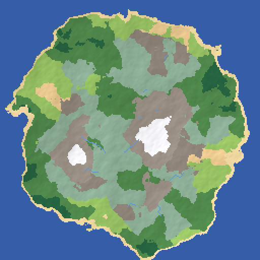
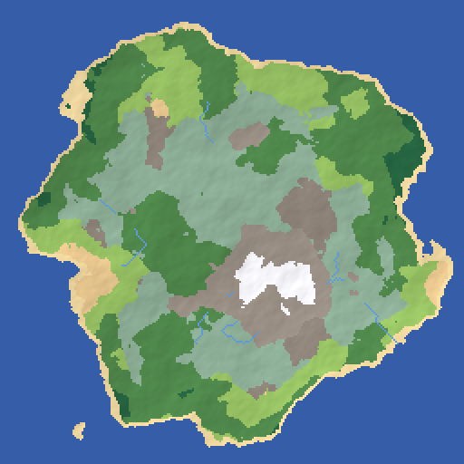
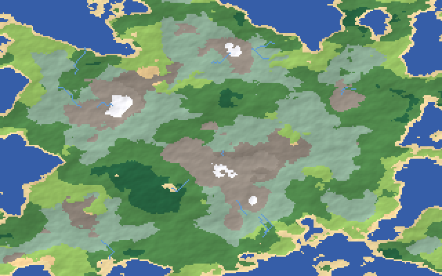

# WorldForge

Procedural fantasy world map generator. Give it a seed and WorldForge grows
an entire world: continents and islands, biomes, mountain ranges, rivers
that flow downhill to the sea, and a fitting fantasy name.



> *Silulgarde, the Ancient Expanse* — `worldforge --seed 1`

## How it works

1. **Terrain** — two independent fractal Brownian motion (fBm) layers built
   from vectorized 2D Perlin noise produce an elevation map and a moisture
   map.
2. **Islands** — an optional radial falloff mask pulls elevation down near
   the map edges, turning the noise field into continents/islands
   surrounded by ocean.
3. **Biomes** — every cell is classified from its elevation and moisture
   into one of 10 biomes (ocean, beach, desert, grassland, forest,
   rainforest, taiga, rock, mountain, snow).
4. **Rivers** — a handful of highland cells are chosen as sources, and each
   one flows downhill along the steepest-descent path until it reaches the
   sea.
5. **Naming** — a deterministic fantasy name + epithet (e.g. *"Eriwood, the
   Forgotten Expanse"*) is generated from the same seed.
6. **Rendering** — the world is rendered to a PNG with elevation-based
   hillshading, or to an ASCII map for the terminal.

Everything is keyed off a single integer seed, so the same seed always
produces the same world.

## Installation

```bash
pip install -e .
```

Requires Python 3.9+, NumPy, and Pillow.

## Usage

Generate a world and save it as a PNG:

```bash
python -m worldforge --seed 1 --output world.png
```

Print an ASCII preview alongside the biome breakdown:

```bash
python -m worldforge --seed 1 --ascii --ascii-step 6 --no-png
```

```
World: Silulgarde, the Ancient Expanse
Seed:  1
Size:  256 x 256

Biome distribution:
  ocean       36.8%
  beach        3.8%
  desert       1.8%
  grassland    8.3%
  forest      16.4%
  rainforest   2.6%
  taiga       17.2%
  rock         4.2%
  mountain     7.3%
  snow         1.7%
  river      106 cells

~~~~~~~~~~~~~~~~~~~~~~~~~~~~~~~~~~~~~~~~~~~
~~~~~~~~~~~~~~~~~~~~~~~~~~~~~~~~~~~~~~~~~~~
~~~~~~~~~~~~~~~..~~~~..~~~~~~~~~~~~~~~~~~~~
~~~~~~~~~~~~fff"""."..""".~~~~~~~~~~~~~~~~~
~~~~~~~~~~~fffff""""""""""::.~~~~~~~~~~~~~~
~~~~~~~~~.Fffffffff""",,":::::::.~~~~~~~~~~
~~~~~~~~~.FFfffffff""",,,,,"":::.~~~~~~~~~~
~~~~~~~~~fFffFffFFftttt,,,,tt,""".~~~~~~~~~
~~~~~~~~.fFFfffffffftttt,,,tt,,""""..~~~~~~
~~~~~~~"ffffffffffffttttt,,,t,,,"""..~~~~~~
~~~~~~""""ftfttfffffttttt,,tt,,ttfff~~~~~~~
~~~~~~""""ttttttffffftttt,,,tttttffF.~~~~~~
~~~~~""""""tttttffttttttt,,,ttttffFFF.~~~~~
~~~~."""""""ttt""fftttttttttttffffFFFFf~~~~
~~~~"""::"""tt""fffffttttttttfffffFFFff.~~~
~~~"""::::""ttt"ffffffftt^^t^^fffffffFf.~~~
~~~ff"""::::,,tttfFfffff^^^^^^^ffffffff.~~~
~~.fff""":,,,,tttffffff^^^^^^^^fffffffFf~~~
~....Ff""":,,tttfffffff^^^^^^^^^tffffFFf~~~
~~~~~.ff""tttt^tttttfff^^^^^*^^^fffftfff.~~
~~~~~.fffftt^^^ttttttt^^^***^^^tfffttttff~~
~~~~.ffffttt^^ttttttt^^*****^^,ttfftttfff~~
~~~~.fffttt^^^^tttttt^^*****^^,ttftttt"f.~~
~~~~ffftttt^^^=fftttt^^^****^^,tttttt""".~~
~~~~fftttt^^*^^ffttttt^^****^^,,,,""""".~~~
~~~~.fftt^^^**^^ttttttt^^*^*^,,,,,::::..~~~
~~~~.ffff^^^***^tttttttt^^^^^,,:::"::...~~~
~~~~~Ffft^^^*^^^tttttttt^^^t,,,""""::".~~~~
~~~~.Fffttt^^^^=tttttftffttt,ttt,""""".~~~~
~~~~FFfftttt^^^,,tttffff^ftttttt""""".~~~~~
~~~~ffffffttt^,,,,ttffff^^^^^ttt""""".~~~~~
~~~~.fffffttt,,ttttttfff^^^^^tttt""f~~~~~~~
~~~~~fFffffttttttttttttt^^^^fftttfff~~~~~~~
~~~~~~FFFFff""""""tttttt^^^tfffffff.~~~~~~~
~~~~~~~.FFFfffff""",,,t^t^tttffffff.~~~~~~~
~~~~~~~~~~FFffff"""",,,,ttttttffffff~~~~~~~
~~~~~~~~~~......""""",ttttfttttffff.~~~~~~~
~~~~~~~~~~~~~~~.""""""tttfffttttfff~~~~~~~~
~~~~~~~~~~~~~~~~~~."ffttfffftt""".~~~~~~~~~
~~~~~~~~~~~~~~~~~~~~.ffffffft"".~~~~~~~~~~~
~~~~~~~~~~~~~~~~~~~~~.ffFFfff.~~~~~~~~~~~~~
~~~~~~~~~~~~~~~~~~~~~~.FFF.~~~~~~~~~~~~~~~~
~~~~~~~~~~~~~~~~~~~~~~~.f.~~~~~~~~~~~~~~~~~
```

### ASCII legend

| Char | Biome      | Char | Biome     |
|------|------------|------|-----------|
| `~`  | ocean      | `,`  | rock      |
| `.`  | beach      | `^`  | mountain  |
| `:`  | desert     | `*`  | snow      |
| `"`  | grassland  | `=`  | river     |
| `f`  | forest     | `t`  | taiga     |
| `F`  | rainforest |      |           |

## CLI options

| Flag | Default | Description |
|------|---------|--------------|
| `--seed` | random | Integer seed; same seed = same world |
| `--width`, `--height` | `256` | Map size in cells |
| `--output` | `world.png` | Output PNG path |
| `--scale-factor` | `2` | Upscale factor (pixels per cell) |
| `--octaves` | `6` | fBm octaves for terrain detail |
| `--noise-scale` | `4.0` | Noise periods spanning the map (lower = larger landmasses) |
| `--island-strength` | `0.9` | Edge falloff strength (`0` = no falloff, borderless terrain) |
| `--rivers` | `10` | Number of rivers carved from highland sources |
| `--ascii` | off | Print an ASCII preview |
| `--ascii-step` | `4` | Cell sampling step for the ASCII preview |
| `--no-png` | off | Skip writing the PNG |

## Gallery

| `--seed 7` | `--seed 2024 --island-strength 0.4 --rivers 14` |
|---|---|
|  |  |
| *Eriwood, the Forgotten Expanse* | *Jorirmoor, the Whispering Cradle* |

## Library usage

```python
from worldforge import generate_world
from worldforge.render import render_png, render_ascii

world = generate_world(seed=42, width=512, height=512)
print(world.name)
render_png(world, "my_world.png", scale_factor=2)
print(render_ascii(world, step=8))
```

## Project layout

```
worldforge/
├── noise.py     # vectorized 2D Perlin noise + fractal Brownian motion
├── worldgen.py  # elevation/moisture generation, biome classification, rivers
├── render.py    # PNG and ASCII rendering
├── names.py     # fantasy world name generator
├── cli.py       # command-line interface
└── __main__.py
tests/           # pytest unit tests
examples/        # sample generated maps
```

## Running tests

```bash
pip install -e . pytest
pytest
```
