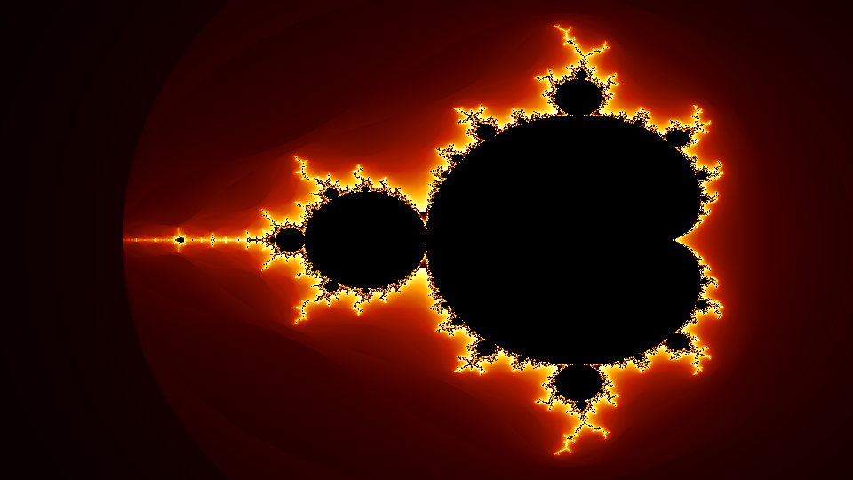
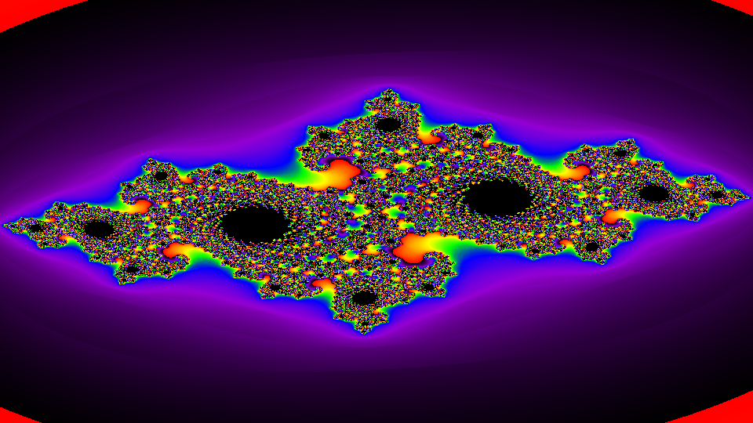
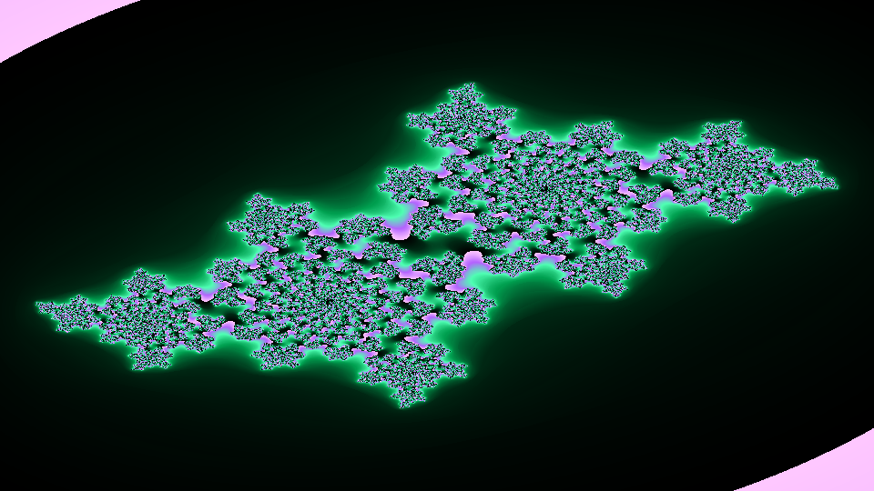
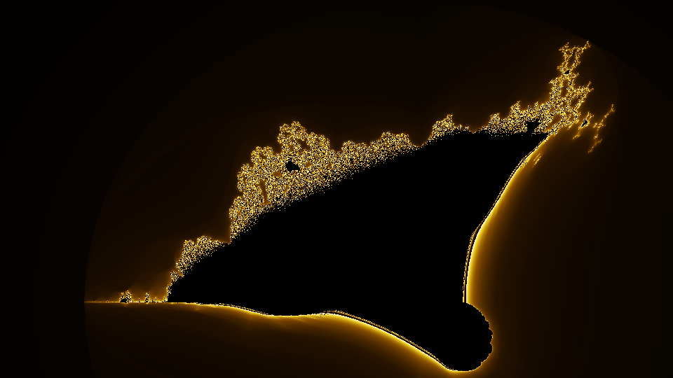

# 🌀 FractalForge

> **Interactive fractal explorer** — render Mandelbrot sets, Julia sets, and the Burning Ship fractal in your terminal or as high-resolution PNG images.

---

## Gallery

<table>
<tr>
  <td align="center"><br/><sub><b>Mandelbrot · fire palette</b></sub></td>
  <td align="center"><br/><sub><b>Julia Spiral · psychedelic palette</b></sub></td>
</tr>
<tr>
  <td align="center"><br/><sub><b>Seahorse Valley · ice palette</b></sub></td>
  <td align="center"><br/><sub><b>Julia Dragon · aurora palette</b></sub></td>
</tr>
<tr>
  <td align="center"><br/><sub><b>Julia Snowflake · ocean palette</b></sub></td>
  <td align="center"><br/><sub><b>Burning Ship · gold palette</b></sub></td>
</tr>
</table>

---

## Features

- **Three fractal types** — Mandelbrot set, Julia sets (with configurable constant `c`), and Burning Ship
- **8 curated presets** — hand-picked coordinates for the most beautiful regions
- **6 color palettes** — fire, ice, psychedelic, ocean, gold, aurora, and monochrome
- **Smooth coloring** — continuous escape-time algorithm eliminates banding artifacts
- **Terminal ASCII art** — colorized with Rich's 24-bit color support
- **High-res PNG export** — lossless output at any resolution (default 1920×1080)
- **Zoom sequences** — generate ordered PNG frames for animated zooms
- **Vectorized computation** — numpy-powered, renders a 1080p frame in under 2 seconds

---

## Project Structure

```
FractalForge/
├── main.py                  # Entry point
├── requirements.txt         # Python dependencies
├── fractalforge/
│   ├── __init__.py
│   ├── fractals.py          # Core math: Mandelbrot, Julia, Burning Ship
│   ├── colors.py            # Palette system + ASCII mapper
│   ├── renderer.py          # Terminal + PNG rendering pipeline
│   └── cli.py               # Click CLI (view / save / gallery / zoom)
└── assets/                  # Sample renders
    ├── classic_fire.png
    ├── julia_spiral_psychedelic.png
    ├── seahorse_ice.png
    ├── julia_dragon_aurora.png
    ├── julia_snowflake_ocean.png
    └── burning_ship_gold.png
```

---

## Installation

```bash
git clone https://github.com/kareemrt/clauder.git
cd clauder
pip install -r requirements.txt
```

---

## Quick Start

### View in terminal (ASCII art)
```bash
# Classic Mandelbrot with fire palette
python main.py view classic --palette fire

# Julia set — dragon wings, aurora palette
python main.py view julia_dragon --palette aurora

# All available options
python main.py view --help
```

### Save to PNG
```bash
# 1920×1080 PNG
python main.py save seahorse --palette ice

# Custom resolution and output name
python main.py save spiral --palette psychedelic --width 3840 --height 2160 --output my_spiral.png
```

### Browse all presets
```bash
python main.py gallery --palette psychedelic
```

### Generate a zoom sequence
```bash
# 10 zoom frames into Seahorse Valley
python main.py zoom seahorse --palette ice --frames 10 --width 1280 --height 720
```

---

## CLI Reference

```
python main.py [COMMAND] [OPTIONS]

Commands:
  view      Render a fractal as ASCII art in the terminal
  save      Render a fractal to a high-resolution PNG file
  gallery   Show all presets as a quick ASCII gallery
  zoom      Generate a zoom-sequence of PNG frames
  presets   List all available fractal presets
  palettes  List all available color palettes
```

### `view` options
| Flag | Default | Description |
|------|---------|-------------|
| `PRESET` | `classic` | Fractal preset name |
| `--palette / -p` | `fire` | Color palette |
| `--width / -W` | `120` | ASCII output width (chars) |
| `--height / -H` | `40` | ASCII output height (lines) |
| `--max-iter / -i` | preset default | Override max iterations |

### `save` options
| Flag | Default | Description |
|------|---------|-------------|
| `PRESET` | `classic` | Fractal preset name |
| `--palette / -p` | `fire` | Color palette |
| `--width / -W` | `1920` | Image width in pixels |
| `--height / -H` | `1080` | Image height in pixels |
| `--output / -o` | `<preset>_<palette>.png` | Output filename |
| `--max-iter / -i` | preset default | Override max iterations |

---

## Available Presets

| Name | Type | Description |
|------|------|-------------|
| `classic` | Mandelbrot | Full Mandelbrot set — the iconic picture |
| `seahorse` | Mandelbrot | Seahorse Valley — intricate spiral tendrils |
| `elephant` | Mandelbrot | Elephant Valley — curling proboscis shapes |
| `spiral` | Mandelbrot | Deep spiral — hypnotic infinite zoom |
| `julia_spiral` | Julia | c ≈ −0.727+0.189i — swirling galaxy |
| `julia_dragon` | Julia | c = −0.4+0.6i — dragon wings |
| `julia_snowflake` | Julia | c = 0.285+0.01i — delicate snowflake |
| `burning_ship` | Burning Ship | Jagged, flame-like fractal structure |

---

## Available Palettes

| Name | Character |
|------|-----------|
| `fire` | Black → deep red → orange → yellow → white |
| `ice` | Black → midnight blue → cyan → white |
| `psychedelic` | Black → violet → blue → green → yellow → red |
| `ocean` | Black → navy → teal → seafoam → white |
| `gold` | Black → brown → amber → gold → cream |
| `aurora` | Black → forest green → cyan → violet → pink |
| `monochrome` | Black → white |

---

## How It Works

### Escape-Time Algorithm

The Mandelbrot set is the set of complex numbers `c` for which the sequence:

```
z₀ = 0
zₙ₊₁ = zₙ² + c
```

does **not** diverge (i.e., remains bounded). Points are colored based on how quickly `|z|` exceeds 2 (the "escape radius").

### Smooth Coloring

Raw iteration counts produce harsh color bands. FractalForge uses the **continuous escape time** formula:

```
smooth = n - log₂(log₂(|z|))
```

where `n` is the escape iteration and `|z|` is the final magnitude. This produces a smooth, band-free gradient.

### Vectorized Computation

All computation uses **numpy broadcasting** — the entire grid of complex numbers is iterated simultaneously rather than pixel-by-pixel, making renders 50–100× faster than pure Python loops.

```python
# The core loop — no explicit Python iteration over pixels
Z[mask] = Z[mask] ** 2 + C[mask]
newly_escaped = mask & (np.abs(Z) > 2.0)
```

---

## Examples

```bash
# Psychedelic full Mandelbrot
python main.py save classic --palette psychedelic

# Deep Seahorse Valley in ice colors at 4K
python main.py save seahorse --palette ice --width 3840 --height 2160 --max-iter 1024

# Terminal preview of Burning Ship
python main.py view burning_ship --palette gold --width 140 --height 50

# 16-frame zoom into the spiral preset
python main.py zoom spiral --palette aurora --frames 16
```

---

## Dependencies

| Package | Version | Purpose |
|---------|---------|---------|
| `numpy` | ≥ 1.26 | Vectorized fractal computation |
| `Pillow` | ≥ 10.0 | PNG image export |
| `rich` | ≥ 13.0 | Beautiful terminal UI + coloring |
| `click` | ≥ 8.1 | CLI argument parsing |

---

## License

MIT — do whatever you want with it. Make something beautiful.
