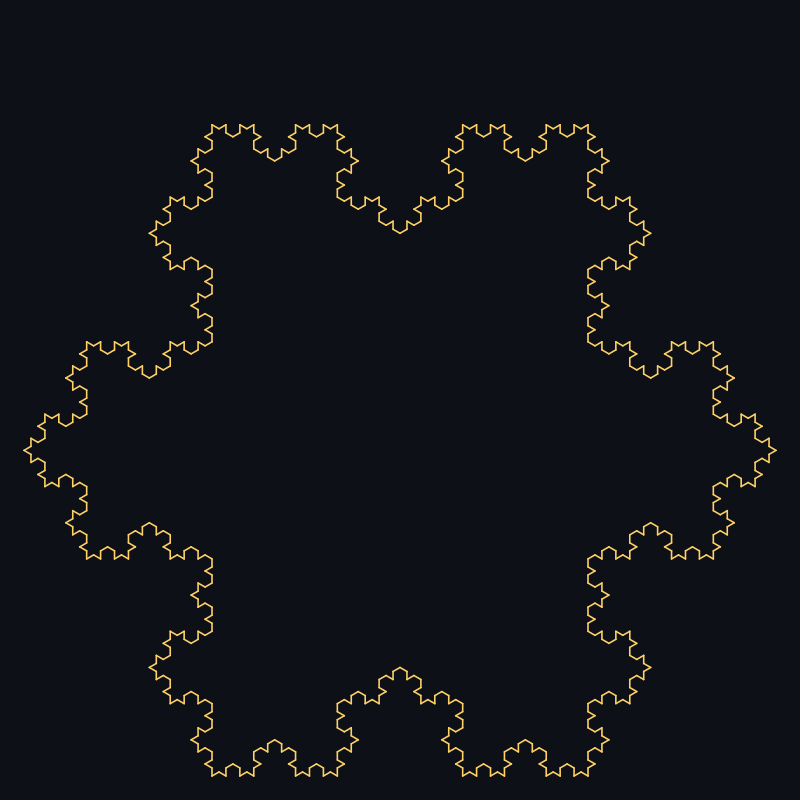
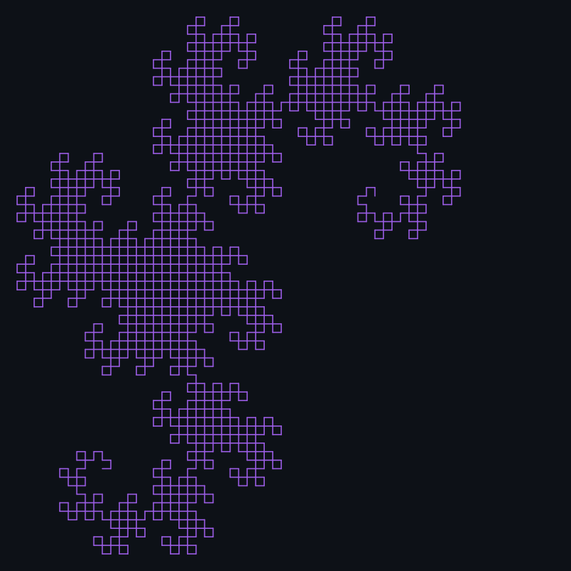
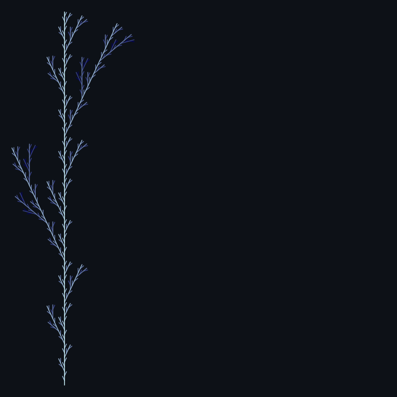
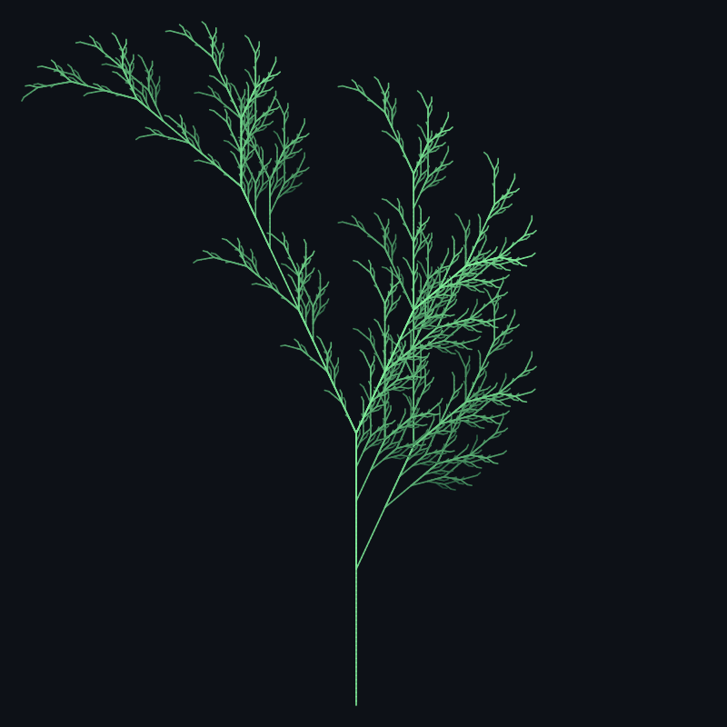
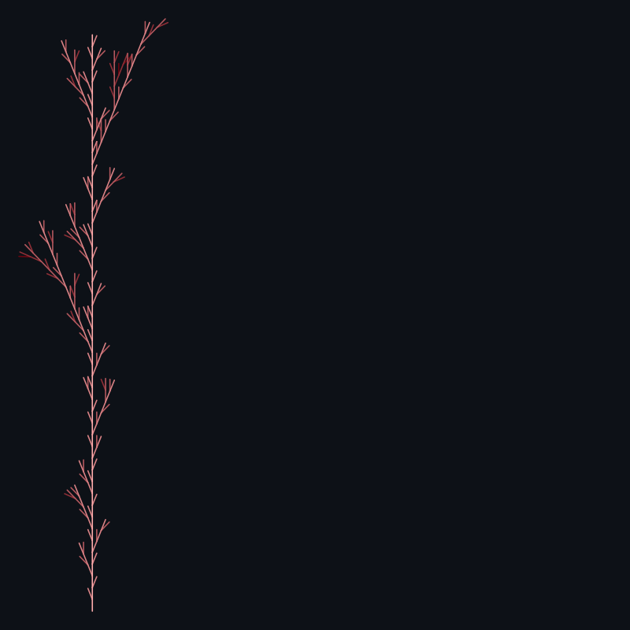

# 🌿 lsystemgarden

**Grow botanical fractals from formal grammars — pure Python, zero dependencies.**

`lsystemgarden` is a tiny engine that turns a [Lindenmayer system](https://en.wikipedia.org/wiki/L-system)
(an axiom plus a handful of string-rewriting rules) into a turtle-graphics path,
then renders that path as a depth-shaded SVG. The same few hundred lines of
code that draw a Koch snowflake also grow a fern, fold a dragon curve, and
branch a stochastic shrub — because underneath, they're all the same trick:
*rewrite a string, then walk a turtle through it.*

[](https://www.python.org/)
[](./tests)
[](./pyproject.toml)
[](./LICENSE)

---

## Gallery

| | | |
|---|---|---|
|  |  |  |
| `koch_snowflake` — the classic, grown from a triangle | `sierpinski_triangle` — traced as one continuous curve | `dragon_curve` — the Heighway dragon, 11 generations deep |
|  |  |  |
| `binary_tree` — deterministic branching | `fractal_plant` — Prusinkiewicz's fern, from *The Algorithmic Beauty of Plants* | `wild_bush` — **stochastic**: every branch rolls its own shape |

Every image above is committed, untouched, exactly as `lsystemgarden render` produced it — see [`examples/`](./examples).

## How it works

```
  axiom + rules            expand()              command string         interpret()           segments              render()
  ──────────────   ───────────────────────▶   ───────────────────▶  ───────────────────▶  ──────────────▶   ┌──────────────┐
  "X"                rewrite every symbol      "F-[[X]+X]+F[+FX]-X"   turtle walks F/f/      [Segment(x1,y1,  │  gradient SVG │
  X → F-[[X]+X]      n times, in parallel,         (after 6 gens,      +/-/[/] and emits      x2,y2,depth),   │  shaded by     │
       +F[+FX]-X      across the whole string       thousands of        a line per "F"         ...]            │  branch depth │
  F → FF              (stochastic rules               symbols)                                                │                │
  angle = 25°          pick weighted choices)                                                                  └──────────────┘
```

1. **`lsystem.py`** — a `LSystem` rewrites every symbol in a string according to production rules, for *n* generations. Rules may be a single deterministic replacement, or a weighted list of replacements (a stochastic rule), so the same engine can produce both crystalline curves and organic, varied growth.
2. **`turtle.py`** — interprets the resulting command string: `F`/`G` move forward and draw, `f` moves without drawing, `+`/`-` turn, `[`/`]` push/pop a branch point. Every other symbol is grammar-only (e.g. `X` placeholders) and has no drawing effect.
3. **`render_svg.py`** — projects the drawn segments into an SVG canvas and colors each line by its branch depth, interpolating between two hex colors — this is what turns a flat line drawing into something that reads as a plant or a snowflake.
4. **`presets.py`** — the six grammars shown in the gallery above, each just an axiom, a rule dict, an angle, and a color pair.
5. **`cli.py`** — `lsystemgarden list` / `lsystemgarden render` ties it all together.

## Installation

```bash
git clone <this-repo>
cd lsystemgarden
pip install -e .
```

No third-party dependencies — the whole engine is Python's standard library (`math`, `random`, `argparse`, `dataclasses`).

## Usage

```bash
# see what's available
$ python -m lsystemgarden list
binary_tree            angle=25     iterations=4   A symmetric branching tree, three new shoots per generation.
dragon_curve           angle=90     iterations=11  The Heighway dragon curve, folded eleven generations deep.
fractal_plant          angle=25     iterations=6   Prusinkiewicz's fern-like plant, from The Algorithmic Beauty of Plants.
koch_snowflake         angle=60     iterations=4   The classic Koch snowflake, grown from an equilateral triangle.
sierpinski_triangle    angle=120    iterations=6   Sierpinski's triangle, traced as a single Lindenmayer curve.
wild_bush              angle=22     iterations=4   A stochastic shrub: every branch independently rolls its own shape.

# render one
$ python -m lsystemgarden render fractal_plant -o my_fern.svg --iterations 7

# tweak a stochastic preset with a different seed for a different shrub
$ python -m lsystemgarden render wild_bush -o shrub_42.svg --seed 42

# override the color gradient
$ python -m lsystemgarden render koch_snowflake -o snowflake.svg --start-color "#ffffff" --end-color "#00bfff"
```

### Using it as a library

```python
from lsystemgarden.lsystem import LSystem
from lsystemgarden.turtle import interpret
from lsystemgarden.render_svg import render

system = LSystem(axiom="F", rules={"F": "F[+F]F[-F]F"}, angle=25, seed=None)
commands = system.expand(iterations=4)
segments = interpret(commands, angle=25, step=10)
svg = render(segments, start_color="#caf0f8", end_color="#03045e")
open("tree.svg", "w").write(svg)
```

### Defining your own preset

A preset is just data — drop a new entry into `PRESETS` in [`lsystemgarden/presets.py`](./lsystemgarden/presets.py):

```python
"my_plant": Preset(
    axiom="X",
    rules={"X": "F[+X][-X]FX", "F": "FF"},
    angle=20,
    iterations=6,
    step=4,
    start_color="#ffffff",
    end_color="#000000",
),
```

Stochastic rules work the same way, just give the rule a list of `(weight, replacement)` pairs instead of a single string — see `wild_bush` for a working example.

## Project structure

```
.
├── lsystemgarden/
│   ├── __init__.py       # public exports: LSystem, Segment, interpret
│   ├── __main__.py       # `python -m lsystemgarden`
│   ├── lsystem.py        # grammar expansion engine (deterministic + stochastic rules)
│   ├── turtle.py         # turtle-graphics interpreter -> list[Segment]
│   ├── render_svg.py     # Segment list -> depth-gradient SVG markup
│   ├── presets.py        # the 6 named fractals in the gallery
│   └── cli.py            # `list` / `render` subcommands
├── tests/
│   ├── test_lsystem.py
│   ├── test_turtle.py
│   ├── test_render_svg.py
│   └── test_cli.py
├── examples/              # the gallery SVGs, committed as-is
├── pyproject.toml
└── LICENSE
```

## Testing

```bash
pip install pytest
pytest -q
```

31 tests cover grammar expansion (including reproducible stochastic rules), turtle interpretation (branch save/restore, unbalanced-bracket errors), SVG well-formedness, and the CLI end-to-end for every preset.

## Why this, of all things

Most "fractal generator" demos hardcode one shape. The interesting part of
L-systems is that the *same four-symbol interpreter* (`F`, `+`, `-`, `[]`)
is expressive enough to describe a snowflake, a space-filling curve, and a
fern, just by changing a one-line grammar — and that adding *randomness to
the grammar itself* (rather than to the rendering) is enough to turn a
rigid tree into something that reads as alive. That's the whole project:
one small interpreter, six very different gardens.

## License

MIT — see [LICENSE](./LICENSE).
