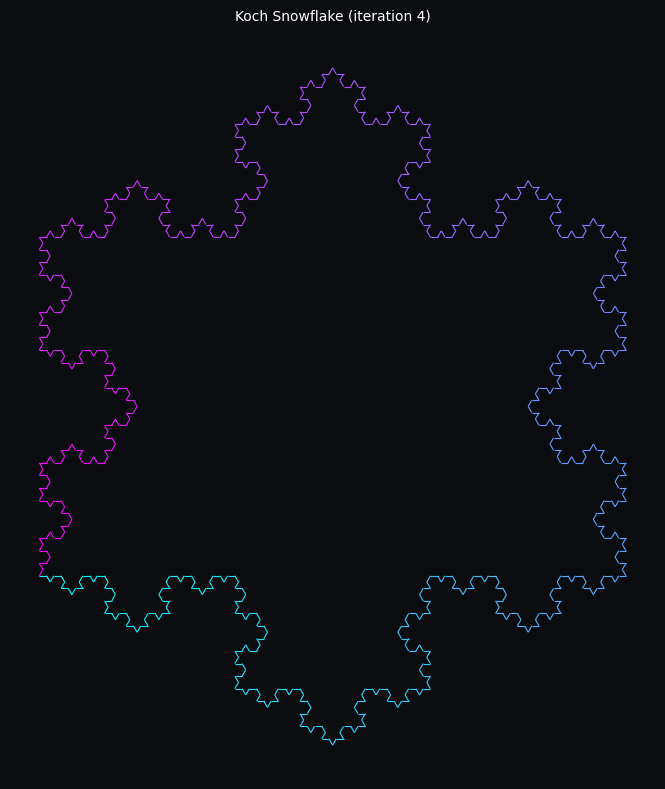
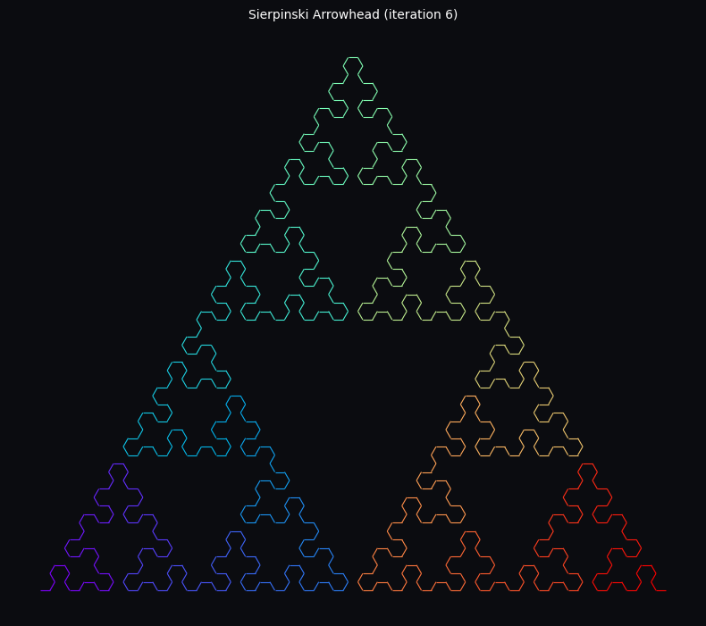
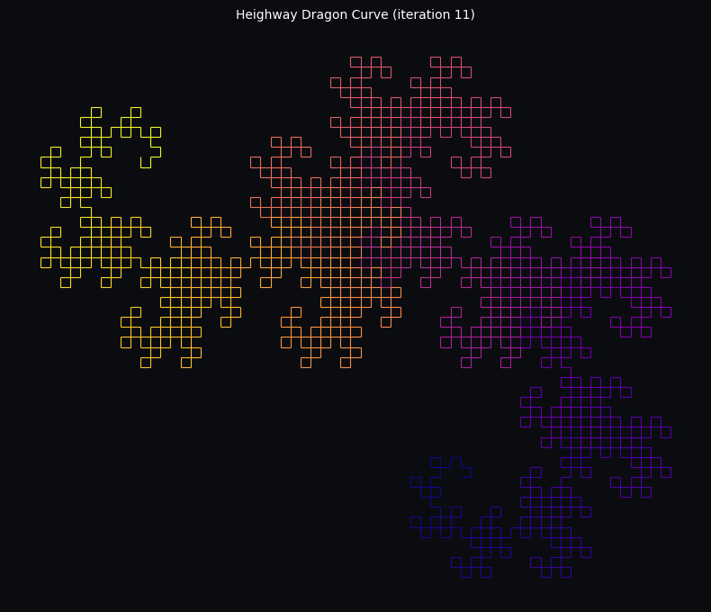
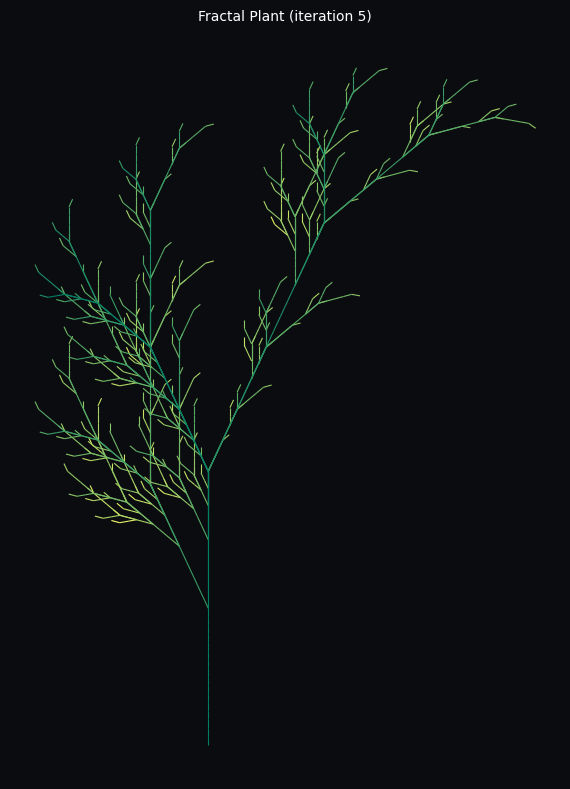
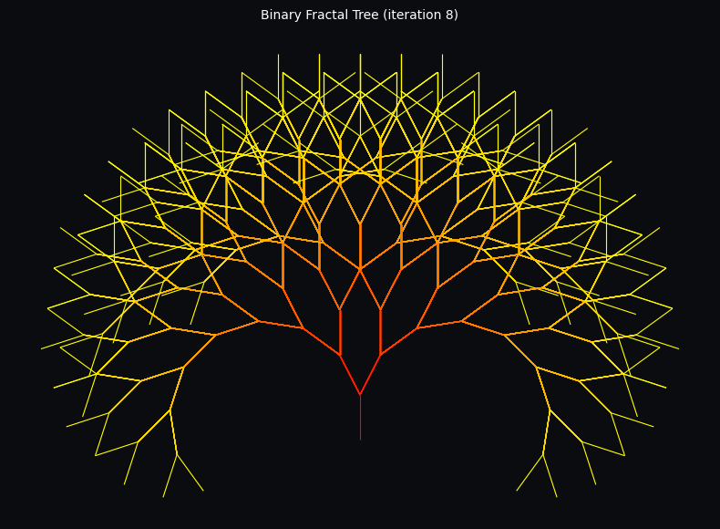
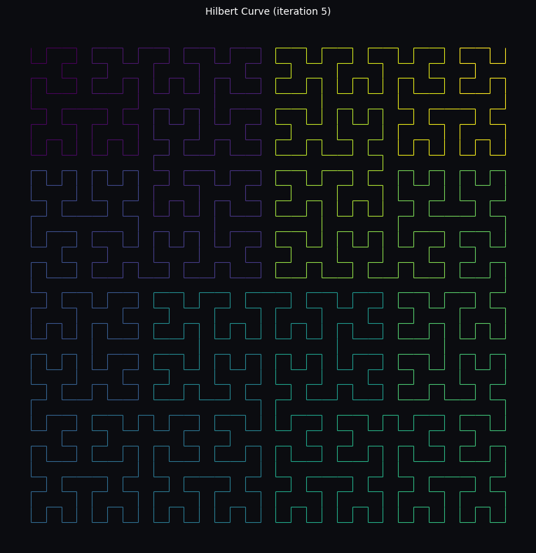
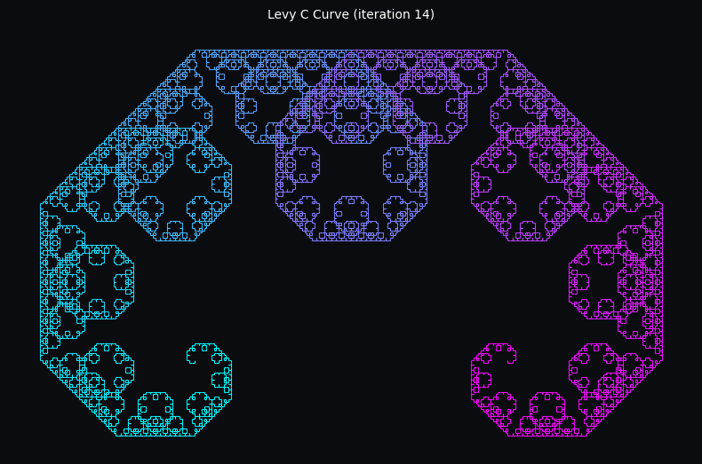
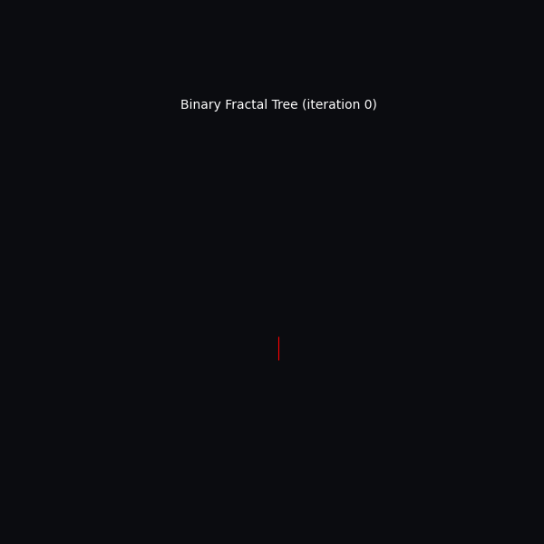

# Fractal Garden 🌿

Grow and render [Lindenmayer-system](https://en.wikipedia.org/wiki/L-system) (L-system)
fractals from the command line — snowflakes, dragon curves, space-filling curves,
and procedurally branching plants and trees, rendered as PNGs or animated GIFs.

An L-system is a tiny string-rewriting grammar: start with an *axiom* string,
repeatedly replace symbols according to a few *production rules*, then hand the
resulting string to a turtle that walks forward, turns, and branches to draw it.
A handful of characters and a couple of rewrite rules is enough to generate
infinitely detailed coastlines, snowflakes, and trees.

## Gallery

| Koch Snowflake | Sierpinski Arrowhead | Heighway Dragon Curve |
| --- | --- | --- |
|  |  |  |

| Fractal Plant | Binary Fractal Tree | Hilbert Curve |
| --- | --- | --- |
|  |  |  |

| Levy C Curve | Growing a Binary Tree |
| --- | --- |
|  |  |

## Project structure

```
.
├── fractal_garden/        # the package
│   ├── lsystem.py          # L-system rewriting engine + turtle interpreter
│   ├── presets.py           # gallery of built-in L-systems
│   ├── render.py             # matplotlib rendering (static images + GIFs)
│   ├── cli.py                  # argparse command-line interface
│   ├── __main__.py             # `python -m fractal_garden` entry point
│   └── __init__.py
├── tests/                  # pytest unit tests for the engine and presets
├── examples/               # generated images shown in this README
├── pyproject.toml          # packaging + `fractal-garden` console script
└── requirements.txt
```

## How it works

1. **`LSystem.expand(iterations)`** repeatedly rewrites the axiom string using the
   production rules (e.g. `F -> F[+F]F[-F]F`).
2. **`interpret(...)`** walks a turtle through the resulting string:
   - a *drawing* character moves forward and records a line segment
   - `+` / `-` turn the turtle left/right by the system's angle
   - `[` / `]` push/pop the turtle's position and heading, enabling branching
3. **`render.py`** turns the resulting line segments into a `matplotlib`
   `LineCollection`, colored by branch depth (for trees/plants) or by position
   along the curve (for snowflakes, dragon curves, etc.), and saves a PNG or an
   animated GIF showing the fractal grow iteration by iteration.

## Installation

```bash
python -m venv .venv && source .venv/bin/activate
pip install -r requirements.txt
```

(or `pip install -e .` to install the `fractal-garden` console script.)

## Usage

List the built-in presets:

```bash
python -m fractal_garden list
```

```
KEY                    NAME                         DEFAULT ITERS  DESCRIPTION
dragon-curve           Heighway Dragon Curve        11             The famous paper-folding dragon curve.
fractal-plant          Fractal Plant                5              Lindenmayer's original branching plant model.
fractal-tree           Binary Fractal Tree          8              A symmetric binary branching tree.
hilbert-curve          Hilbert Curve                5              A space-filling curve that visits every cell of a grid.
koch-snowflake         Koch Snowflake               4              The classic von Koch snowflake curve.
levy-c-curve           Levy C Curve                 14             A self-similar fractal curve resembling jagged coastline.
sierpinski-arrowhead   Sierpinski Arrowhead         6              Sierpinski triangle traced as a single continuous curve.
```

Render a fractal to a PNG:

```bash
python -m fractal_garden render fractal-tree -o tree.png --cmap autumn
```

Render a growth animation showing iterations 0 through N:

```bash
python -m fractal_garden animate fractal-plant -n 6 -o plant.gif --cmap summer
```

Inspect a preset's grammar without rendering anything:

```bash
python -m fractal_garden info dragon-curve -n 11
```

### Options

| Flag | Description |
| --- | --- |
| `--iterations`, `-n` | Number of rewrite iterations (defaults to a sensible per-preset value) |
| `--cmap` | Any [matplotlib colormap](https://matplotlib.org/stable/users/explain/colors/colormaps.html) name |
| `--linewidth` | Line width of the drawn segments |
| `--size` | Figure size in inches (square) |
| `--output`, `-o` | Output file path |
| `--dpi` | Image DPI (`render` only) |
| `--fps` | Frames per second (`animate` only) |
| `--custom` | Path to a JSON file describing your own L-system (see below) |

### Defining your own L-system

```json
{
  "name": "My Fractal",
  "axiom": "F+F+F+F",
  "rules": { "F": "F+F-F-FF+F+F-F" },
  "angle": 90,
  "draw_chars": "F",
  "start_heading": 0,
  "default_iterations": 3
}
```

```bash
python -m fractal_garden render --custom my_fractal.json -o my_fractal.png
```

## Running the tests

```bash
pip install pytest
python -m pytest
```
