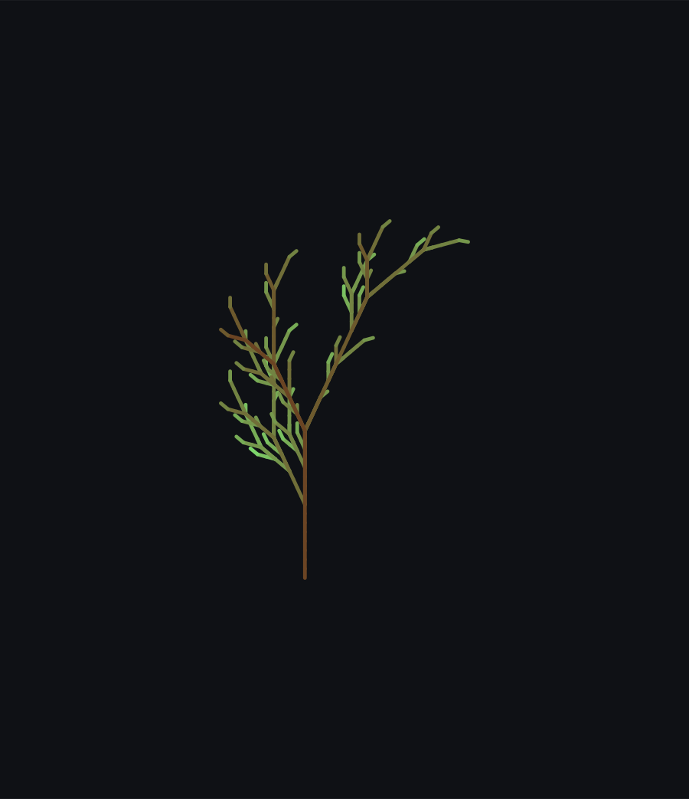
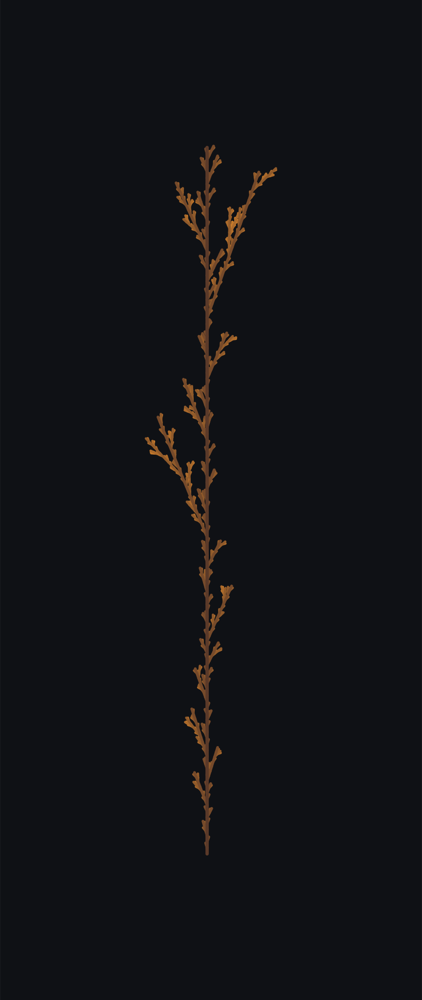
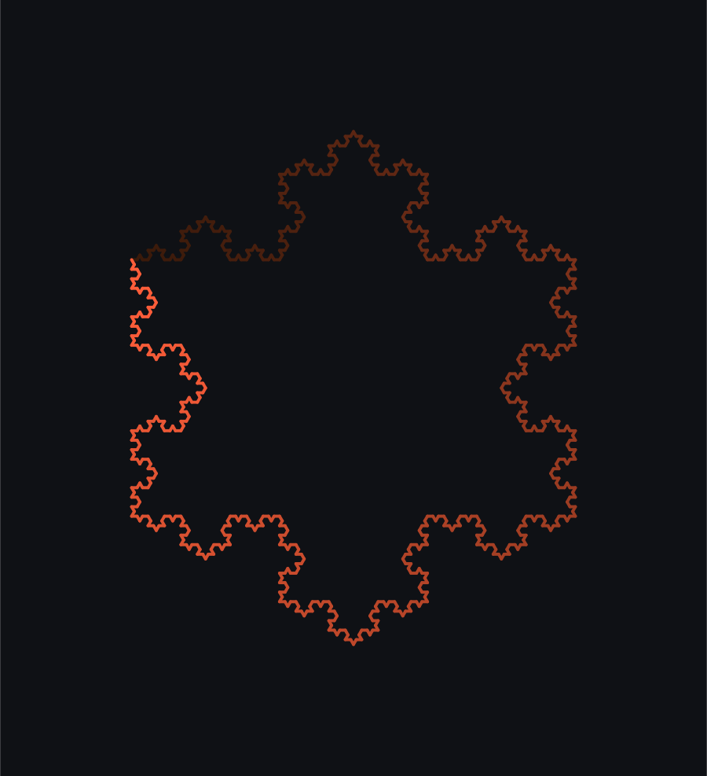
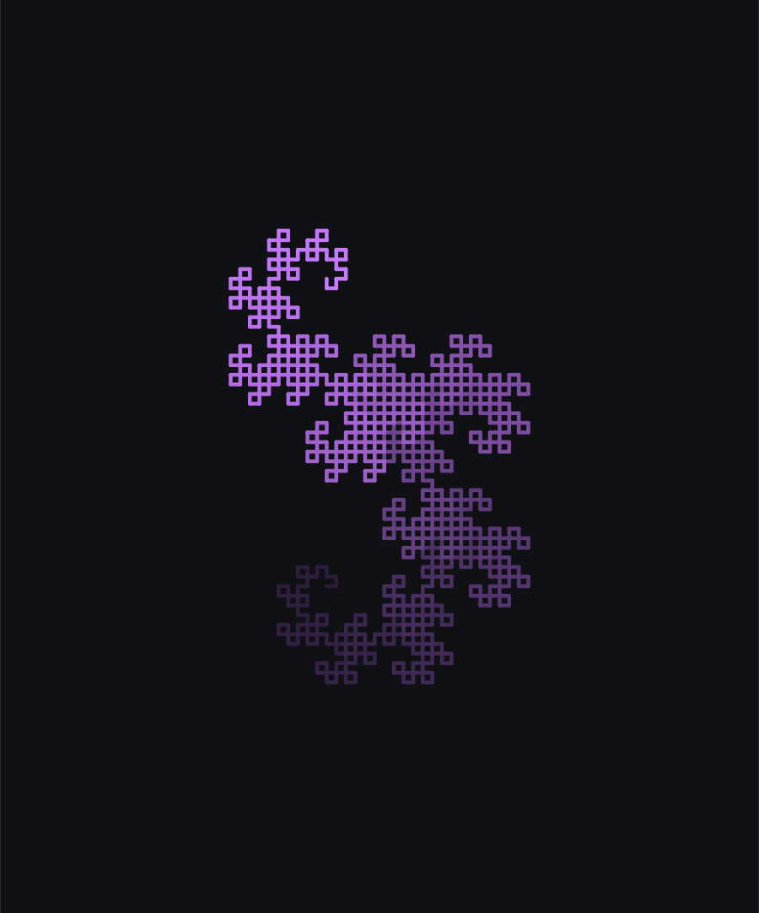
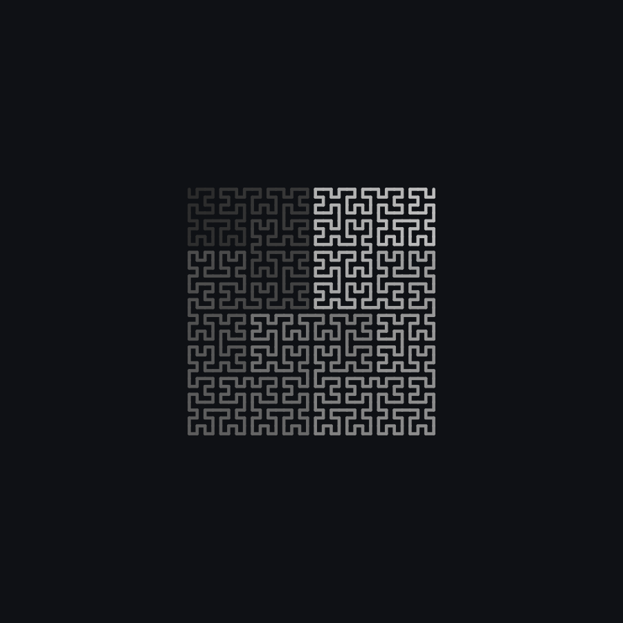
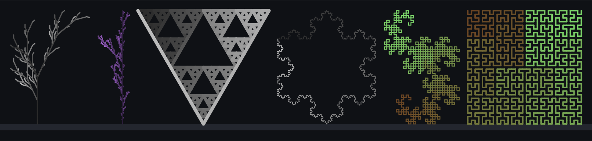

# 🌿 Fractal Garden

Grow fractal plants and curves from [L-systems](https://en.wikipedia.org/wiki/L-system) and
render them as scalable, dependency-free SVG art straight from the command line.

An L-system is just a string-rewriting grammar: start with a tiny "seed" string, repeatedly
replace each character according to a small set of rules, then hand the resulting (very long)
string to a turtle that draws a line every time it sees `F`, turns on `+`/`-`, and
branches on `[`/`]`. A handful of simple rules and a few iterations later, you get a fern, a
snowflake, or a space-filling curve.

```
"X"
 → "F+[[X]-X]-F[-FX]+X"
 → "FF+[[F+[[X]-X]-F[-FX]+X]-F+[[X]-X]-F[-FX]+X]-FF[-FFF+[[X]-X]-F[-FX]+X]+F+[[X]-X]-F[-FX]+X"
 → ... (and so on, into a fern)
```

## Gallery

| Species | Preview |
| --- | --- |
| **Fractal Fern** — the textbook Barnsley-style L-system |  |
| **Wild Bush** — a stochastic shrub where every branch rolls its own shape |  |
| **Sierpinski Arrowhead** — the Sierpinski triangle as one continuous curve |  |
| **Koch Snowflake** — three Koch curves joined into a jagged snowflake |  |
| **Dragon Curve** — the Heighway dragon, born from folding paper in half |  |
| **Hilbert Curve** — a space-filling curve visiting every grid cell once |  |

A whole `garden` scene, growing several species side by side on one ground line:



All of the above are regenerated by [`scripts/generate_gallery.py`](scripts/generate_gallery.py)
and committed as plain SVG — no binary assets, no rendering dependencies.

## Quick start

Requires Python 3.9+. No third-party dependencies for the core library or CLI.

```bash
# List the available species
python3 -m fractal_garden list

# Grow a single plant to an SVG file
python3 -m fractal_garden grow fern -o fern.svg --seed 42 --palette spring

# Grow a whole garden scene
python3 -m fractal_garden garden -o garden.svg --seed 7

# Pipe SVG straight to stdout
python3 -m fractal_garden grow dragon --palette twilight | head -c 200
```

Or install it as a package and use the `fractal-garden` entry point:

```bash
pip install -e .
fractal-garden grow hilbert -o hilbert.svg --palette mono
```

### CLI reference

```
fractal-garden list
fractal-garden grow <species> [-o FILE] [--seed N] [--iterations N]
                               [--angle-jitter DEG] [--palette NAME]
                               [--background "#rrggbb"] [--width PX]
                               [--color-by {auto,depth,position,solid}]
fractal-garden garden [--species KEY [KEY ...]] [-o FILE] [--seed N] [--width PX]
```

Available palettes: `spring`, `autumn`, `twilight`, `ocean`, `fire`, `mono`
(see [`fractal_garden/palette.py`](fractal_garden/palette.py)).

## Using it as a library

```python
from fractal_garden import garden, palette, svgrender

segments = garden.grow("fern", seed=42, iterations=5)
svg = svgrender.render_svg(segments, palette=palette.resolve("spring"))
open("fern.svg", "w").write(svg)
```

## How it works

```
fractal_garden/
├── lsystem.py    # string-rewriting engine (deterministic + stochastic rules)
├── turtle.py     # turns a command string into line segments (Segment objects)
├── species.py    # presets: axiom, rules, angle, iterations, colours per species
├── palette.py    # named colour palettes + hex interpolation
├── svgrender.py  # Segment lists -> standalone SVG documents and "garden" scenes
├── garden.py     # ties it together: species -> expanded string -> segments
└── cli.py        # `fractal-garden` command-line interface
```

1. **`lsystem.expand`** rewrites the species' `axiom` using its `rules` for `iterations` rounds.
   Rules can be a plain replacement string, or a list of `(replacement, weight)` pairs for
   stochastic species like `bush`, where each branch independently rolls its own shape.
2. **`turtle.run`** walks the resulting string, emitting a `Segment(x1, y1, x2, y2, depth)` for
   every `F`/`G`, turning on `+`/`-` (optionally with random jitter for a more organic look),
   and pushing/popping turtle state on `[`/`]` so branches can fork and rejoin.
3. **`svgrender`** measures the segments' bounding box, colours each one by branch depth (or by
   position along the curve for branchless fractals), tapers stroke width with depth, and emits
   an `<svg>` document. `render_garden` repeats this for several plants and lines them up on a
   shared ground line.

## Species

| Key | Name | Axiom | Angle | Notes |
| --- | --- | --- | --- | --- |
| `fern` | Fractal Fern | `X` | 25° | Classic Barnsley-style recursive frond |
| `bush` | Wild Bush | `F` | 22° | Stochastic rules + angle jitter for an organic shrub |
| `sierpinski` | Sierpinski Arrowhead | `F-G-G` | 120° | Sierpinski triangle as one continuous path |
| `koch` | Koch Snowflake | `F--F--F` | 60° | Three Koch curves forming a snowflake |
| `dragon` | Dragon Curve | `FX` | 90° | The Heighway dragon |
| `hilbert` | Hilbert Curve | `A` | 90° | Space-filling curve |

## Development

```bash
pip install -e ".[dev]"
pytest                          # 31 tests covering the L-system, turtle, and renderer
python3 scripts/generate_gallery.py   # regenerate gallery/*.svg
```
