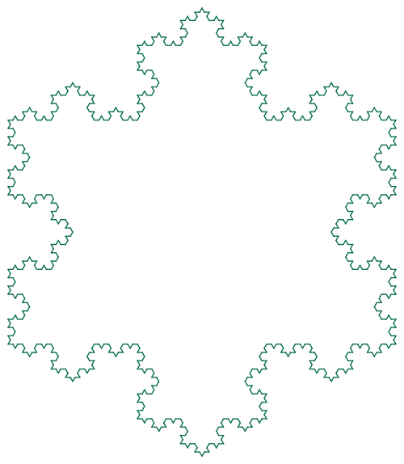
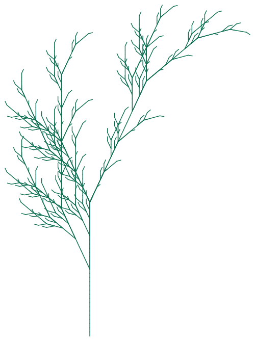
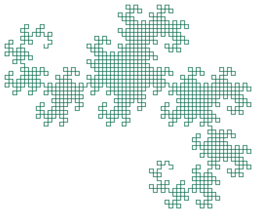
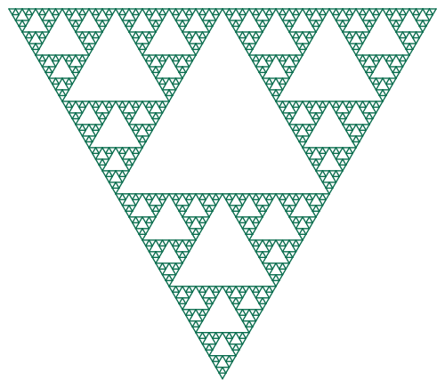
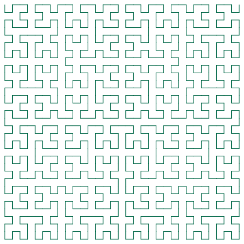
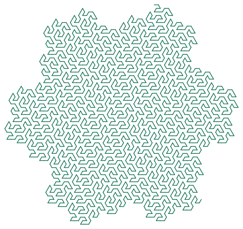

# lsystems

**Procedurally generate fractal curves from Lindenmayer (L-) systems and render
them as standalone, scalable SVGs.** Pure Python standard library, no runtime
dependencies, fully unit tested.

<p align="center">
  
  
  
</p>
<p align="center">
  
  
  
</p>

## What's an L-system?

A Lindenmayer system rewrites a short starting string (the **axiom**) by
repeatedly substituting every character according to a set of **production
rules**. After a handful of iterations, a one-line description like

```
axiom: X
rules: X -> F+[[X]-X]-F[-FX]+X, F -> FF
angle: 25°
```

expands into thousands of symbols. Feeding that symbol string to a **turtle**
(move forward, turn left, turn right, push/pop position) traces a path —
and that path is the fractal plant pictured above. The same trick produces
the Koch snowflake, the Sierpinski triangle, space-filling curves like
Hilbert's and Gosper's, and any custom fractal you can describe with a rule
set.

## Features

- Pure-Python L-system string expansion (`lsystems.core.LSystem`)
- A small turtle-graphics interpreter with push/pop branching support
  (`lsystems.turtle.TurtleInterpreter`)
- A dependency-free SVG writer that auto-fits the drawing to a target width
  (`lsystems.svg.segments_to_svg`)
- Seven classic presets: Koch snowflake, Koch island, Sierpinski triangle,
  dragon curve, fractal plant, Hilbert curve, Gosper curve
- A CLI for listing presets, rendering them, or rendering your own
  axiom/rule/angle combination
- 25 unit tests covering the rewriting engine, turtle geometry, SVG output,
  and every preset

## Project structure

```
Clauder/
├── lsystems/
│   ├── core.py       # LSystem: axiom + rules -> expanded string
│   ├── turtle.py     # TurtleInterpreter: symbol string -> line Segments
│   ├── svg.py         # segments_to_svg: Segments -> SVG document
│   ├── presets.py     # named, ready-to-render L-systems
│   ├── cli.py          # `lsystems list|render|custom`
│   └── __main__.py     # `python -m lsystems ...` entry point
├── tests/               # pytest suite (25 tests)
└── examples/            # pre-rendered SVGs used above
```

### Data flow

```mermaid
flowchart LR
    A["axiom + rules\n(LSystem)"] -->|expand(n)| B["expanded symbol string"]
    B -->|TurtleInterpreter.interpret| C["list[Segment]\n(x1,y1 → x2,y2)"]
    C -->|segments_to_svg| D["SVG document"]
```

## Installation

No dependencies to install for the library/CLI itself — just Python 3.11+:

```bash
git clone <this repo>
cd Clauder
python3 -m lsystems list
```

(Tests use `pytest`: `pip install pytest`.)

## CLI usage

List the built-in presets:

```bash
$ python3 -m lsystems list
dragon-curve         Heighway dragon curve, generated by paper-folding rules.
fractal-plant        Binary-tree-like fractal plant, the canonical L-system example.
gosper-curve         Gosper curve (flowsnake), a space-filling curve with hexagonal symmetry.
hilbert-curve        Hilbert space-filling curve.
koch-island          Quadratic Koch island, a square-based variant of the Koch curve.
koch-snowflake       Koch snowflake: a triangle with each edge replaced by a Koch curve.
sierpinski-triangle  Sierpinski triangle traced with a single turtle path.
```

Render a preset to SVG:

```bash
python3 -m lsystems render fractal-plant -o plant.svg --iterations 6 --width 800
```

Render your own L-system:

```bash
python3 -m lsystems custom \
  --axiom F \
  --rule "F=F+F-F-F+F" \
  --angle 90 \
  --iterations 4 \
  -o my-curve.svg
```

## Library usage

```python
from lsystems import LSystem, TurtleInterpreter, segments_to_svg

system = LSystem(axiom="F", rules={"F": "F+F-F-F+F"})
instructions = system.expand(iterations=4)

segments = TurtleInterpreter(angle=90, start_heading=0).interpret(instructions)
svg = segments_to_svg(segments, width=600)

with open("curve.svg", "w") as f:
    f.write(svg)
```

## Running the tests

```bash
pip install pytest
python3 -m pytest tests/ -v
```

All 25 tests should pass — they exercise string expansion edge cases, turtle
geometry (forward movement, turning, branching, unbalanced brackets), SVG
well-formedness, and every preset rendering successfully.
