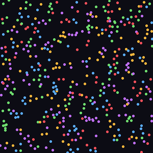
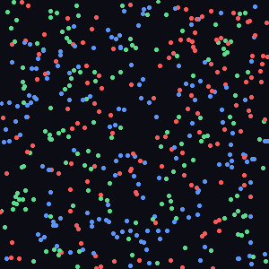
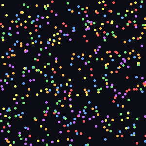
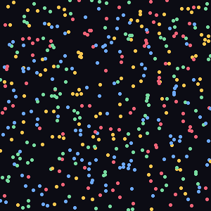

# Particle Life

**Artificial life from a single pairwise force rule.**

Hundreds of particles, split into a handful of "species", drift around a
toroidal world. Every pair of particles pushes or pulls on each other
according to one simple rule and their species. No species has a goal, no
particle has a brain — yet cells, swarms, predators, and chains emerge.

<p align="center">
  
  
</p>
<p align="center">
  
  
</p>

## How it works

The whole simulation rests on one force curve, applied to every pair of
particles `i` and `j` based on the distance `r` between them (normalized by
an interaction radius `r_max`) and an **attraction value** `A[type_i][type_j]`
looked up in a small matrix:

```
            repel always        attraction band (sign & strength from A)
        ┌───────────────────┬─────────────────────────────────────┐
 force  │    r / beta - 1    │   A * (1 - |2r - 1 - beta| / (1-beta))│   0
        └───────────────────┴─────────────────────────────────────┘
        0                  beta                                    1   (r / r_max)
```

* **Inside the repulsion core** (`r < beta`), every pair pushes apart —
  regardless of species — so particles never collapse into one point.
* **In the "social band"** (`beta < r < 1`), the force ramps from 0 up to
  `A[type_i][type_j]` and back to 0. Positive values pull species together,
  negative values push them apart.
* **Beyond `r_max`**, particles don't interact at all.

Each step, every particle sums these pairwise forces, updates its velocity
(with friction for damping), and moves — wrapping around the edges of the
world like Pac-Man. That's the entire model. The *attraction matrix* — one
number per pair of species — is the only thing that changes between the wildly
different behaviours below.

## Preset gallery

| Preset | Behaviour |
| --- | --- |
| `cells` | Each species attracts itself but repels its neighbour in a cycle. The result: drifting, flower-like blobs with stable membranes. |
| `chase` | A 3-species rock-paper-scissors — each species flees the one "ahead" of it and is drawn to the one "behind". Produces endless rotating vortices. |
| `chaos` | A dense, asymmetric web of six species with no fixed points. Nothing settles — turbulent, ever-shifting flow. |
| `small_clusters` | Mild self-attraction plus broad repulsion. Particles settle into many small, stable clusters scattered across the world. |

Run `python main.py --list-presets` to see this list with the live
descriptions from the code.

## Installation

```bash
git clone <this-repo>
cd Clauder
pip install -r requirements.txt
```

Requires Python 3.10+, NumPy, and Pillow.

## Usage

Generate an animated GIF of any preset:

```bash
python main.py --preset cells --particles 500 --frames 150 --output cells.gif
```

```
usage: particle-life [-h] [--preset {cells,chaos,chase,small_clusters}]
                      [--particles PARTICLES] [--frames FRAMES]
                      [--steps-per-frame STEPS_PER_FRAME] [--size SIZE]
                      [--output OUTPUT] [--seed SEED] [--list-presets]
```

| Flag | Default | Description |
| --- | --- | --- |
| `--preset` | `cells` | Which attraction matrix / rule set to simulate |
| `--particles` | `500` | Number of particles |
| `--frames` | `150` | Number of frames in the output GIF |
| `--steps-per-frame` | `2` | Simulation steps per rendered frame (higher = faster motion) |
| `--size` | `360` | Output image size in pixels (square) |
| `--output` | `output.gif` | Output GIF path |
| `--seed` | random | Random seed, for reproducible runs |

## Using it as a library

```python
from particle_life import ParticleSystem, SimulationConfig, get_preset
from particle_life.render import render_gif

preset = get_preset("chase")
config = SimulationConfig(
    num_particles=600,
    attraction_matrix=preset.matrix,
    r_max=preset.r_max,
    force_factor=preset.force_factor,
    friction=preset.friction,
)
system = ParticleSystem(config, seed=42)
render_gif(system, preset.colors, "chase.gif", frames=200)
```

## Project structure

```
particle_life/
├── simulation.py   # core toroidal physics (ParticleSystem, SimulationConfig)
├── presets.py      # named attraction matrices + colour palettes
├── render.py       # frame rendering and GIF assembly (Pillow)
└── cli.py          # command line interface
tests/
└── test_simulation.py
assets/             # pre-rendered demo GIFs used in this README
main.py             # entry point: python main.py --preset ...
```

## Running the tests

```bash
pip install -r requirements-dev.txt
pytest
```

## Ideas for extending this

- New presets: tweak `particle_life/presets.py` — small changes to the
  attraction matrix produce dramatically different emergent behaviour.
- Interactive viewer: swap the GIF renderer for a live `pygame`/`matplotlib`
  animation so you can nudge the attraction matrix and watch the world react.
- Spatial hashing: the current force computation is `O(n²)`; a grid-based
  neighbour search would allow many more particles at interactive speed.
