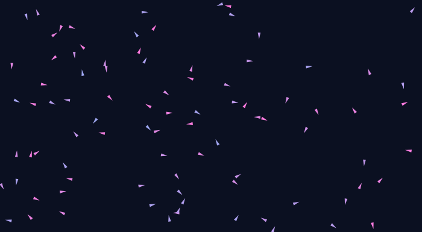
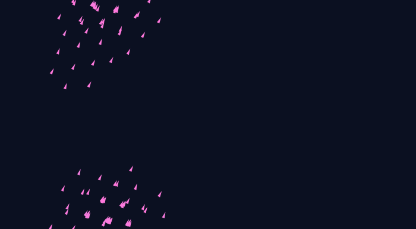
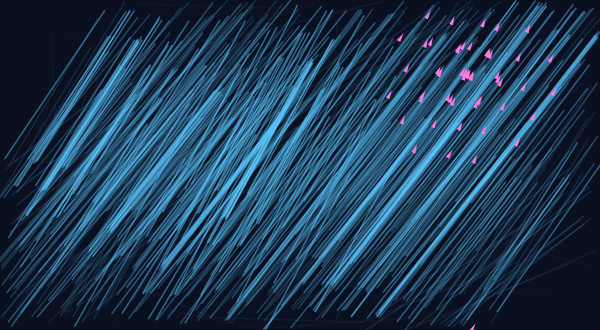
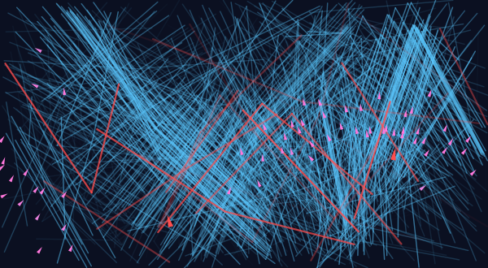
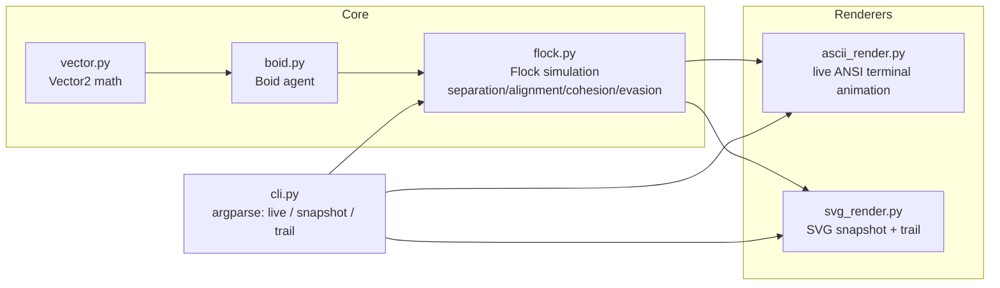

# Clauder — `murmuration`

**A from-scratch boids flocking simulation.** Zero dependencies, pure Python
standard library — watch emergent flocking behavior unfold from three simple
local rules, live in your terminal or rendered to SVG.

```
                 ⠀⠀⠀⠀⠀⠀⠀⠀⠀⠀⠀⠀⠀⠀⠀⠀⠀⠀⠀⠀⠀⠀⠀⠀⠀⠀⠀⠀⠀
        ↗               ↗   ↗
              ↗      ↗   ↗  ↗   ↗
         ↗   ↗   ↗    ↗  ↗     ↗
              ↗   ↗  ↗ ↗    ↗
        ↗   ↗      ↗  ↗  ↗
                ↗     ↗
       a thousand starlings, three rules, no leader
```

[](https://github.com/kareemrt/Clauder/actions/workflows/tests.yml)


[](LICENSE)

## Table of contents

- [What this is](#what-this-is)
- [Visuals](#visuals)
- [How it works](#how-it-works)
- [Architecture](#architecture)
- [Project structure](#project-structure)
- [Installation](#installation)
- [Usage](#usage)
- [Testing](#testing)
- [Ideas for extension](#ideas-for-extension)
- [License](#license)

## What this is

In 1986, Craig Reynolds showed that the complex, fluid motion of a bird
flock — a **murmuration** — doesn't require a leader, a plan, or global
awareness. Each bird (a "boid") only needs three local rules:

1. **Separation** — don't crowd your neighbors
2. **Alignment** — steer toward the average heading of nearby flockmates
3. **Cohesion** — steer toward the average position of nearby flockmates

Apply those three rules to every agent, every frame, and the *group*
exhibits behavior none of the individuals were ever told to produce:
swirling, splitting, merging, and — when a predator shows up — scattering
and re-forming.

This project implements that simulation from scratch (no NumPy, no
Pygame, no image libraries — just `math` and `random` from the standard
library) along with two renderers: a live ANSI terminal animation, and an
SVG snapshot/trail renderer for producing the images below.

## Visuals

**Before flocking (random initial velocities) → after ~250 steps:**

<table>
<tr>
<td></td>
<td></td>
</tr>
<tr>
<td align="center"><sub>t = 0</sub></td>
<td align="center"><sub>t = 250</sub></td>
</tr>
</table>

**Motion trails** — each line is a fading streak of where a boid has been;
brighter triangles are faster boids:



**Predator evasion** — two red predators (large triangles) hunt the
nearest boid; the flock scatters and reforms around them:



All four images above are generated by the CLI itself — see
[Usage](#usage) to regenerate them or render your own.

## How it works

Every step, for every boid, the simulation looks at flockmates within a
neighbor radius (on a toroidal, wrap-around plane) and computes a steering
vector:

```
separation = Σ (away from each flockmate closer than separation_radius)
alignment  = average velocity of flockmates within neighbor_radius
cohesion   = steer toward the average position of those flockmates
evasion    = steer away from any predator within fear_radius (prey only)

velocity  += weighted_sum(separation, alignment, cohesion, evasion)
velocity   = clamp(velocity, max_speed)
position  += velocity * dt   (wrapping at the world edges)
```

Predators ignore all of this and simply accelerate toward the nearest
prey boid. The result is a feedback loop: prey evade in directions
unconstrained by their other rules, predators re-target the new nearest
boid, and the whole flock ends up performing the swooping, splitting
"predator confusion" maneuvers real starling murmurations are famous for.

## Architecture



## Project structure

```
Clauder/
├── murmuration/
│   ├── __init__.py
│   ├── vector.py          # Vector2: add/sub/scale/normalize/limit, toroidal delta
│   ├── boid.py             # Boid agent (position, velocity, predator flag)
│   ├── flock.py            # Flock: separation/alignment/cohesion/evasion rules
│   ├── svg_render.py        # SVG snapshot + fading-trail renderer
│   ├── ascii_render.py       # Live ANSI terminal animation
│   ├── cli.py               # `live` / `snapshot` / `trail` subcommands
│   └── __main__.py           # python -m murmuration
├── tests/
│   ├── test_vector.py        # vector math correctness
│   └── test_flock.py          # flocking rules, bounds, predator/prey behavior
├── assets/                     # generated SVGs embedded in this README
├── .github/workflows/tests.yml  # CI: runs the test suite on push
└── README.md
```

## Installation

No dependencies — just Python 3.10+.

```bash
git clone https://github.com/kareemrt/Clauder.git
cd Clauder
```

## Usage

**Watch a live flock in your terminal:**

```bash
python -m murmuration live --boids 80 --predators 2 --frames 600 --fps 20
```

**Render a single SVG snapshot after N steps:**

```bash
python -m murmuration snapshot --boids 90 --steps 250 --seed 7 --out flock.svg
```

**Render fading motion trails over a run:**

```bash
python -m murmuration trail --boids 60 --predators 2 --steps 200 --seed 13 --out trail.svg
```

Every subcommand accepts `--boids`, `--predators`, `--width`, `--height`,
and `--seed` for reproducible runs. Run `python -m murmuration <command> -h`
for the full flag list.

## Testing

```bash
python -m unittest discover -s tests -v
```

18 tests cover vector math, toroidal wrap-around, deterministic seeding,
speed clamping, separation reducing crowding in an overcrowded cluster,
and predator/prey chase-and-evade dynamics.

## Ideas for extension

- Obstacle avoidance (static hazards the flock steers around)
- 3D flocking (extend `Vector2` to `Vector3`)
- Multiple species with different rule weights, flocking separately
- An actual animated GIF/video exporter
- A WebSocket bridge to visualize the simulation in a browser

## License

MIT — see [LICENSE](LICENSE).
