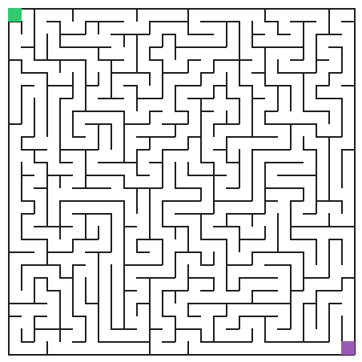
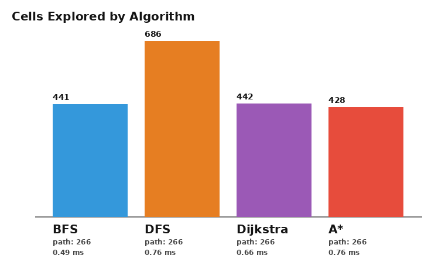

# MazeCraft

**Generate a maze. Race four pathfinding algorithms through it. Watch them think.**

MazeCraft procedurally carves a perfect maze, then sets BFS, DFS, Dijkstra,
and A* loose on it simultaneously — recording every cell each one visits so
you can watch their search strategies unfold as animated GIFs, side by side.


## Why this is fun

A "perfect" maze (generated here with a randomized recursive backtracker) is
secretly a spanning tree: there is exactly **one** path between any two
cells. That means every algorithm that finds *a* path finds *the same*
path — so the only thing distinguishing them is **how much of the maze they
had to look at to find it**. That's the whole show: same answer, wildly
different amounts of guessing.

| Algorithm | Strategy | Exploration |
|---|---|---|
| **BFS** | expand the nearest unvisited cells first (ring by ring) |  |
| **DFS** | commit to a direction, backtrack only when stuck |  |
| **Dijkstra** | BFS's general-purpose cousin, expands by lowest known cost |  |
| **A\*** | Dijkstra + a Manhattan-distance heuristic that points it at the goal |  |

(🟩 start · 🟪 end · 🟦 explored · 🟧 current frontier · 🟥 final path)

## Results from the run above

A 27×27 maze (729 cells), same seed for every algorithm:



A\* wins by exploring the fewest cells because its heuristic actively steers
the search toward the goal instead of expanding blindly outward. DFS
explores the most because it commits down dead ends before backtracking.
BFS and Dijkstra land in the middle and within a hair of each other — on a
maze where every edge costs 1, Dijkstra degenerates into BFS.

## Installation

```bash
git clone <this-repo>
cd Clauder
pip install -r requirements.txt
```

Requires Python 3.9+ and Pillow (used purely for image/GIF rendering — no
heavier plotting or numerical dependencies).

## Usage

```bash
python -m mazecraft --size 27x27 --seed 20260627 --algos bfs,dfs,dijkstra,astar --out assets
```

| Flag | Default | Description |
|---|---|---|
| `--size` | `25x25` | maze dimensions, `ROWSxCOLS` |
| `--seed` | random | RNG seed, for a reproducible maze |
| `--algos` | `bfs,dfs,dijkstra,astar` | comma-separated subset to run |
| `--cell-size` | `20` | pixel size of each maze cell in renders |
| `--out` | `assets` | output directory |

Each run writes, into `--out`:

- `maze.png` — the bare maze with start/end markers
- `<algo>.gif` — an animated replay of that algorithm's search, ending on the
  discovered path
- `comparison.png` — a bar chart of cells explored, annotated with path
  length and wall-clock time
- `summary.json` — the same stats in machine-readable form

## Project layout

```
mazecraft/
├── maze.py        # randomized recursive-backtracker maze generation
├── algorithms.py  # BFS, DFS, Dijkstra, A* — identical interface, easy to compare
├── render.py       # Pillow-based static images, animated GIFs, bar chart
├── cli.py          # argparse entry point
└── __main__.py     # `python -m mazecraft`
tests/
├── test_maze.py        # connectivity, determinism, spanning-tree property
└── test_algorithms.py  # every solver finds a valid, walkable path
assets/             # sample output checked in for this README
```

## Running the tests

```bash
pip install pytest
pytest tests/ -v
```

The test suite checks that generated mazes are fully connected and
deterministic for a given seed, that every solver's path only steps through
open passages, and that the optimal solvers (BFS, Dijkstra, A\*) always agree
on path length.

## How it works, briefly

- **Maze generation** (`maze.py`): a randomized depth-first carve. Starting
  from cell (0, 0), repeatedly move to a random unvisited neighbor, carving
  open the wall between them, and backtrack when boxed in. The result is a
  maze with no loops and no isolated areas — a spanning tree of the grid.
- **Search** (`algorithms.py`): all four algorithms share one shape — a
  frontier (queue / stack / heap), a `came_from` map for path
  reconstruction, and a recorded `visited_order` for animation. That shared
  shape is what makes them directly comparable.
- **Rendering** (`render.py`): no plotting library — the maze, the
  progressive search animation, and the bar chart are all drawn cell-by-cell
  with `PIL.ImageDraw`, then saved as a multi-frame GIF or PNG.
