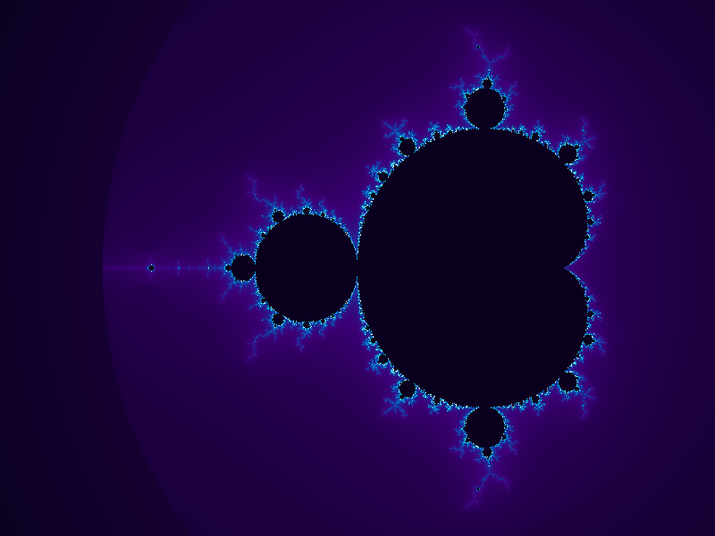
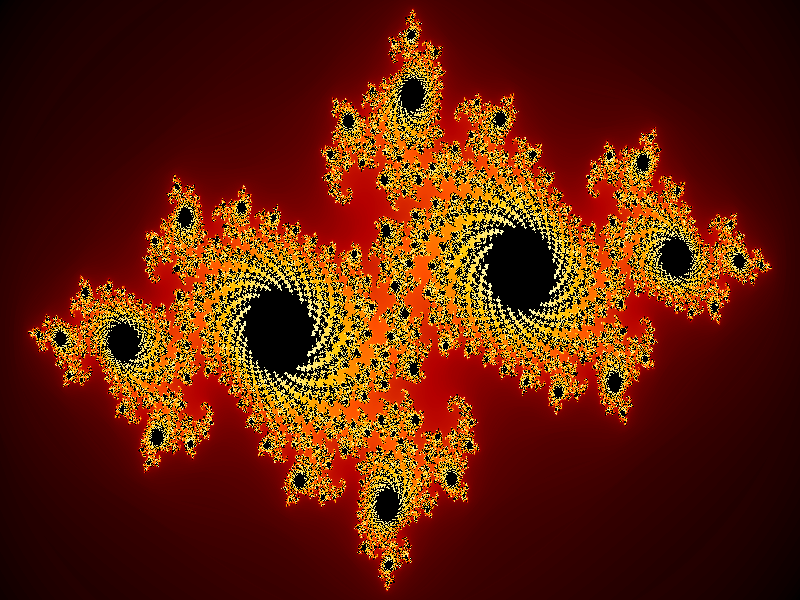
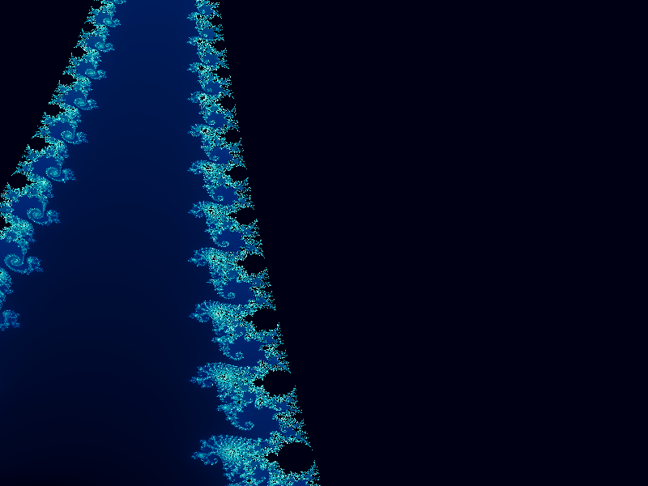
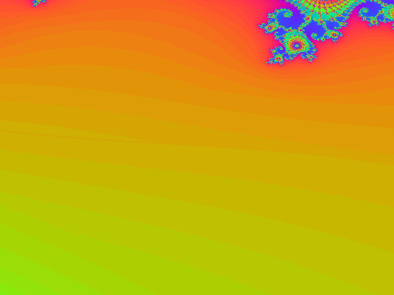
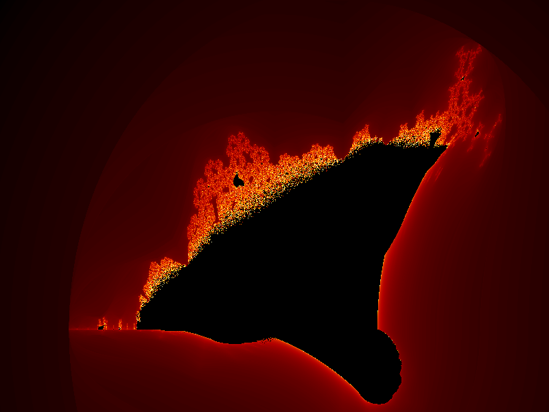

# Nebula — Terminal Fractal Art Generator

```
  _   _      _           _
 | \ | | ___| |__  _   _| | __ _
 |  \| |/ _ \ '_ \| | | | |/ _` |
 | |\  |  __/ |_) | |_| | | (_| |
 |_| \_|\___|_.__/ \__,_|_|\__,_|

  Fractal Art Generator  •  v1.0.0
```

> Explore infinite mathematical beauty — render Mandelbrot sets, Julia sets, and Burning Ship fractals as stunning high-resolution PNG images or coloured ASCII art directly in your terminal.

---

## Gallery

| Classic Mandelbrot | Julia Dragon | Seahorse Valley |
|:------------------:|:------------:|:---------------:|
|  |  |  |
| **nebula** palette | **fire** palette | **ocean** palette |

| Triple Spiral | Douady Rabbit | Burning Ship |
|:-------------:|:-------------:|:------------:|
|  |  |  |
| **psychedelic** palette | **cosmic** palette | **fire** palette |

---

## Features

- **3 fractal types** — Mandelbrot, Julia sets, and Burning Ship
- **6 colour palettes** — nebula, fire, ocean, psychedelic, cosmic, grayscale
- **Smooth colouring** — continuous escape-time algorithm for gradient-smooth bands
- **10 built-in scenes** — pre-defined coordinates at visually interesting locations
- **Terminal ASCII preview** — instant coloured ASCII render in your terminal
- **High-resolution PNG export** — save publication-quality images
- **Batch rendering** — render all presets in one command
- **Gamma correction** — adjustable contrast control

---

## Installation

```bash
git clone https://github.com/kareemrt/Clauder.git
cd Clauder
pip install -r requirements.txt
```

---

## Quick Start

```bash
# Render the classic Mandelbrot set to a PNG file
PYTHONPATH=. python3 -m nebula.cli render --preset classic

# Show a live ASCII preview in your terminal
PYTHONPATH=. python3 -m nebula.cli render --preset julia_dragon --terminal

# Render all 10 preset scenes at once
PYTHONPATH=. python3 -m nebula.cli batch --output-dir my_renders

# List all available presets
PYTHONPATH=. python3 -m nebula.cli list-presets

# List all colour palettes
PYTHONPATH=. python3 -m nebula.cli list-colormaps
```

---

## Commands

### `render` — Single fractal

```
PYTHONPATH=. python3 -m nebula.cli render [OPTIONS]

Options:
  -p, --preset TEXT          Use a named preset scene
  -f, --fractal [mandelbrot|julia|burning_ship]
  -W, --width INTEGER        Image width in pixels   [default: 800]
  -H, --height INTEGER       Image height in pixels  [default: 600]
      --x-min FLOAT                                  [default: -2.5]
      --x-max FLOAT                                  [default: 1.0]
      --y-min FLOAT                                  [default: -1.25]
      --y-max FLOAT                                  [default: 1.25]
  -i, --max-iter INTEGER     Maximum iterations      [default: 256]
  -c, --colormap TEXT        Colour palette          [default: nebula]
      --julia-c TEXT         Julia constant e.g. '-0.7+0.27j'
  -o, --output TEXT          Output PNG path
      --gamma FLOAT          Gamma correction        [default: 0.5]
  -t, --terminal             Print ASCII preview
```

### `batch` — All presets

```
PYTHONPATH=. python3 -m nebula.cli batch [OPTIONS]

Options:
  -d, --output-dir TEXT   Output directory    [default: examples]
  -W, --width INTEGER     Image width (px)    [default: 800]
  -H, --height INTEGER    Image height (px)   [default: 600]
      --presets TEXT      Comma-separated preset names (default: all)
```

---

## Custom Exploration

Render any coordinate window with custom parameters:

```bash
# Deep zoom into the Mandelbrot boundary at a custom location
PYTHONPATH=. python3 -m nebula.cli render \
  --fractal mandelbrot \
  --x-min -0.7269 --x-max -0.7266 \
  --y-min 0.1887 --y-max 0.1890 \
  --max-iter 2048 \
  --colormap fire \
  --output deep_zoom.png

# Custom Julia set
PYTHONPATH=. python3 -m nebula.cli render \
  --fractal julia \
  --julia-c "-0.4+0.6j" \
  --colormap ocean \
  --output my_julia.png
```

---

## Preset Scenes

| Key | Name | Fractal | Palette | Description |
|-----|------|---------|---------|-------------|
| `classic` | Classic Mandelbrot | mandelbrot | nebula | The full iconic view |
| `seahorse` | Seahorse Valley | mandelbrot | ocean | Intricate spirals near the main bulge |
| `elephant` | Elephant Valley | mandelbrot | fire | A chain of elephant-trunk spirals |
| `triple_spiral` | Triple Spiral | mandelbrot | psychedelic | Ultra-deep zoom — self-similar spirals |
| `julia_dragon` | Julia Dragon | julia | fire | Classic dragon-wing Julia set |
| `julia_dendrite` | Julia Dendrite | julia | ocean | Snowflake-like dendritic Julia set |
| `julia_rabbit` | Douady Rabbit | julia | cosmic | The famous Douady rabbit |
| `burning_ship_full` | Burning Ship | burning_ship | fire | Full Burning Ship — eerie and asymmetric |
| `burning_ship_zoom` | Burning Ship Detail | burning_ship | cosmic | The iconic ship's mast detail |
| `minibrot` | Mini Mandelbrot | mandelbrot | nebula | Tiny embedded copy at extreme zoom |

---

## Colour Palettes

| Palette | Description |
|---------|-------------|
| `nebula` | Deep-space purple → cyan → white |
| `fire` | Black → red → orange → yellow → white |
| `ocean` | Black → navy → teal → aqua → white |
| `psychedelic` | Cycling rainbow — 3 full hue rotations |
| `cosmic` | Black → midnight purple → gold → white |
| `grayscale` | Pure luminance — no colour |

---

## Architecture

```
Clauder/
├── nebula/
│   ├── __init__.py       # Package metadata
│   ├── cli.py            # Click CLI — render, batch, list-presets, list-colormaps
│   ├── fractals.py       # Vectorised numpy kernels (Mandelbrot / Julia / Burning Ship)
│   ├── renderer.py       # Terminal ASCII preview + PNG export via Pillow
│   ├── colormaps.py      # 6 colour palettes with LUT-based application
│   └── presets.py        # 10 pre-defined coordinate scenes
├── examples/             # Pre-rendered PNG gallery (committed to repo)
├── requirements.txt
├── setup.py
└── README.md
```

### Data Flow

```
  CLI args / preset
        │
        ▼
  fractals.py          ← numpy vectorised iteration
  ──────────
  Escape-time array       shape: (H, W), dtype: float64
  (smooth colouring)
        │
        ├──────────────────────────────────────────────►  renderer.py
        │                                                  └─ terminal ASCII preview
        ▼
  colormaps.py         ← LUT mapping [0,1] → RGB
  ──────────
  RGB image array         shape: (H, W, 3), dtype: uint8
        │
        ▼
  renderer.py  →  PIL Image  →  PNG file
```

---

## The Maths

### Mandelbrot Set

A point **c** is in the Mandelbrot set if the sequence:

```
z₀ = 0
zₙ₊₁ = zₙ² + c
```

remains bounded as n → ∞. Points outside the set escape to infinity; the escape speed determines the colour.

**Smooth colouring** avoids harsh bands using the continuous escape count:

```
smooth_count = n + 1 − log(log|zₙ|) / log(2)
```

### Julia Sets

A Julia set uses a fixed complex constant **c** instead of the starting point:

```
z₀ = pixel coordinate
zₙ₊₁ = zₙ² + c
```

Different values of `c` produce wildly different shapes — from smooth blobs to
intricate dendrites and "rabbit" structures.

### Burning Ship

A delightful variation — the modulus of each component is taken before squaring:

```
zₙ₊₁ = (|Re(zₙ)| + i|Im(zₙ)|)² + c
```

This creates the distinctive "ship" silhouette and asymmetric flame-like structures.

---

## Requirements

- Python 3.10+
- numpy ≥ 1.24
- Pillow ≥ 10.0
- rich ≥ 13.0
- click ≥ 8.1

---

## Performance

All fractal kernels use fully vectorised numpy operations — no Python-level loops per
pixel. Typical render times on a single CPU core:

| Scene | Resolution | Iterations | Time |
|-------|-----------|------------|------|
| Classic Mandelbrot | 800 × 600 | 256 | ~0.6 s |
| Seahorse Valley | 800 × 600 | 512 | ~2.3 s |
| Triple Spiral | 800 × 600 | 1024 | ~1.9 s |
| Mini Mandelbrot | 800 × 600 | 2048 | ~20 s |
