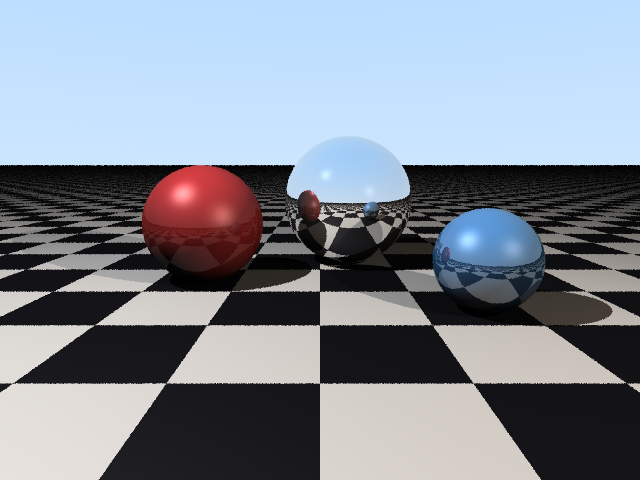
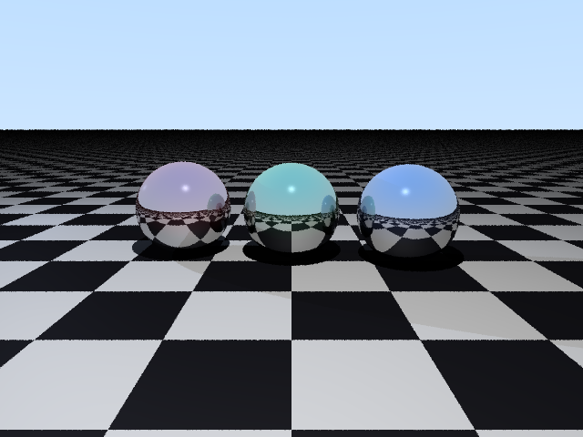
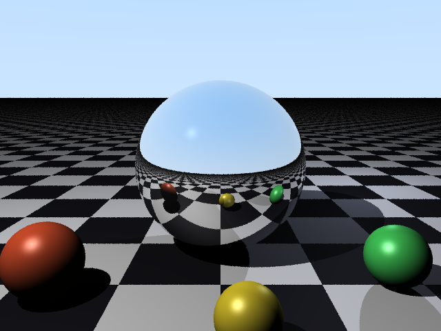
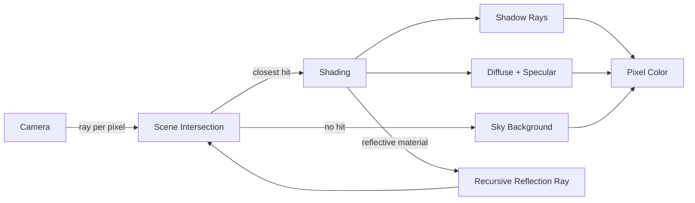

# PyTracer

A from-scratch CPU ray tracer in pure Python — no rendering engine, no shader
language, just vector math, light, and shadows turned into pixels.

<p align="center">
  
</p>

## Table of Contents

- [Why](#why)
- [Features](#features)
- [Example Renders](#example-renders)
- [How It Works](#how-it-works)
- [Installation](#installation)
- [Usage](#usage)
- [Project Structure](#project-structure)
- [Performance](#performance)
- [Testing](#testing)
- [License](#license)

## Why

Ray tracing is one of the few algorithms where a few hundred lines of plain
math directly produce something you can *see* — shadows fall where geometry
says they should, mirrors reflect the world correctly, and light falls off
exactly as the physics dictates. PyTracer implements that pipeline with zero
graphics dependencies: every sphere intersection, shadow ray, and reflection
bounce is plain Python.

## Features

- 🔵 **Primitives** — spheres and infinite planes, with procedural checkerboard texturing
- 💡 **Phong/Blinn shading** — ambient, diffuse, and specular lighting from multiple point lights
- 🌑 **Hard shadows** — shadow rays test occlusion against the whole scene
- 🪞 **Recursive reflections** — mirrored materials bounce rays up to a configurable depth
- 🌫️ **Antialiasing** — jittered supersampling smooths sphere edges and shadow boundaries
- ⚡ **Parallel rendering** — rows are distributed across worker processes via `ProcessPoolExecutor`
- 🎬 **Scene presets** — three ready-made scenes (`showcase`, `reflective-trio`, `macro`)

## Example Renders

| `showcase` | `reflective-trio` | `macro` |
|---|---|---|
|  |  |  |

All three were rendered with the CLI defaults (`640x480`, 4 samples/pixel) in
roughly 10 seconds each on 4 worker processes — see [Performance](#performance).

## How It Works



For every pixel, the [`Camera`](pytracer/camera.py) fires one or more
jittered rays (for antialiasing) into the [`Scene`](pytracer/scene.py). The
[`renderer`](pytracer/renderer.py) finds the closest intersection among all
shapes, then [shades](pytracer/renderer.py) the hit point:

1. **Ambient** term so nothing is ever pitch black.
2. For each light, a **shadow ray** toward it — if occluded, that light
   contributes nothing.
3. **Diffuse** (Lambertian) and **specular** (Blinn-Phong half-vector)
   contributions from unoccluded lights.
4. If the material is reflective, a **mirror ray** is cast and traced
   recursively (bounded by `--depth`), and its color is blended in.

Rows are independent, so the renderer farms them out across processes and
reassembles the image with [Pillow](https://python-pillow.org/).

## Installation

```bash
git clone <this-repo>
cd Clauder
pip install -r requirements.txt
```

Requires Python 3.10+ (uses `dataclasses(slots=True)` and PEP 604 unions).

## Usage

Render the default showcase scene:

```bash
python -m pytracer.cli
```

Render a specific preset at higher quality:

```bash
python -m pytracer.cli --scene reflective-trio --width 1280 --height 960 \
    --samples 8 --depth 5 --workers 8 --out trio.png
```

| Flag | Default | Meaning |
|---|---|---|
| `--scene` | `showcase` | One of `showcase`, `reflective-trio`, `macro` |
| `--width` / `--height` | `640` / `480` | Output image size in pixels |
| `--samples` | `4` | Antialiasing samples per pixel (higher = smoother, slower) |
| `--depth` | `3` | Max recursive reflection bounces |
| `--workers` | `4` | Parallel worker processes |
| `--out` | `render.png` | Output file path |

## Project Structure

```
pytracer/
├── vector.py      # Vec3: the only math primitive everything is built from
├── ray.py         # Ray: origin + direction
├── materials.py   # Material: color, ambient/diffuse/specular, reflectivity
├── shapes.py       # Sphere, Plane (+ checkerboard texturing), Hit record
├── lights.py       # PointLight
├── camera.py       # Pinhole camera: pixel -> ray
├── scene.py        # Scene: objects, lights, sky background
├── presets.py       # Hand-built demo scenes
├── renderer.py      # trace/shade pipeline + parallel row rendering
├── cli.py           # argparse entry point
└── __main__.py      # `python -m pytracer.cli` support

tests/                # pytest unit + smoke tests
examples/              # pre-rendered PNGs used in this README
```

## Performance

Pure-Python ray tracing is CPU-bound and embarrassingly parallel by scanline,
so PyTracer splits rows across a `ProcessPoolExecutor`. On this machine,
`showcase` at `640x480`, 4 samples/pixel, depth 3, takes ~10s with 4 workers.
Resolution and sample count scale render time roughly linearly; reflection
depth only matters for scenes with mirrored materials, since non-reflective
rays terminate after one bounce.

## Testing

```bash
pip install pytest
pytest tests/ -v
```

Tests cover vector math, ray-sphere/ray-plane intersection (including misses
and behind-camera cases), checkerboard material selection, and a rendering
smoke test that asserts a real image with visual variety comes out the other
end.

## License

MIT
