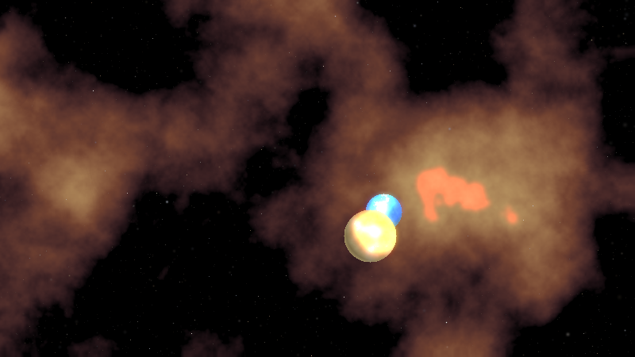
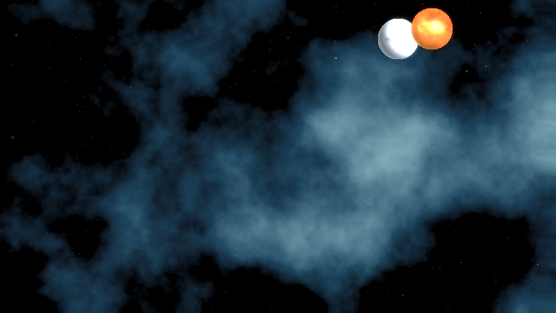
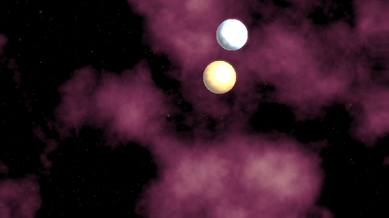
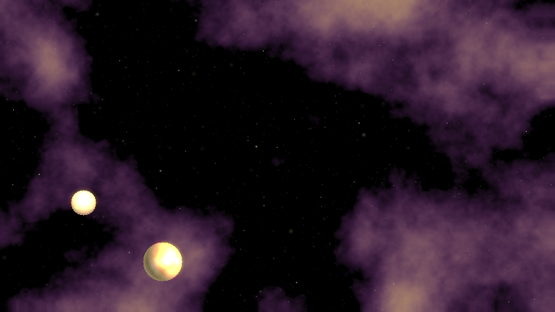
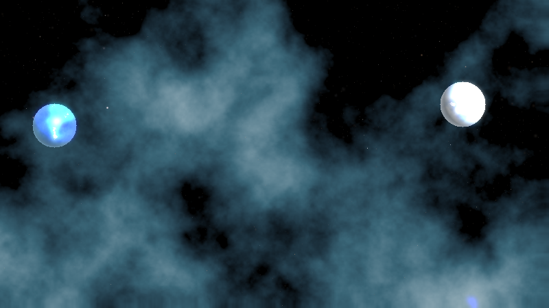

# 🌌 Lumina — Generative Cosmic Art Engine

<div align="center">


**Procedurally generate breathtaking cosmic art — nebulae, star fields, and planets — using pure mathematics.**  
*Every seed is a universe. Every render is unique.*

</div>

---

## ✨ Gallery

| Pillars of Creation | Crab Supernova |
|:---:|:---:|
|  |  |
| `--seed 42 --nebula pillars` | `--seed 7 --nebula crab` |

| Rosette Bloom | Butterfly Nebula + Lava World |
|:---:|:---:|
|  |  |
| `--seed 314 --nebula rosette` | `--seed 1337 --nebula butterfly` |

<div align="center">

| Orion + Ice World |
|:---:|
|  |
| `--seed 999 --nebula orion --planet ice_world` |

</div>

---

## 🚀 Quick Start

```bash
# Clone and install
git clone https://github.com/kareemrt/clauder.git
cd clauder
pip install -r requirements.txt

# Generate your first scene (random seed)
python main.py

# Reproducible scene at 4K
python main.py --seed 42 --width 3840 --height 2160 --output my_cosmos.png

# Batch generate a gallery of 10 scenes
python main.py --batch 10 --output-dir ./my_gallery
```

---

## 📦 Installation

### Requirements

| Package | Version | Purpose |
|---------|---------|---------|
| Python  | ≥ 3.10  | Core language (uses `str \| None` union syntax) |
| NumPy   | ≥ 1.24  | Array math, noise generation |
| Pillow  | ≥ 10.0  | Image composition, glow effects, PNG export |

```bash
pip install numpy Pillow

# Or install as a package (adds `lumina` CLI command)
pip install -e .
lumina --seed 42
```

---

## 🎨 Nebula Palettes

| Palette | Inspired By | Color Profile |
|---------|------------|---------------|
| `pillars` | Pillars of Creation | Deep purple → burnt sienna → gold |
| `crab` | Crab Nebula | Midnight blue → electric cyan → white |
| `rosette` | Rosette Nebula | Black → crimson → salmon → blush |
| `orion` | Orion Nebula | Ink → cobalt → sky → icy white |
| `butterfly` | Butterfly Nebula | Violet → magenta → amber → cream |

```bash
python main.py --nebula rosette
python main.py --nebula orion --seed 100
```

---

## 🪐 Planet Themes

| Theme | Surface | Atmosphere | Inspired By |
|-------|---------|-----------|------------|
| `gas_giant` | Banded ochre & gold | Warm amber haze | Jupiter / Saturn |
| `ice_world` | Glacial blue & white | Cool cyan rim | Europa / Pluto |
| `lava_world` | Charcoal & molten orange | Red-orange glow | Io |
| `ocean_world` | Deep navy → turquoise | Azure atmosphere | Earth-like |
| `desert_world` | Sienna & dunes | Dust-haze tan | Mars |

```bash
python main.py --planet lava_world --seed 42
python main.py --planet ocean_world --nebula orion --seed 77
```

---

## ⚙️ CLI Reference

```
usage: lumina [--seed N] [--width W] [--height H] [--output FILE]
              [--nebula PALETTE] [--planet THEME] [--stars N]
              [--planets 0-3] [--batch N] [--output-dir DIR]
```

| Flag | Default | Description |
|------|---------|-------------|
| `--seed` | random | Integer seed for full reproducibility |
| `--width` | 1920 | Output width in pixels |
| `--height` | 1080 | Output height in pixels |
| `--output` | `lumina_<seed>.png` | Output file path |
| `--nebula` | random | Nebula color palette |
| `--planet` | random | Planet surface theme |
| `--stars` | 2200 | Star count |
| `--planets` | 2 | Number of planets (0–3) |
| `--batch` | 1 | Generate N scenes with sequential seeds |
| `--output-dir` | `.` | Output directory for batch mode |

---

## 🏗️ Architecture

```
lumina/
├── __init__.py          # Package metadata
├── noise.py             # Value noise + Fractal Brownian Motion
├── stars.py             # Star field rendering + bloom glow effect
├── nebula.py            # Procedural nebula with domain-warped fBm
├── planets.py           # Sphere-traced planets with lighting & atmosphere
└── composer.py          # Scene assembly (layer compositing pipeline)
main.py                  # CLI entry point
examples/                # Pre-rendered example images
requirements.txt
setup.py
```

### Rendering Pipeline

```
Deep Space Black
      │
      ▼
Background Star Haze  (60% of stars, dimmed)
      │
      ▼
Nebula Layer          (domain-warped fBm + palette mapping)
      │
      ▼
Foreground Stars      (40% of stars, full brightness)
      │
      ▼
Planet(s)             (sphere + Lambert shading + atmosphere)
      │
      ▼
Tone Mapping          (filmic exposure curve)
      │
      ▼
Gamma Correction      (γ = 2.2)
      │
      ▼
Star Bloom / Glow     (high-pass Gaussian blur overlay)
      │
      ▼
PNG Export
```

---

## 🔬 How It Works

### Fractal Brownian Motion (fBm)

The nebulae are shaped by **layered noise** — each octave adds finer detail at half the amplitude:

```
f(x,y) = Σ  amplitude_i × noise(x,y, scale_i)
           i=0..N
         where amplitude_{i+1} = amplitude_i × gain
               scale_{i+1}     = scale_i / lacunarity
```

### Domain Warping

To create the organic "flowing gas" look, the nebula field is sampled at distorted coordinates:

```
nebula(x, y) = fBm( x + warp_x(x,y), y + warp_y(x,y) )
```

This single trick transforms boring noise into convincing cosmic structure.

### Planet Shading

Each planet is a ray-intersected unit sphere with:
- **Lambertian diffuse** — `max(0, N · L)`
- **Blinn-Phong specular** — `(N · H)^28`
- **Atmospheric rim glow** — `(1 - N·V)^1.5 × atmosphere_color`
- **Filmic tone mapping** — `1 - exp(-exposure × color)`

### Star Brightness Distribution

Real stars follow a **Pareto distribution** in apparent magnitude — most are dim and a few are brilliant. Lumina samples this distribution to place 2000+ stars per scene with physically plausible brightness variance.

---

## 📐 Examples by Resolution

```bash
# Wallpaper (1920×1080)
python main.py --seed 42 --width 1920 --height 1080

# Social media square (1080×1080)
python main.py --seed 42 --width 1080 --height 1080

# 4K UHD (3840×2160)
python main.py --seed 42 --width 3840 --height 2160

# Portrait phone wallpaper (1080×1920)
python main.py --seed 42 --width 1080 --height 1920

# Ultrawide (3440×1440)
python main.py --seed 42 --width 3440 --height 1440
```

---

## 🌠 Seed Showcase

Some favorite seeds discovered during development:

| Seed | Recommended Style | Description |
|------|------------------|-------------|
| `42` | `--nebula pillars` | Classic warm nebula with dramatic pillars |
| `7` | `--nebula crab` | Electric cyan supernova remnant |
| `314` | `--nebula rosette` | Rosy spiral bloom |
| `1337` | `--nebula butterfly` | Purple-gold wings with lava world |
| `999` | `--nebula orion` | Cool blue Orion field with icy planet |
| `2718` | any | Dense star field, massive gas giant |
| `31415` | `--nebula butterfly` | Sweeping magenta arms |

---

## 🤝 Contributing

1. Fork the repository
2. Create a feature branch: `git checkout -b feat/my-new-palette`
3. Add your nebula palette to `lumina/nebula.py` or planet theme to `lumina/planets.py`
4. Generate a few showcase images and update the README gallery
5. Open a pull request

### Adding a Custom Nebula Palette

```python
# In lumina/nebula.py, add to PALETTES dict:
"my_palette": [
    ((R, G, B), 0.0),   # darkest color at t=0
    ((R, G, B), 0.5),   # midtone at t=0.5
    ((R, G, B), 1.0),   # brightest at t=1.0
],
```

---

## 📄 License

MIT — use freely, remix freely, share widely.

---

<div align="center">

*"The cosmos is within us. We are made of star-stuff."*  
— Carl Sagan

**Made with ✨ by Claude**

</div>
