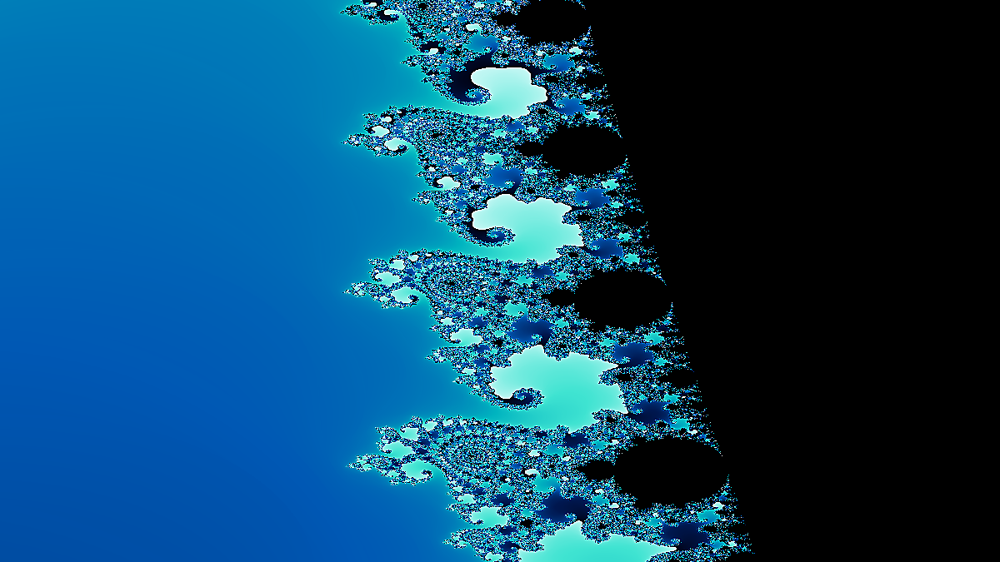
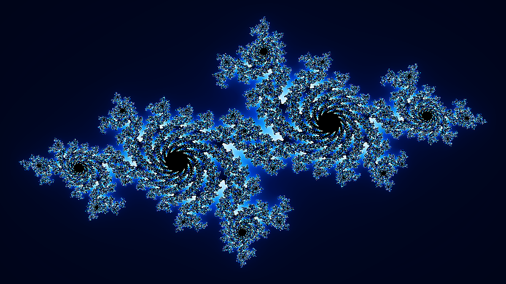
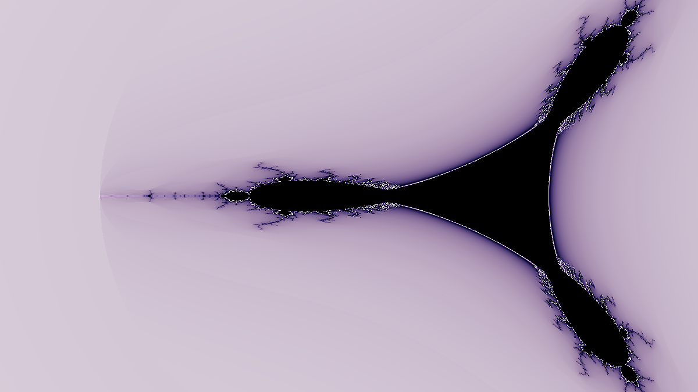

# FractalScape 🌀

> *"Equipped with his five senses, man explores the universe around him and calls the adventure Science."* — Edwin Hubble

**FractalScape** is a terminal fractal explorer that renders stunning mathematical artwork — directly in your terminal using true-color Unicode graphics, and as high-resolution PNG exports. Explore the infinite complexity of the Mandelbrot set, Julia sets, Burning Ship, Tricorn, and Newton fractals with 12 color themes and 18 curated presets.

---

## Gallery

| Mandelbrot Set — `electric` theme | Julia Set (Douady Rabbit) — `neon` theme |
|:-:|:-:|
|  |  |

| Seahorse Valley — `ocean` theme | Julia Set (Dragon Wing) — `ice` theme |
|:-:|:-:|
|  |  |

| Burning Ship — `inferno` theme | Tricorn (Mandelbar) — `twilight` theme |
|:-:|:-:|
|  |  |

---

## Features

- **5 Fractal Types** — Mandelbrot, Julia, Burning Ship, Tricorn, Newton
- **12 Color Themes** — fire, ice, gold, neon, ocean, electric, inferno, plasma, viridis, grayscale, twilight, tropical
- **18 Curated Presets** — from the full Mandelbrot view to deep spiral zooms at 4096× magnification
- **Terminal Rendering** — ANSI 24-bit true color with half-block Unicode characters (double vertical resolution)
- **PNG Export** — 720p through 4K resolution with sharpening
- **NumPy Acceleration** — vectorized computation is ~100× faster than pure Python
- **Smooth Coloring** — continuous iteration count algorithm eliminates harsh banding
- **Gallery Mode** — cycle through featured presets with a single command

---

## Architecture

```
fractalscape/
├── core.py       ← Fractal algorithms (NumPy-vectorized + Python fallback)
├── colors.py     ← Color themes and gradient interpolation
├── render.py     ← Terminal renderer (ANSI 24-bit, half-block technique)
├── export.py     ← PNG export engine (Pillow)
├── presets.py    ← 18 curated viewport presets
└── cli.py        ← Argument parser, subcommands, progress display
main.py           ← Entry point
examples/         ← Pre-generated PNG gallery images
```

### How It Works

```
           Complex Plane                   Escape-Time Algorithm
    ┌──────────────────────────┐    ┌─────────────────────────────────────┐
    │  Map each pixel (x,y)    │    │  z₀ = 0   (Mandelbrot)              │
    │  to complex c = x + iy   │───▶│  z_{n+1} = z_n² + c                 │
    └──────────────────────────┘    │  Iterate until |z| > 2 or n=max     │
                                    └────────────────┬────────────────────┘
                                                     │
                                    ┌────────────────▼────────────────────┐
                                    │  Smooth coloring:                    │
                                    │  v = n + 1 – log₂(log₂|z_escape|)   │
                                    └────────────────┬────────────────────┘
                                                     │
                                    ┌────────────────▼────────────────────┐
                                    │  Map v → RGB via cyclic gradient     │
                                    │  Render: ▀ char with fg/bg colors    │
                                    └─────────────────────────────────────┘
```

---

## Installation

```bash
git clone https://github.com/kareemrt/clauder.git
cd clauder
pip install -r requirements.txt
```

**Requirements:** Python 3.8+, `numpy`, `Pillow`, `rich`

---

## Usage

### Quick Start

```bash
# Classic Mandelbrot in your terminal
python main.py

# Load a named preset
python main.py --preset julia-rabbit

# Choose fractal type and color theme
python main.py --fractal burning_ship --theme inferno

# Export a 1080p PNG
python main.py --preset sea-horse-valley --export seahorse.png

# Export without terminal display
python main.py --preset spiral-galaxy --export galaxy.png --no-display --resolution 4k
```

### Subcommands

```bash
# Browse all 18 presets
python main.py presets
python main.py presets --verbose   # include coordinate bounds

# Cycle through featured presets interactively
python main.py gallery
python main.py gallery --all       # all 18 presets

# View all 12 color themes as gradient swatches
python main.py themes

# Benchmark computation speed
python main.py benchmark
```

### Custom Coordinates

```bash
# Custom viewport bounds (x_min,x_max,y_min,y_max)
python main.py --bounds "-0.76,-0.74,0.10,0.14" --theme ocean --max-iter 512

# Custom Julia constant
python main.py --fractal julia --julia-c "-0.123,0.745" --theme neon

# Full control
python main.py \
  --fractal mandelbrot \
  --bounds "-0.1628,-0.1620,1.0380,1.0387" \
  --max-iter 2048 \
  --theme fire \
  --cycle 96 \
  --export deep_spiral.png \
  --resolution 4k
```

### All Options

```
  --preset, -p    NAME       Load a named preset
  --fractal, -f   TYPE       mandelbrot|julia|burning_ship|tricorn|newton
  --theme, -t     NAME       Color theme (see: python main.py themes)
  --max-iter, -i  N          Iteration cap (default: 256)
  --cycle, -c     N          Color cycle period in iterations (default: 64)
  --bounds, -b    x0,x1,y0,y1  Viewport bounds
  --julia-c       re,im      Julia set constant (default: -0.7,0.27015)
  --width, -W     N          Terminal width in characters
  --height, -H    N          Pixel height (2× terminal rows)
  --export, -e    FILE       Also export a PNG to this file
  --resolution    RES        720p|1080p|1440p|4k|square|thumb (default: 1080p)
  --no-display               Skip terminal render (for PNG-only output)
  --quiet, -q                Suppress progress bars
```

---

## Fractal Types

| Type | Formula | Character |
|------|---------|-----------|
| **Mandelbrot** | `z = z² + c`, `z₀ = 0` | The iconic apple-man; infinite complexity at every scale |
| **Julia** | `z = z² + c`, `z₀ = pixel`, `c` = constant | Family of connected/disconnected sets parameterized by `c` |
| **Burning Ship** | `z = (|Re z| + i|Im z|)² + c` | Asymmetric chaos with a haunting ship silhouette |
| **Tricorn** | `z = conj(z)² + c` | Anti-holomorphic twin of Mandelbrot with 3-fold symmetry |
| **Newton** | Newton's method on `z³ – 1` | Colorful basins of attraction for three cube roots |

---

## Color Themes

| Theme | Character |
|-------|-----------|
| `fire` | Black → deep red → orange → yellow-white |
| `ice` | Deep navy → blue → cyan → white |
| `gold` | Black → brown → gold → cream |
| `neon` | Black → purple → magenta → pink-white |
| `ocean` | Deep sea → teal → aquamarine → white |
| `electric` | Black → electric blue → cyan → lime |
| `inferno` | Black → purple → red → orange → yellow |
| `plasma` | Indigo → violet → pink → orange → yellow |
| `viridis` | Purple → teal → green → yellow |
| `grayscale` | Black → gray → white |
| `twilight` | Cyclic lavender–indigo–midnight |
| `tropical` | Black → green → lime → yellow → red → white |

---

## Curated Presets

```
classic              Mandelbrot       The full Mandelbrot set — the iconic overview
elephant-valley      Mandelbrot       Baby Mandelbrot elephants parading in rows
sea-horse-valley     Mandelbrot       Swirling spiral arms and filaments
deep-spiral          Mandelbrot       A deep zoom spiral — infinite recursive complexity
mini-brot            Mandelbrot       A tiny satellite Mandelbrot
lightning            Mandelbrot       Lightning filaments branching at the edge of chaos
spiral-galaxy        Mandelbrot       A spiral galaxy — swirling arms of infinite detail

julia-classic        Julia            c = -0.7 + 0.27015i  (dragon-wing curves)
julia-rabbit         Julia            c = -0.123 + 0.745i  (three-petal Douady Rabbit)
julia-dragon         Julia            c = 0.355 + 0.355i   (tangled filaments)
julia-dendrite       Julia            c = 0 + 1i           (fractal snowflake)
julia-san-marco      Julia            c = -0.75 + 0i       (connected bubbles)
julia-siegel         Julia            c = -0.391 - 0.587i  (rotation-symmetric)

burning-ship         Burning Ship     The full fractal with its fiery hull
burning-ship-zoom    Burning Ship     The 'burning ship' itself up close

tricorn              Tricorn          Three-fold anti-holomorphic symmetry

newton               Newton           Basins of attraction for z³ = 1
```

---

## The Mathematics

### Escape-Time Algorithm
Every point `c` in the complex plane is tested: does the sequence `z_{n+1} = z_n² + c` (starting at `z_0 = 0`) remain bounded? Points that stay bounded forever form the **Mandelbrot Set**. Points that escape to infinity are colored by *how quickly* they escape.

### Smooth Coloring
Raw escape counts produce harsh color bands. The **normalized iteration count** formula produces continuous gradients:

```
smooth_value = n + 1 – log₂(log₂|z_escape|)
```

where `n` is the iteration count when `|z| > 2`. This continuous value is then mapped cyclically through the color gradient.

### NumPy Vectorization
The computation is fully vectorized: the entire complex plane is represented as a 2D NumPy array, and all pixels are updated simultaneously each iteration. Escaped pixels are masked out, so computation stops only for active pixels. This gives **~100× speedup** over a pure Python pixel loop.

### Half-Block Rendering
Terminal characters are roughly 2:1 (height:width). To achieve square pixels, FractalScape uses the **Unicode half-block** character `▀` with different foreground and background colors. Each character encodes **two vertical pixels**, doubling effective resolution.

```
Character ▀  =  [ top pixel   ]    ← foreground color
              [ bottom pixel ]    ← background color
```

---

## Performance

| Scene | Resolution | Max Iter | Time |
|-------|-----------|---------|------|
| Mandelbrot (terminal) | 120×80 | 256 | ~0.1s |
| Mandelbrot | 1280×720 | 512 | ~1.5s |
| Mandelbrot | 1920×1080 | 512 | ~3.5s |
| Julia set | 1920×1080 | 256 | ~2.0s |
| Burning Ship | 1920×1080 | 256 | ~2.5s |
| Deep spiral | 1920×1080 | 4096 | ~30s |

*Tested on a single CPU core with NumPy. GPU acceleration would bring deep zooms to near-realtime.*

---

## License

MIT — use freely for any purpose.

---

<div align="center">

*"Fractals are not just a chapter of mathematics, but one that helps Everyman to see the same world differently."* — Benoît Mandelbrot

</div>
