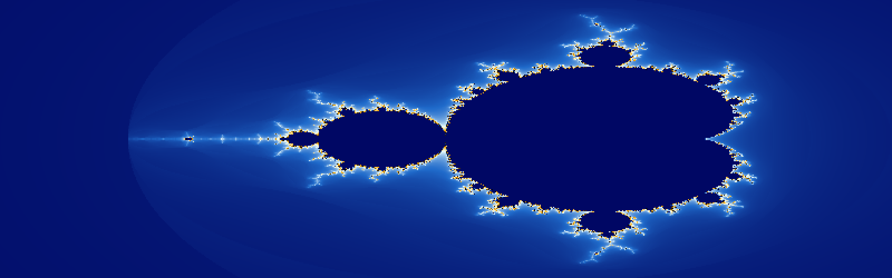
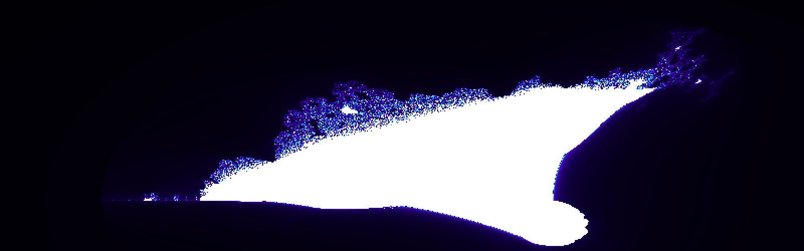
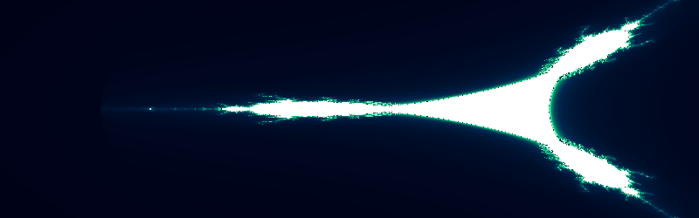
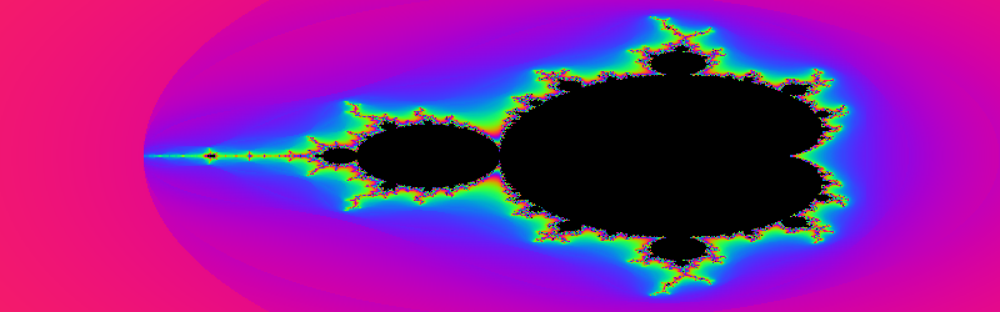

# Fractal Universe

> **Explore infinite mathematical beauty — right in your terminal.**

A Python CLI that renders Mandelbrot sets, Julia sets, Burning Ships, and Tricorns with smooth iteration coloring, 8 vivid palettes, animated zooms, and PNG export. Uses Unicode half-block characters so every terminal cell carries **two pixel rows** — doubling vertical resolution without any external display server.

---

## Gallery

| Fractal | Palette | Preview |
|---------|---------|---------|
| Mandelbrot | Classic |  |
| Julia (Dragon) | Fire |  |
| Julia (Seahorse) | Ice |  |
| Burning Ship | Electric |  |
| Tricorn | Aurora |  |
| Mandelbrot | Neon |  |

---

## Features

- **4 fractals** — Mandelbrot, Julia set (8 presets + custom c), Burning Ship, Tricorn
- **8 color palettes** — classic, fire, ice, electric, gold, neon, aurora, sunset
- **Smooth coloring** — real-valued escape-time normalization (no visible iteration bands)
- **Half-block rendering** — Unicode `▀` with 24-bit fg/bg colors for 2× vertical density
- **Animated zoom** — 4 famous zoom destinations, configurable frames and speed
- **PNG export** — save any render at arbitrary resolution via Pillow
- **Auto-explorer** — cycles through all fractal × palette combinations hands-free
- **Plain ASCII fallback** — `--ascii` flag for terminals without color support
- **Rich info panel** — shows bounds, iteration count, resolution, and palette after each render

---

## Project Structure

```
Clauder/
├── fractal_universe/
│   ├── __init__.py        # Package metadata
│   ├── fractals.py        # Core math: Mandelbrot, Julia, Burning Ship, Tricorn
│   ├── palettes.py        # 8 color palettes with linear interpolation
│   ├── renderer.py        # Terminal (half-block), PNG, and ASCII renderers
│   ├── zoom.py            # Smooth zoom sequence generator + famous destinations
│   └── cli.py             # Click-based CLI (render / zoom / explore / list-presets)
├── main.py                # Entry point
├── requirements.txt       # numpy, rich, click, Pillow
├── examples/              # Pre-rendered PNG gallery images
│   ├── mandelbrot_classic.png
│   ├── julia_dragon_fire.png
│   ├── julia_seahorse_ice.png
│   ├── burning_ship_electric.png
│   ├── tricorn_aurora.png
│   └── mandelbrot_neon.png
└── README.md
```

---

## Installation

```bash
git clone https://github.com/kareemrt/Clauder.git
cd Clauder
pip install -r requirements.txt
```

**Requirements:** Python 3.9+, a terminal with 24-bit color (iTerm2, Windows Terminal, most modern Linux terminals).

---

## Usage

### Render a fractal

```bash
# Mandelbrot with classic blue-gold palette
python main.py render mandelbrot

# Julia set — "Dragon" preset, fire palette, saved as PNG
python main.py render julia --preset dragon --palette fire --save dragon.png

# Burning Ship, electric palette, custom resolution
python main.py render burning_ship --palette electric --width 160 --height 100

# Tricorn, high iteration count
python main.py render tricorn --palette aurora --max-iter 512

# Custom Julia c parameter
python main.py render julia --c-real -0.4 --c-imag 0.6 --palette neon

# Zoom into a specific region of the Mandelbrot set
python main.py render mandelbrot --x-min -0.76 --x-max -0.74 --y-min 0.12 --y-max 0.14 --max-iter 1024
```

### Animate a zoom

```bash
# Zoom into Seahorse Valley over 20 frames
python main.py zoom seahorse_valley --frames 20 --palette classic

# Fast zoom into the Elephant Valley
python main.py zoom elephant_valley --frames 15 --delay 0.03 --palette fire

# Available destinations: seahorse_valley, elephant_valley, triple_spiral, mini_brot
```

### Explore all combinations

```bash
# Auto-cycles through every fractal × palette, 3 seconds each
python main.py explore
```

### List all options

```bash
python main.py list-presets
```

---

## CLI Reference

```
Usage: python main.py [COMMAND] [OPTIONS]

Commands:
  render         Render a fractal to the terminal (+ optional PNG save)
  zoom           Animate a zoom into a famous fractal location
  explore        Auto-explorer: cycle all fractals × palettes
  list-presets   Show Julia presets, palettes, and zoom destinations

render options:
  FRACTAL              mandelbrot | julia | burning_ship | tricorn
  -p, --palette        classic | fire | ice | electric | gold | neon | aurora | sunset
  -w, --width INT      Terminal columns (default: terminal width)
  -h, --height INT     Pixel rows (default: terminal height × 2)
  -n, --max-iter INT   Escape iteration cap (default: 256)
  --x-min/--x-max      Custom horizontal bounds
  --y-min/--y-max      Custom vertical bounds
  --preset NAME        Julia preset: dragon|dendrite|spiral|lightning|galaxy|douady|rabbit|seahorse
  --c-real FLOAT       Julia c real part (overrides preset)
  --c-imag FLOAT       Julia c imaginary part (overrides preset)
  --save PATH          Export PNG to this path
  --ascii              Plain ASCII output (no color)
  --no-info            Suppress the info panel

zoom options:
  DESTINATION          seahorse_valley | elephant_valley | triple_spiral | mini_brot
  -f, --frames INT     Number of animation frames (default: 12)
  -p, --palette        Color palette
  -n, --max-iter INT   Escape iterations per frame
  -d, --delay FLOAT    Seconds between frames (default: 0.05)
```

---

## How It Works

### Escape-Time Algorithm

Every pixel maps to a complex number *c*. The algorithm iterates *z → z² + c* and counts how many steps until |z| > 2 (the escape radius). The boundary of the set — where this count transitions from small to large — is where all the visual detail lives.

**Smooth coloring** avoids discrete color bands by using a real-valued count:

```
smooth_n = n - log₂(log₂(|z|))
```

This exploits the fact that the magnitude of *z* at escape carries information about *exactly how close* the orbit was to escaping on the previous step.

### Half-Block Terminal Rendering

Standard terminals render one color per cell. The Unicode character `▀` (upper half block) lets us assign an independent foreground color (top half) and background color (bottom half), effectively halving the pixel pitch vertically. A 40-row terminal becomes an 80-pixel-row canvas.

### Julia Sets

A Julia set uses the same iteration *z → z² + c*, but *c* is **fixed** across the entire plane, and *z* is what varies. Each choice of *c* produces a completely different fractal — from the smooth dragon curves at *c = −0.7269 + 0.1889i* to the dendrite lightning at *c = 0 + 1i*.

### Burning Ship

Replaces *z² + c* with *(|Re(z)| + i|Im(z)|)² + c*. The absolute values fold the plane before squaring, creating the eerie ship-like forms and fiery detail that give it its name.

---

## Color Palettes

| Name | Description | Key Colors |
|------|-------------|------------|
| `classic` | Timeless blue & gold | Navy → cobalt → white → gold → black |
| `fire` | Volcanic heat | Black → crimson → orange → white |
| `ice` | Polar depth | Deep navy → cyan → white |
| `electric` | Neon storm | Black → violet → electric blue → white |
| `gold` | Ancient treasure | Black → sienna → gold → ivory |
| `neon` | Cycling hues | Full-spectrum cycling, darkness near interior |
| `aurora` | Northern lights | Midnight blue → emerald → white |
| `sunset` | Dusk sky | Deep purple → coral → amber |

---

## Julia Set Presets

| Name | c value | Character |
|------|---------|-----------|
| `dragon` | −0.7269 + 0.1889i | Smooth dragon wings |
| `dendrite` | 0 + 1i | Lightning bolt tree |
| `spiral` | −0.4 + 0.6i | Twin spirals |
| `lightning` | −0.8 + 0.156i | Electric discharge |
| `galaxy` | −0.12 + 0.77i | Galactic swirl |
| `douady` | −0.123 + 0.745i | Douady's rabbit island |
| `rabbit` | −0.1226 + 0.7449i | Fractal rabbit ears |
| `seahorse` | −0.7436 + 0.1319i | Seahorse filaments |

---

## Zoom Destinations

| Name | Location | Magnification |
|------|----------|---------------|
| `seahorse_valley` | −0.7436 + 0.1318i | ×50,000 |
| `elephant_valley` | 0.3074 + 0.0229i | ×10,000 |
| `triple_spiral` | −0.1583 + 1.0325i | ×20,000 |
| `mini_brot` | −1.7687 + 0.0042i | ×100,000 |

---

## License

MIT — do whatever you like with it. The universe is infinite; so are the fractals.
