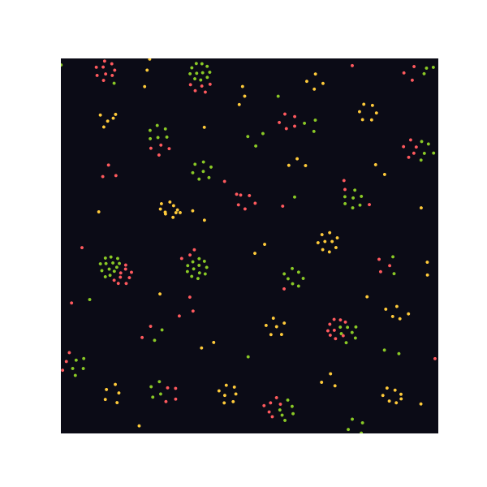
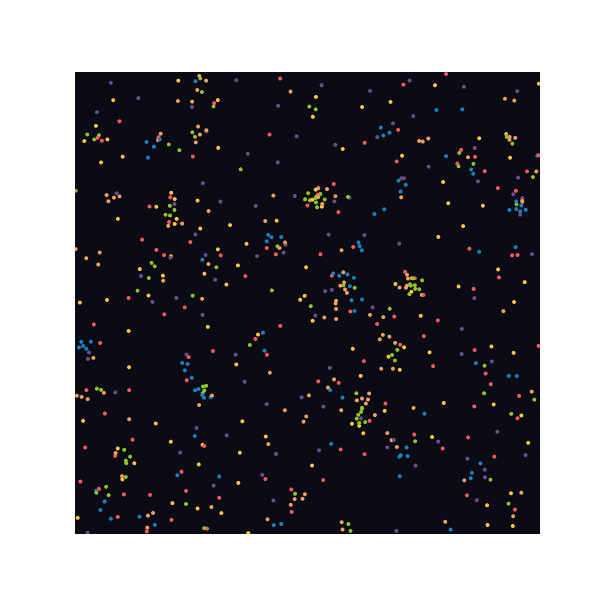
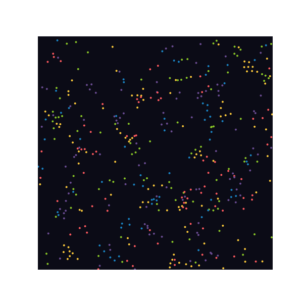
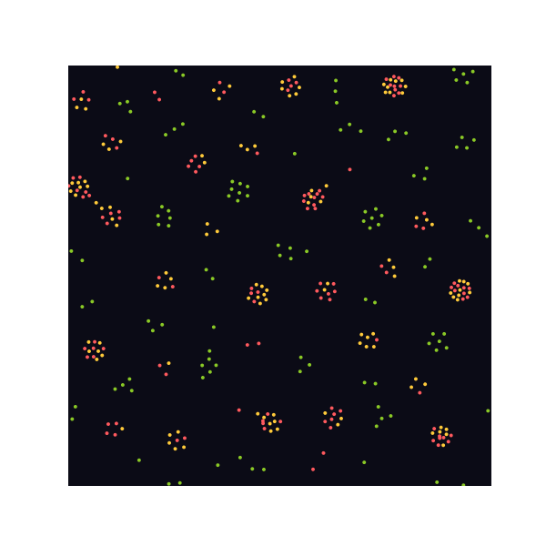

# Primordia

**A tiny set of physical rules. No biology. Yet something that looks alive.**

Primordia is a vectorized 2D particle-life simulator. Every particle belongs
to one of a handful of "species," and every
pair of species has a single number describing how strongly they attract or
repel each other. That's the entire rulebook. Run it forward, and particles
spontaneously organize into cells, swarms, orbits, chains, and chases —
emergent structure with nothing resembling "life" written anywhere in the
code.

| `cells` | `chaos` |
| --- | --- |
|  |  |

| `chase` | `symbiosis` |
| --- | --- |
|  |  |

## How it works

Each particle has a position, a velocity, and a type `0..K-1`. A `K x K`
matrix `rules` holds the interaction strength between every pair of types,
each roughly in `[-1, 1]`:

- **Positive** → particles of type `i` are *attracted* to particles of type `j`.
- **Negative** → particles of type `i` are *repelled* by particles of type `j`.

At every step, for every pair of particles, the force between them is a
piecewise "tent" function of their distance `r`:

```
force(r)
   │
 1 ┤        ╭──╮
   │       ╱    ╲
 0 ┤──────╱──────╲──────────
   │     ╱        ╲
-1 ┤────╯          ╰─────────
   └────┴────┴────┴────┴──── r
   0   beta       r_max
   (always       (rule-driven attraction
    repel)        or repulsion, then nothing)
```

- For `r < beta`: particles always strongly repel, regardless of type — this
  is what keeps everything from collapsing into a single point.
- For `beta <= r <= r_max`: the force ramps from 0 up to `rules[i, j]` at the
  midpoint and back to 0 — same-sign rules pull particles into orbit-like
  shells, opposite-sign rules push them apart.
- For `r > r_max`: no interaction.

Velocities decay each step by a `friction` factor and positions wrap around
the edges of the arena (a torus), so structures can drift forever without
hitting a wall. The whole pairwise computation is vectorized with numpy
broadcasting, so a few hundred particles update in real time.

The whole thing is ~100 lines of numpy. See
[`primordia/simulation.py`](primordia/simulation.py) for the implementation
and [`primordia/presets.py`](primordia/presets.py) for the rule matrices
behind each preset above.

## Project structure

```
primordia/
├── __init__.py       # public API: ParticleLife, SimulationConfig
├── __main__.py        # `python -m primordia ...` entry point
├── simulation.py       # the vectorized physics core
├── presets.py          # named, hand-tuned rule matrices
├── render.py            # snapshot (PNG) and animation (GIF) rendering
└── cli.py                # argparse-based command-line interface
tests/
└── test_simulation.py   # determinism, bounds, and preset sanity checks
examples/
└── *.gif              # pre-rendered demos shown above
```

## Getting started

```bash
pip install -r requirements.txt
```

List the built-in presets:

```bash
python -m primordia list
```

```
cells        A few species that separate into soft, slowly drifting blobs.
chaos        A fully random rule matrix with many species and low friction,
chase        Five species locked in a rock-paper-scissors chase, forming
symbiosis    Two mutually-attracting species wrapped in a third species that
```

Render an animation:

```bash
python -m primordia run chaos --output chaos.gif --frames 150 --fps 24
```

Or a single snapshot after letting the system settle:

```bash
python -m primordia run cells --snapshot cells.png --steps 500
```

### Use it as a library

```python
from primordia import ParticleLife, SimulationConfig
from primordia.render import save_animation

config = SimulationConfig(num_particles=400, num_types=4, seed=42)
sim = ParticleLife(config)
save_animation(sim, "out.gif", frames=150, warmup_steps=100)
```

### Designing your own rules

Pass any `K x K` matrix of numbers in `[-1, 1]` as `rules` to
`SimulationConfig`. Row `i`, column `j` is "how much type `i` likes type
`j`." Symmetric matrices tend to produce static clusters; antisymmetric or
cyclic matrices (`A[i, j] = -A[j, i]`, or `A[i, (i+1) % K] > 0` while
`A[i, (i-1) % K] < 0`) tend to produce chases and rotation. Small changes can
flip a simulation from a static crystal to a swirling, never-repeating
soup — that sensitivity is most of the fun.

## Running the tests

```bash
pip install -r requirements.txt pytest
python -m pytest
```
