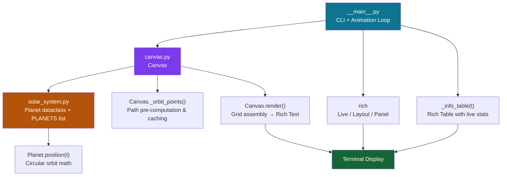

# 🌌 Orbit — Terminal Solar System Simulator

[](https://www.python.org/)
[](LICENSE)
[](https://github.com/Textualize/rich)
[](https://claude.ai)

> **Watch all 8 planets orbit the Sun — live in your terminal.** Orbital speeds are derived from real NASA planetary data. No GUI, no browser, no dependencies beyond `rich`.

---

## Demo

```
╭───────────────────────────── ✦  O R B I T  — Solar System Simulator  ✦  ─────────────────────────────╮
│     ·                                                                         ·                        │
│                                       ·      ········                 ·                               │
│                                       ·······        ·······                        ·              ·  │
│                              ·   ·····   ················   ·····                                     │
│                               ····   ····     ······     ····   ····              ·                   │
│             ·               ···  ····  ········    ········  ····  ···  ·                              │
│                            ··  ···  ···    ············    ···  ···  ··              ·                 │
│                          ··  ··   ···   ····      ◎ Jup···   ···   ○ Ura                              │
│                         ··  ··  ··   ···    ··········    ···   ··  ··                                 │
│                        ··  ··  ·   ··   ····   ····   ····   ··   ·  ··  ··                            │
│              ·         ·  ··  ·  ··    ·· ····· ·  ····· ··    ··  ·  ··  ·                            │
│             ··        ·  ··  ·   ·   ·· ··· ·········· ·◉ Ear   ·   ·  ··  ·                           │
│                       ·  ·   ·  ··   ·  · ··● Ven······  ·  ● Mar·  ·   ·  ··                          │
│                       ·  ·  ·   ·   ·· ·  · ··      ·  ·  · ··   ·   ·  ·  ·                           │
│                       ·  ·  ·   ·   ·· ·  ·  ·   ☀  ·· ·  · ··   ·   ·  ·  ·                           │
│                       ◦ Nep  ·· ··   ·  · ·· ··········  ·  ·   ··  ·   ·  ·                           │
│                       ·  ··  ·   ·   ·· ··· ········Mer··· ··   ·   ·  ··  ·              ·            │
│                        ·  ··  ·  ··    ·· ······   ····· ··    ··  ·  ··  ·                            │
│           ·            ··  ··  ·   ··   ···· · ····   ····   ··   ·  ··  ··      ·                     │
│                         ··· ··   ···   ····          ····   ···   ··  ··                               │
│                          ·  ·····   ················   ·····                                           │
│    · ·                       ·····        ·······                  ·                                   │
│                              ⊕ Sat ·······        ·······                                              │
│                                       ·      ········                                                  │
│                ·                                                                                        │
╰────────────────────────────────────────────────────────────────────────────────────────────────────────╯
╭──────────────────────────────────── Planetary Data ────────────────────────────────────────────────────╮
│  Planet     Sym   Orbital Period   Orbits Elapsed   Sim. Year                                          │
│  Mercury    ·     0.241 yr         6.22             1.50 yr                                            │
│  Venus      ●     0.615 yr         2.44             1.50 yr                                            │
│  Earth      ◉     1.000 yr         1.50             1.50 yr                                            │
│  Mars       ●     1.881 yr         0.80             1.50 yr                                            │
│  Jupiter    ◎     11.862 yr        0.13             1.50 yr                                            │
│  Saturn     ⊕     29.457 yr        0.05             1.50 yr                                            │
│  Uranus     ○     84.011 yr        0.02             1.50 yr                                            │
│  Neptune    ◦     164.795 yr       0.01             1.50 yr                                            │
╰────────────────────────────────────────────────────────────────────────────────────────────────────────╯
```

---

## Features

- **Real orbital mechanics** — angular velocities derived from actual NASA orbital period data
- **All 8 planets** rendered simultaneously with unique symbols and terminal colors
- **Live planetary data panel** — tracks simulation year, orbits elapsed per planet
- **Procedural starfield** — seeded random background stars that fill your terminal
- **Aspect-ratio corrected orbits** — orbits look circular, not oval, regardless of font
- **Configurable speed & FPS** — slow-motion study or fast time-lapse at your choice
- **Zero-friction setup** — one `pip install` and you're watching planets orbit

---

## Quick Start

```bash
# Clone the repo
git clone https://github.com/kareemrt/Clauder.git
cd Clauder

# Install dependency
pip install rich

# Run the simulation
python -m orbit
```

Or install as a command:

```bash
pip install -e .
orbit
```

---

## Usage

```
python -m orbit [OPTIONS]

Options:
  --speed FLOAT   Simulation speed in Earth-years per real second  [default: 2.0]
  --fps INT       Frames per second                                 [default: 24]
  --width INT     Canvas width in columns  (default: terminal width)
  --height INT    Canvas height in rows    (default: 34)
  --help          Show this message and exit.
```

### Examples

```bash
# Default: 2 Earth-years per second at 24 FPS
python -m orbit

# Slow-motion: 0.5 Earth-years per second — great for inner planets
python -m orbit --speed 0.5

# Fast time-lapse: watch Neptune complete an orbit in ~1 minute
python -m orbit --speed 200

# Fixed canvas size for screenshots
python -m orbit --width 120 --height 40

# Silky smooth 60 FPS
python -m orbit --fps 60
```

---

## Architecture



### File Structure

```
Clauder/
├── orbit/
│   ├── __init__.py          Version metadata
│   ├── __main__.py          CLI entry point, animation loop, info table
│   ├── solar_system.py      Planet dataclass + NASA orbital period data
│   └── canvas.py            Starfield, orbit path renderer, ASCII grid
├── requirements.txt         rich>=13.0.0
├── pyproject.toml           Installable package config
└── README.md
```

---

## How It Works

### Orbital Mechanics

Each planet follows a **circular orbit** (a good approximation for most solar planets) described by:

```
θ(t) = θ₀ + ω·t       where ω = 2π / T  (T = orbital period in years)

x(t) = cx + r·cos(θ)
y(t) = cy + r·sin(θ) × 0.45   ← aspect-ratio correction
```

The `0.45` Y-scale factor compensates for terminal characters being approximately twice as tall as they are wide, keeping orbits visually circular.

### Distance Scaling

Actual planetary distances span 3 orders of magnitude (0.4 AU → 30 AU). Displaying them to-scale would make the inner planets invisible. Orbit uses **manually tuned logarithmic-style display radii** that preserve the sense of relative spacing while keeping every planet visible:

| Planet  | Real (AU) | Display radius (normalized) |
|---------|-----------|----------------------------|
| Mercury | 0.387     | 0.13                       |
| Venus   | 0.723     | 0.21                       |
| Earth   | 1.000     | 0.30                       |
| Mars    | 1.524     | 0.39                       |
| Jupiter | 5.203     | 0.53                       |
| Saturn  | 9.537     | 0.65                       |
| Uranus  | 19.19     | 0.76                       |
| Neptune | 30.07     | 0.87                       |

### Rendering Pipeline

```
Each frame:
  1. Fill 2D char grid with spaces
  2. Scatter background stars  (seeded RNG, computed once)
  3. Draw orbital ellipses     (pre-computed and cached after first frame)
  4. Place Sun glyph  ☀  at center
  5. For each planet:
       a. Compute (x, y) from orbital equation
       b. Write planet glyph + 3-char label to grid
  6. Flatten grid → Rich Text object with per-cell styles
  7. Wrap in Rich Panel, push to Live layout
```

---

## Planet Data Reference

| Planet  | Symbol | Color        | Period (yr) | Real Distance (AU) |
|---------|--------|--------------|-------------|-------------------|
| Mercury | `·`    | White        | 0.241       | 0.387             |
| Venus   | `●`    | Yellow       | 0.615       | 0.723             |
| Earth   | `◉`    | Bright Blue  | 1.000       | 1.000             |
| Mars    | `●`    | Red          | 1.881       | 1.524             |
| Jupiter | `◎`    | Bright Yellow| 11.862      | 5.203             |
| Saturn  | `⊕`    | Yellow       | 29.457      | 9.537             |
| Uranus  | `○`    | Cyan         | 84.011      | 19.19             |
| Neptune | `◦`    | Blue         | 164.795     | 30.07             |

---

## Requirements

| Requirement   | Version  |
|---------------|----------|
| Python        | ≥ 3.9    |
| rich          | ≥ 13.0.0 |
| Terminal size | ≥ 80×24  |

---

## License

MIT — see [LICENSE](LICENSE). Built by Claude (Anthropic) for the Clauder project.
