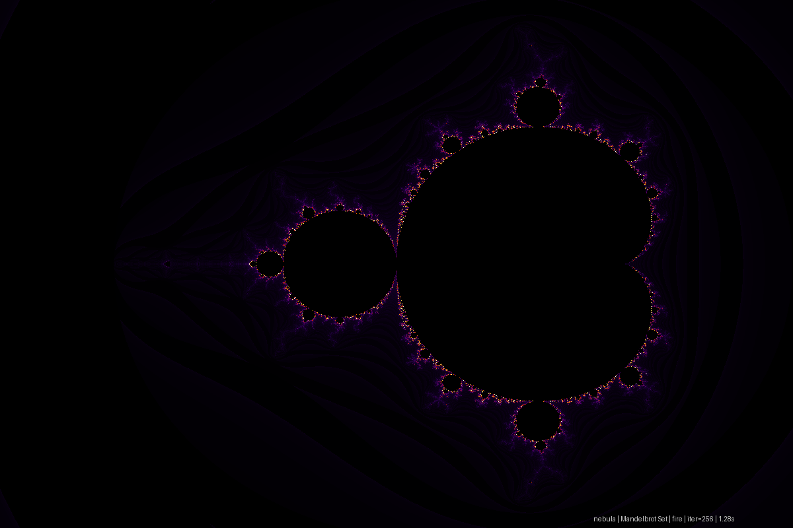
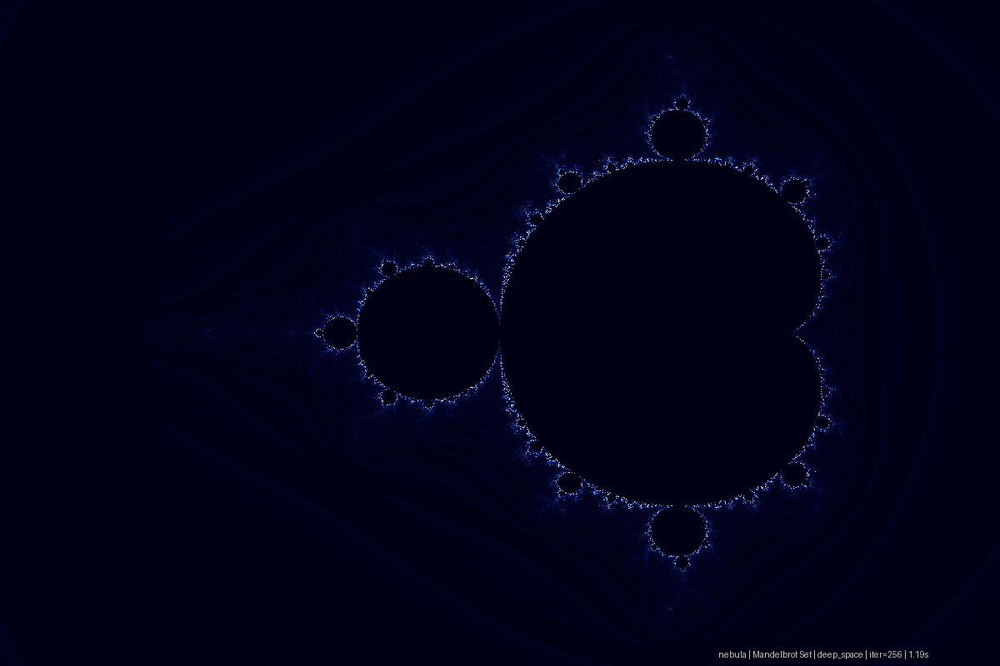
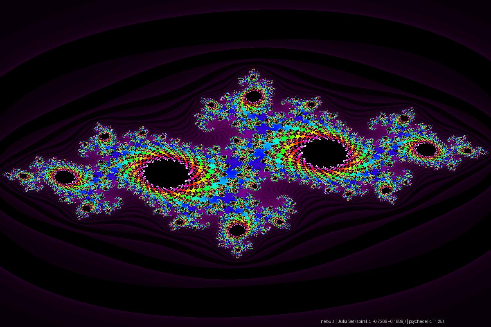
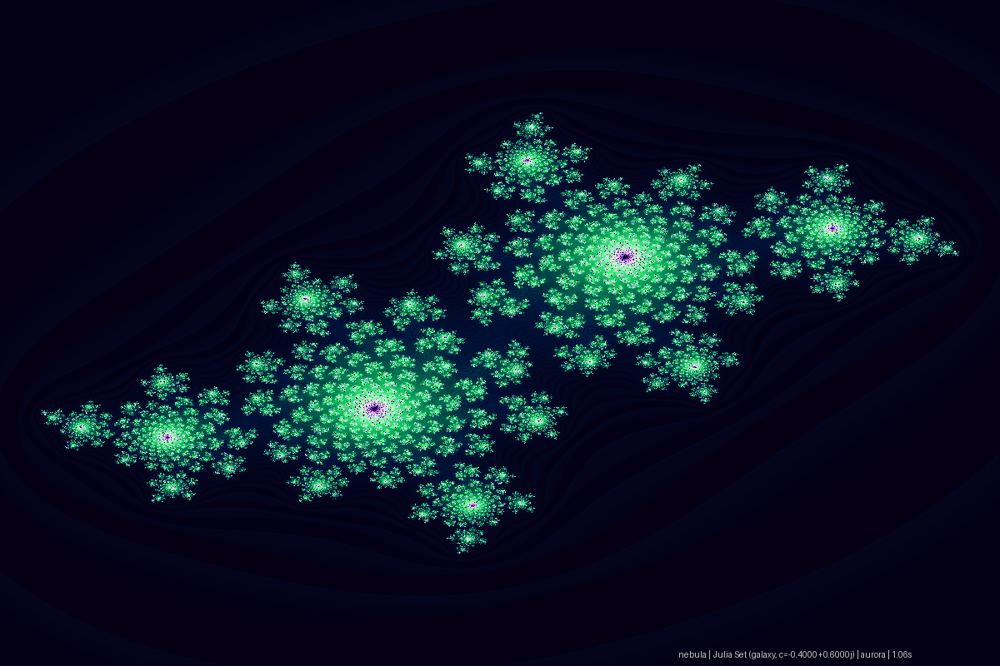
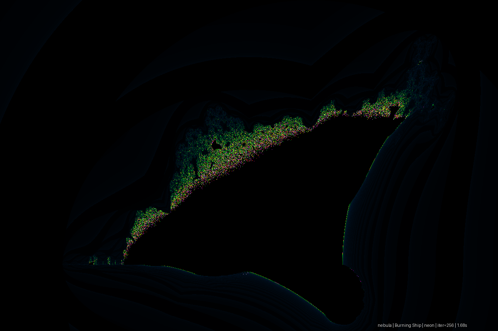
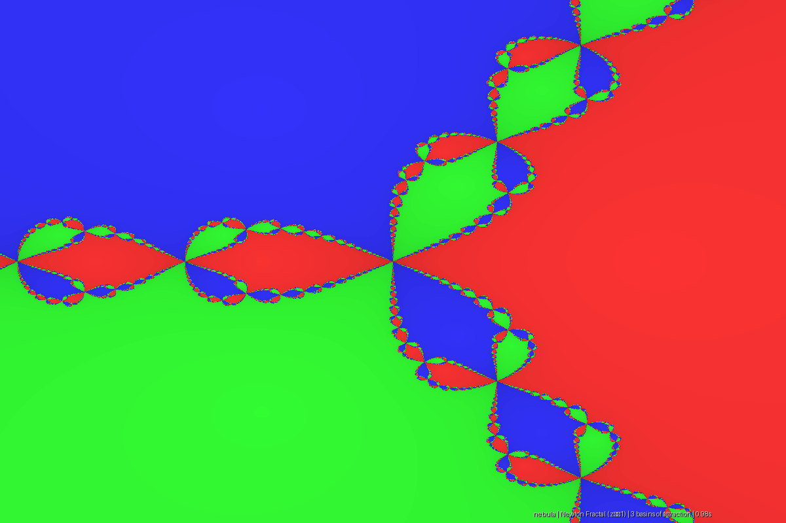

# 🌌 Nebula — A Fractal Universe Explorer

> *"Bottomless wonders spring from simple rules repeated without end."*
> — Benoit Mandelbrot

Nebula is a high-performance Python command-line tool that renders mathematically stunning fractal images. From the infinite self-similarity of the Mandelbrot set to the eerie basin boundaries of Newton fractals, Nebula lets you explore the hidden geometry of mathematics — all from your terminal.

---

## ✨ Gallery

<table>
  <tr>
    <td align="center"><br/><b>Mandelbrot · Fire</b></td>
    <td align="center"><br/><b>Mandelbrot · Deep Space</b></td>
  </tr>
  <tr>
    <td align="center"><br/><b>Julia Spiral · Psychedelic</b></td>
    <td align="center"><br/><b>Julia Galaxy · Aurora</b></td>
  </tr>
  <tr>
    <td align="center"><br/><b>Burning Ship · Neon</b></td>
    <td align="center"><br/><b>Newton Fractal · z³ − 1</b></td>
  </tr>
</table>

---

## 🧠 The Mathematics

Each fractal type is built on a simple iterative rule applied to the complex plane:

| Fractal | Rule | Character |
|---------|------|-----------|
| **Mandelbrot** | `z_{n+1} = z_n² + c`, `z₀ = 0` | The mother of all fractals — self-similar at every scale |
| **Julia** | `z_{n+1} = z_n² + c`, `z₀ = point` | A family of sets parameterized by the constant `c` |
| **Burning Ship** | `z_{n+1} = (|Re(z)| + i|Im(z)|)² + c` | Folding the plane produces eerie ship-like structures |
| **Newton** | Newton's method on `f(z) = z³ − 1` | Basin boundaries between three roots form fractal chaos |

**Smooth coloring** uses the escape-time algorithm with a fractional iteration count:

```
smooth_iter = n + 1 − log(log(|z_n|)) / log(2)
```

This eliminates the banding artifacts of integer escape counts, producing silky-smooth gradients across the fractal boundary.

---

## 📁 Project Structure

```
nebula/                         ← Main package
├── __init__.py
├── cli.py                      ← Rich-powered command-line interface
├── renderer.py                 ← Orchestrates fractal computation + coloring
├── palettes.py                 ← 8 gradient color palettes
└── fractals/
    ├── __init__.py
    ├── mandelbrot.py           ← Mandelbrot set (smooth coloring)
    ├── julia.py                ← Julia sets (8 named presets)
    ├── burning_ship.py         ← Burning Ship fractal
    └── newton.py               ← Newton fractal (z³ − 1)

examples/                       ← Pre-rendered gallery images
main.py                         ← Entry point
requirements.txt
```

---

## 🚀 Quick Start

### Install

```bash
git clone https://github.com/kareemrt/clauder.git
cd clauder
pip install -r requirements.txt
```

### Render a fractal

```bash
# Mandelbrot set with the "fire" palette
python main.py render mandelbrot -p fire -o out.png

# Julia set — "galaxy" preset with aurora colors
python main.py render julia -p aurora --julia-preset galaxy -o julia.png

# Burning Ship fractal, neon palette, 4x zoom
python main.py render burning_ship -p neon --zoom 4 -o ship.png

# Newton fractal — basins of attraction for z^3 = 1
python main.py render newton -o newton.png

# ASCII art in the terminal (no image output needed)
python main.py render mandelbrot --ascii
```

### Render a full gallery

```bash
python main.py gallery -o my_gallery/
```

### List all options

```bash
python main.py list
```

---

## 🎨 Color Palettes

| Palette | Description |
|---------|-------------|
| `fire` | Black → purple → orange → white, like a solar flare |
| `deep_space` | Dark navy → cerulean → white, cosmic and serene |
| `psychedelic` | Full rainbow loop, maximum visual chaos |
| `ice` | Dark blue → sky blue → white, glacial and crisp |
| `neon` | Black → electric green → magenta → violet |
| `gold` | Black → amber → gold → pale white |
| `monochrome` | Classic grayscale |
| `aurora` | Teal → emerald → lavender → violet, Northern Lights |

---

## 🌀 Julia Set Presets

The Julia set is parameterized by a complex constant `c`. Different values produce radically different topologies:

| Preset | `c` value | Shape |
|--------|-----------|-------|
| `spiral` | `-0.7269 + 0.1889i` | Tight spiraling tendrils |
| `galaxy` | `-0.4 + 0.6i` | Galaxy-like swirling arms |
| `dendrite` | `0 + 1i` | Tree-like branching dendrites |
| `rabbit` | `-0.123 + 0.745i` | Douady's rabbit — three-lobed |
| `lightning` | `0.285 + 0.01i` | Electric, branching lightning |
| `san_marco` | `-0.75 + 0i` | San Marco dragon curves |
| `siegel_disk` | `-0.3905 − 0.5868i` | Smooth rotating disk boundary |
| `douady_rabbit` | `-0.1226 + 0.7449i` | Nested rabbit clusters |

---

## ⚙️ CLI Reference

```
python main.py render <fractal> [options]

Fractals:
  mandelbrot          The classic Mandelbrot set
  julia               Julia sets (use --julia-preset to pick a variant)
  burning_ship        Burning Ship fractal
  newton              Newton fractal for z^3 − 1

Options:
  -p, --palette       Color palette (default: deep_space)
  -W, --width         Image width in pixels (default: 1200)
  -H, --height        Image height in pixels (default: 800)
  -i, --max-iter      Max iteration depth (default: 256, higher = more detail)
  -o, --output        Output file path (e.g. out.png)
  --ascii             Render as ASCII art in the terminal
  --julia-preset      Julia set variant (default: spiral)
  --zoom              Zoom level (default: 1.0)
  --cx, --cy          Center coordinates for zoom viewport
```

---

## 🔬 How It Works

```
User input
    │
    ▼
CLI (cli.py) parses arguments
    │
    ▼
Renderer (renderer.py) builds viewport coordinates
    │
    ├──► Fractal engine (fractals/*.py)
    │         Uses NumPy vectorized operations
    │         Returns normalized [0, 1] escape-time field
    │
    ▼
Palette mapper (palettes.py)
         Applies smooth gradient coloring
         Outputs PIL Image
    │
    ▼
PNG export / terminal display / ASCII art
```

**Performance:** NumPy's vectorized complex arithmetic processes millions of points per second without Python loops over individual pixels. A 1200×800 Mandelbrot at 256 iterations typically renders in **1–2 seconds** on modern hardware.

---

## 🧩 Extending Nebula

### Add a new fractal

Create `nebula/fractals/my_fractal.py`:

```python
import numpy as np

def my_fractal(width, height, ...) -> np.ndarray:
    # Return a normalized [0, 1] escape-time field
    ...
```

Then register it in `nebula/fractals/__init__.py` and `nebula/renderer.py`.

### Add a new palette

In `nebula/palettes.py`, add an entry to `PALETTES`:

```python
"sunset": _make_gradient([
    (20, 0, 40), (180, 60, 0), (255, 200, 0), (255, 240, 200)
]),
```

---

## 📦 Requirements

- Python 3.11+
- `numpy` — vectorized fractal computation
- `Pillow` — image output
- `rich` — beautiful terminal UI

```
pip install numpy Pillow rich
```

---

## 📄 License

MIT — go explore infinity.

---

<div align="center">
  Built with Python, NumPy, and a deep appreciation for chaos theory.<br/>
  <i>The boundary of the Mandelbrot set is a fractal curve of infinite length.</i>
</div>
