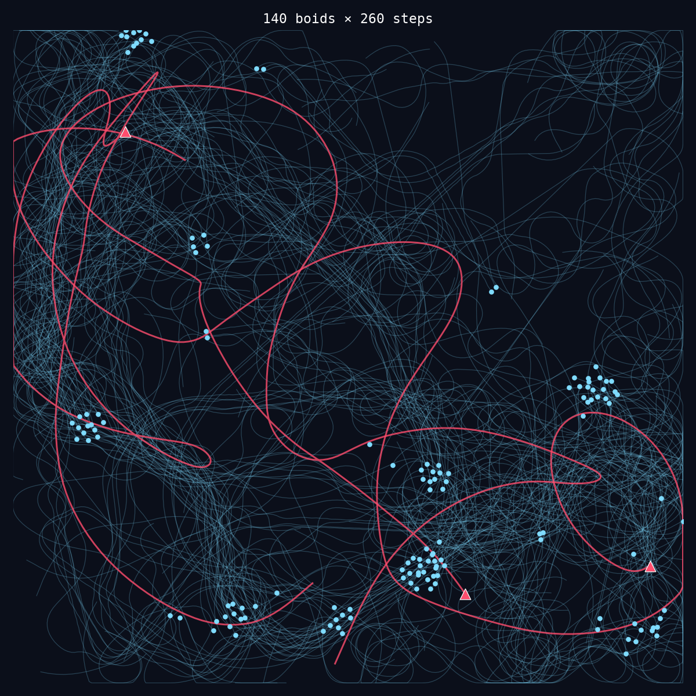

# Murmuration

A vectorized **boids flocking simulation** with predator–prey dynamics — watch
a swarm of simple, locally-acting agents produce the same swirling,
splitting, and reforming patterns seen in real starling murmurations and fish
schools, entirely from three local rules and a healthy fear of predators.


> 140 boids, 3 predators, 260 steps — every boid sees only its closest
> neighbors, yet the *flock* behaves as one.

## Why this is fascinating

No boid knows the shape of the flock. No boid is in charge. Each one reacts
only to the handful of neighbors within its own perception radius, using
three rules first described by Craig Reynolds in 1986:

| Rule | What it does | Effect |
|---|---|---|
| **Separation** | Steer away from neighbors that are *too* close | Prevents collisions |
| **Alignment** | Match the average heading of nearby flockmates | Creates coordinated motion |
| **Cohesion** | Steer toward the average position of nearby flockmates | Keeps the group together |

On top of classic boids, this simulation adds a fourth force —
**predator avoidance** — plus predators that actively hunt the nearest
cluster of boids. The result is genuinely emergent: flocks split to evade an
incoming predator, scatter, and re-coalesce once the threat passes, with no
agent ever "deciding" to do any of that.

## Structure

```
murmuration/
├── simulation.py   # Vectorized numpy core: FlockSimulation, SimulationConfig
├── visualize.py     # Renders a simulation run to an animated GIF or a static plot
└── cli.py           # `python -m murmuration.cli` entry point
tests/
└── test_simulation.py
assets/
├── flock.gif         # Generated animation (see below)
└── trajectories.png  # Generated static plot
```

```
                ┌─────────────────────┐
   neighbors ──▶│   FlockSimulation   │──▶ positions, velocities
   predators ──▶│   (numpy, O(n²))    │      per step
                └─────────┬───────────┘
                          │ .run(steps)
                          ▼
                ┌─────────────────────┐
                │     visualize.py     │──▶ flock.gif / trajectories.png
                └─────────────────────┘
```

Every step is a handful of vectorized numpy operations over an `(N, N, 2)`
pairwise displacement tensor — no per-agent Python loops, so a few hundred
boids update in well under a millisecond.

## Quick start

```bash
pip install -r requirements.txt

# generate assets/flock.gif and assets/trajectories.png
python -m murmuration.cli --boids 140 --predators 3 --steps 260 --seed 7
```

### Watching trajectories form



> Faint blue trails are individual boid paths; the bold red trails are the
> predators' hunts. Notice how the flock fractures into multiple
> independent clusters that drift apart as predators carve through the
> middle of the group.

## CLI reference

```
python -m murmuration.cli [options]
```

| Flag | Default | Description |
|---|---|---|
| `--boids` | `120` | Number of boid agents |
| `--predators` | `2` | Number of predator agents |
| `--steps` | `300` | Simulation steps to render |
| `--width`, `--height` | `100.0` | World size |
| `--seed` | random | Shared seed for both the GIF and trajectory renders |
| `--fps` | `24` | Frames per second of the GIF |
| `--gif` | `assets/flock.gif` | GIF output path |
| `--trajectories` | `assets/trajectories.png` | Static plot output path |
| `--skip-gif` / `--skip-trajectories` | off | Skip one of the two renders |

## Using it as a library

```python
from murmuration.simulation import FlockSimulation, SimulationConfig

sim = FlockSimulation(SimulationConfig(num_boids=80, num_predators=1, seed=42))
for _ in range(200):
    sim.step()

print(sim.positions)    # (80, 2) — current boid positions
print(sim.velocities)   # (80, 2) — current boid velocities
```

Every parameter in `SimulationConfig` — perception radius, rule weights,
speed/force limits, predator aggressiveness — is tunable, so it's easy to
explore the boundary between orderly flocking and chaotic scattering.

## Running the tests

```bash
pip install -r requirements-dev.txt
pytest tests/ -v
```

Tests cover boundary containment, speed clamping, determinism under a fixed
seed, and that the flock actually clusters (mean nearest-neighbor distance
shrinks) when no predators are present.

## License

MIT
