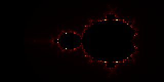
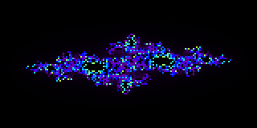
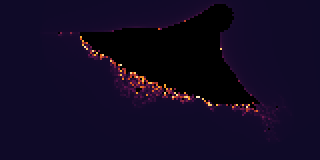

# FractalScope 🔭

> **A terminal fractal explorer with smooth colouring, multiple fractal types, and PNG export.**

FractalScope renders mathematically beautiful fractals — Mandelbrot, Julia sets, and the Burning Ship — directly in your terminal using Unicode half-block characters and true-colour ANSI escape codes.  It also exports high-resolution PNG images via Pillow.

---

## Gallery

| Mandelbrot · `fire` | Julia (lightning) · `neon` | Burning Ship · `sunset` |
|---|---|---|
|  |  |  |

| Julia (Douady Rabbit) · `ocean` |
|---|
|  |

---

## Features

- **3 fractal types** — Mandelbrot, Julia (7 named presets), Burning Ship
- **8 colour palettes** — fire, ocean, neon, sunset, forest, ice, gold, grayscale
- **Smooth colouring** — fractional escape-count algorithm eliminates harsh banding
- **True-colour terminal** — 24-bit ANSI + Unicode half-block (▀) for 2× vertical resolution
- **PNG export** — pixel-perfect lossless export with configurable upscale factor
- **Gallery mode** — renders every fractal × palette combination in one command
- **Zero runtime deps** for terminal output (only `numpy`); `Pillow` optional for PNG

---

## Project Structure

```
Clauder/
├── fractalscope/
│   ├── __init__.py
│   ├── main.py              ← CLI entry point (argparse)
│   ├── palettes.py          ← 8 colour palettes with smooth interpolation
│   ├── demo.py              ← quick three-fractal demo
│   ├── fractals/
│   │   ├── __init__.py
│   │   ├── mandelbrot.py    ← Mandelbrot set (z → z² + c, c = pixel)
│   │   ├── julia.py         ← Julia sets (z → z² + c, c = parameter)
│   │   └── burning_ship.py  ← Burning Ship (z → (|Re|+i|Im|)² + c)
│   └── renderers/
│       ├── __init__.py
│       ├── terminal.py      ← ANSI 24-bit colour + ▀ block rendering
│       └── image.py         ← Pillow PNG export with upscaling
├── gallery/                 ← generated PNG images
├── requirements.txt
├── setup.py
└── README.md
```

---

## How It Works

### The Escape-Time Algorithm

Each pixel corresponds to a complex number **c** (or **z₀** for Julia sets).
We iterate the recurrence until |z| > 2 (escaped) or we hit `max_iter`:

```
Mandelbrot:    z₀ = 0,     z_{n+1} = z_n² + c
Julia:         z₀ = pixel, z_{n+1} = z_n² + c   (c is a fixed parameter)
Burning Ship:  z₀ = 0,     z_{n+1} = (|Re(z_n)| + i|Im(z_n)|)² + c
```

### Smooth Colouring

Raw iteration counts produce harsh colour bands. FractalScope uses the
**normalized iteration count** formula to produce smooth gradients:

```
smooth = i + 1 − log₂(log₂(|z|))
```

where `i` is the escape iteration and `|z|` is the final magnitude.

### Terminal Rendering

Each terminal cell holds **two pixel rows** using the Unicode character `▀`
(UPPER HALF BLOCK). The foreground colour (24-bit ANSI) paints the top half;
the background paints the bottom. This doubles the effective vertical
resolution without requiring a graphics window.

```
ANSI sequence per cell:
  \033[38;2;<R>;<G>;<B>m   ← foreground (top pixel)
  \033[48;2;<R>;<G>;<B>m   ← background (bottom pixel)
  ▀
  \033[0m                   ← reset after each row
```

### Colour Palettes

Each palette is defined as a list of RGB control points. A 1024-entry lookup
table is built via linear interpolation between adjacent control points:

```
fire    ●━━━━━━━━━━━━━━━━━━━━━━●  black → deep red → orange → yellow → white
ocean   ●━━━━━━━━━━━━━━━━━━━━━━●  dark blue → cobalt → cyan → pale blue
neon    ●━━━━━━━━━━━━━━━━━━━━━━●  black → violet → electric blue → lime
sunset  ●━━━━━━━━━━━━━━━━━━━━━━●  midnight → magenta → amber → cream
forest  ●━━━━━━━━━━━━━━━━━━━━━━●  black → dark green → lime → pale green
ice     ●━━━━━━━━━━━━━━━━━━━━━━●  deep navy → steel blue → sky → white-blue
gold    ●━━━━━━━━━━━━━━━━━━━━━━●  black → bronze → amber → gold → cream
gray    ●━━━━━━━━━━━━━━━━━━━━━━●  black → mid-grey → white
```

Points **inside** the fractal set are always forced to pure black.

---

## Installation

```bash
# Clone and install
git clone https://github.com/kareemrt/Clauder.git
cd Clauder

# Core (terminal output only)
pip install numpy

# With PNG export
pip install numpy Pillow

# Or install as a package
pip install -e .
```

---

## Usage

### Terminal rendering

```bash
# Mandelbrot with fire palette (default)
python -m fractalscope.main

# Julia "lightning" with neon palette
python -m fractalscope.main --fractal julia --palette neon

# Burning Ship — wider view
python -m fractalscope.main --fractal burning_ship --palette sunset --width 200 --height 100

# Julia preset
python -m fractalscope.main --fractal julia --julia-preset douady_rabbit --palette ocean

# Custom Julia constant
python -m fractalscope.main --fractal julia --c-real -0.391 --c-imag -0.587 --palette ice

# Zoom into Mandelbrot seahorse valley
python -m fractalscope.main --x-min -0.8 --x-max -0.7 --y-min 0.05 --y-max 0.15 --max-iter 1024 --palette gold
```

### PNG export

```bash
python -m fractalscope.main --fractal mandelbrot --palette fire \
    --width 1920 --height 1080 --save mandelbrot.png --scale 1

# Skip terminal output when saving
python -m fractalscope.main --fractal julia --palette neon --no-terminal --save julia.png
```

### Full gallery

```bash
# Renders every fractal × palette → ./gallery/
python -m fractalscope.main --all
```

### List options

```bash
python -m fractalscope.main --list
```

### Demo script

```bash
python fractalscope/demo.py
```

---

## CLI Reference

```
usage: fractalscope [-h] [--fractal {mandelbrot,julia,burning_ship}]
                    [--palette {fire,ocean,neon,sunset,forest,ice,gold,grayscale}]
                    [--width W] [--height H] [--max-iter I]
                    [--x-min X] [--x-max X] [--y-min Y] [--y-max Y]
                    [--c-real C] [--c-imag C] [--julia-preset PRESET]
                    [--save FILE] [--scale N] [--no-terminal]
                    [--list] [--all]

Options:
  --fractal,  -f    Fractal type          (default: mandelbrot)
  --palette,  -p    Colour palette        (default: fire)
  --width,    -W    Width in pixels       (default: 160)
  --height,   -H    Height in pixels      (default: 90)
  --max-iter, -i    Maximum iterations    (default: 256)
  --x-min         Real axis minimum
  --x-max         Real axis maximum
  --y-min         Imaginary axis minimum
  --y-max         Imaginary axis maximum
  --c-real        Julia c (real part)     (default: -0.7269)
  --c-imag        Julia c (imaginary)     (default:  0.1889)
  --julia-preset  Named Julia constant
  --save,     -s    Save PNG to file
  --scale           PNG upscale factor    (default: 2)
  --no-terminal     Skip terminal output
  --list,     -l    List fractals/palettes
  --all,      -a    Render full gallery
```

### Julia presets

| Preset | c | Notes |
|---|---|---|
| `lightning` | −0.7269 + 0.1889i | Branching lightning bolts |
| `seahorse` | −0.75 + 0.13i | Seahorse shapes |
| `douady_rabbit` | −0.123 + 0.745i | Three-lobed rabbits |
| `san_marco` | −0.75 + 0i | San Marco dragon |
| `siegel_disk` | −0.391 − 0.587i | Rotating disk |
| `spiral` | 0.285 + 0.01i | Tight spirals |
| `dendrite` | 0 + 1i | Tree-like dendrite |

---

## Requirements

| Package | Version | Purpose |
|---|---|---|
| Python | ≥ 3.10 | f-strings, type hints |
| numpy | ≥ 1.24 | Vectorised iteration |
| Pillow | ≥ 9.0 | PNG export *(optional)* |

Terminal output requires a true-colour (24-bit) terminal emulator. Tested on:
- iTerm2, Kitty, Alacritty, WezTerm, GNOME Terminal, Windows Terminal

---

## Mathematical Background

### Mandelbrot Set
The Mandelbrot set **M** is the set of complex numbers **c** for which the
sequence `0, c, c²+c, (c²+c)²+c, …` remains bounded.  Its boundary is
infinitely complex — zooming in reveals self-similar spirals, seahorses, and
mini-Mandelbrot copies at every scale.

### Julia Sets
For each **c ∈ ℂ** there is a corresponding Julia set **J_c** — the boundary
between points that escape and those that don't under `z → z² + c`.
When **c ∈ M**, **J_c** is connected; when **c ∉ M**, it's a Cantor dust.

### Burning Ship
Replacing the squaring step with `(|Re(z)| + i|Im(z)|)²` breaks the
rotational symmetry and creates jagged, flame-like structures with a
distinctive "ship" shape near the real axis.

---

## License

MIT — see source for details.
