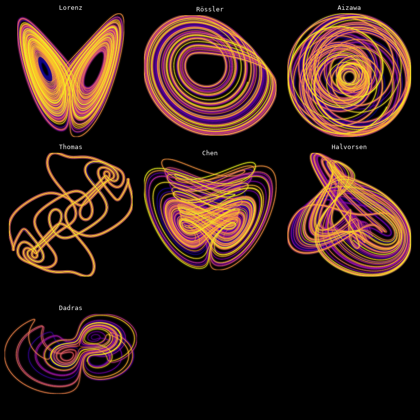
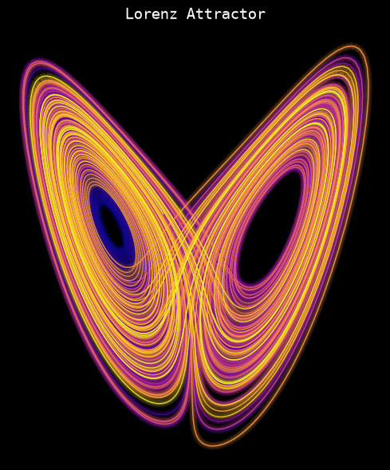
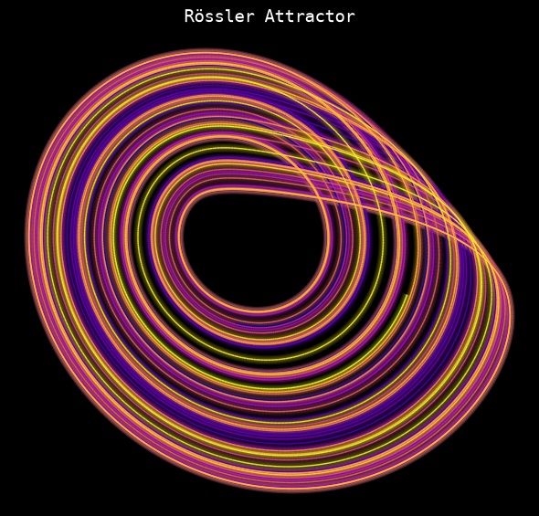
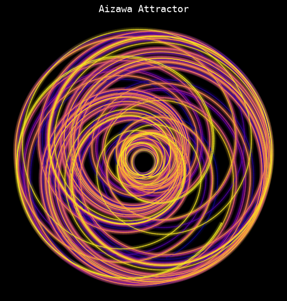
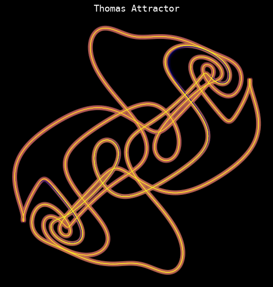
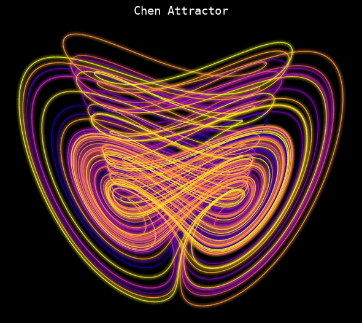
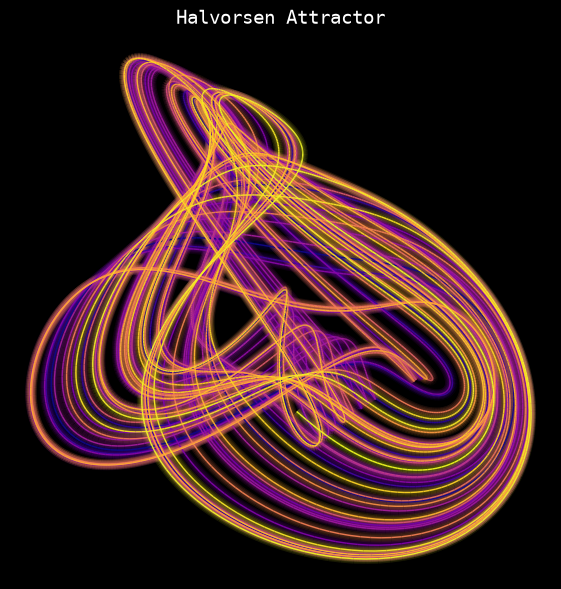
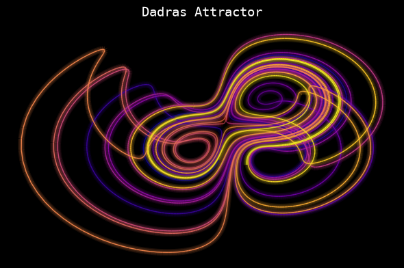
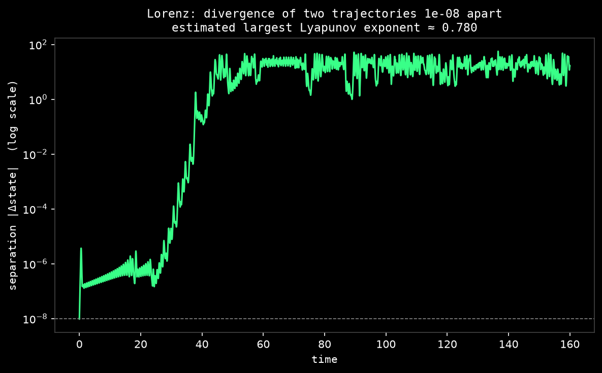
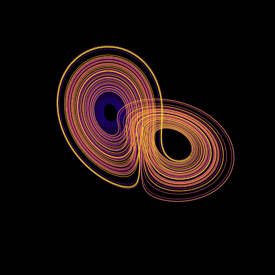

# Strange Attractors Explorer

**A numerical playground for chaos theory** — integrate, render, and watch the butterfly effect happen in seven classic chaotic dynamical systems.

<p align="center">
  
</p>

Strange attractors are deterministic: there is no randomness anywhere in the equations below. Yet two trajectories starting a hair's width apart diverge exponentially fast and end up on opposite sides of the attractor — the same mechanism that makes weather unpredictable past about two weeks. This project integrates these systems with a 4th-order Runge–Kutta solver, renders them as glowing line art, and measures *how* chaotic each one is by estimating its largest Lyapunov exponent.

---

## Why this is fascinating

- **Deterministic ≠ predictable.** Every point on the Lorenz butterfly below is computed from a simple set of three equations with no noise term. The unpredictability comes entirely from sensitivity to initial conditions, not from any randomness in the model.
- **The "butterfly effect" is measurable.** The `chaos` command starts two trajectories `1e-8` apart and tracks their separation — you can watch it grow exponentially in real time, then plateau once it saturates the attractor's size.
- **Wildly different equations converge on similar behavior.** Lorenz, Rössler, Aizawa, Thomas, Chen, Halvorsen, and Dadras all look nothing alike on paper, yet every one of them produces this same qualitative phenomenon: bounded, non-repeating, infinitely-detailed motion.

## Gallery

| Lorenz | Rössler | Aizawa |
|---|---|---|
|  |  |  |

| Thomas | Chen | Halvorsen |
|---|---|---|
|  |  |  |

| Dadras |
|---|
|  |

## The butterfly effect, visualized

<p align="center">
  
</p>

Two Lorenz trajectories start `10⁻⁸` apart — closer than the width of a virus. For the first ~25 time units they stay indistinguishable, then the separation grows exponentially (a straight line on this log scale) until it saturates at the size of the attractor itself. The slope of that exponential climb, estimated here with Benettin's renormalization method, is the system's **largest Lyapunov exponent** (λ ≈ 0.78 for these parameters) — a single number that quantifies how fast nearby futures fly apart.

## Rotating in 3D

<p align="center">
  
</p>

## Project structure

```
Clauder/
├── strange_attractors/        # the library
│   ├── systems.py             #   7 attractor definitions (dx/dt = f(x, y, z))
│   ├── integrator.py          #   fixed-step RK4 integration
│   ├── render.py               #   2D / 3D glow-style rendering (matplotlib)
│   ├── divergence.py          #   butterfly-effect demo + Lyapunov estimation
│   ├── animate.py             #   rotating GIF export
│   └── cli.py                 #   `python -m strange_attractors ...`
├── tests/                     # pytest unit tests
├── assets/
│   ├── images/                # generated PNGs (this README's visuals)
│   └── gifs/                  # generated rotation GIFs
└── requirements.txt
```

## The systems

| Key | System | Equations |
|---|---|---|
| `lorenz` | Lorenz (1963) | ẋ = σ(y−x), ẏ = x(ρ−z)−y, ż = xy−βz |
| `rossler` | Rössler | ẋ = −y−z, ẏ = x+ay, ż = b+z(x−c) |
| `aizawa` | Aizawa | ẋ = (z−b)x−dy, ẏ = dx+(z−b)y, ż = c+az−z³/3−(x²+y²)(1+ez)+fzx³ |
| `thomas` | Thomas | ẋ = sin(y)−bx, ẏ = sin(z)−by, ż = sin(x)−bz |
| `chen` | Chen | ẋ = a(y−x), ẏ = (c−a)x−xz+cy, ż = xy−bz |
| `halvorsen` | Halvorsen | ẋ = −ax−4y−4z−y², ẏ = −ay−4z−4x−z², ż = −az−4x−4y−x² |
| `dadras` | Dadras | ẋ = y−ax+byz, ẏ = cy−xz+z, ż = dxy−ez |

Run `python -m strange_attractors list` to see each system's description and default parameters in `strange_attractors/systems.py`.

## Installation

```bash
pip install -r requirements.txt
```

Requires Python 3.10+, NumPy, Matplotlib, and Pillow.

## Usage

```bash
# List all available systems
python -m strange_attractors list

# Render a single attractor as a glowing PNG
python -m strange_attractors render lorenz -o lorenz.png --cmap plasma

# Render every system as one grid image
python -m strange_attractors gallery -o gallery.png

# Plot the butterfly-effect divergence and estimate the Lyapunov exponent
python -m strange_attractors chaos lorenz -o divergence.png --eps 1e-8

# Export a rotating 3D GIF
python -m strange_attractors animate aizawa -o aizawa.gif --frames 60
```

Or use it as a library:

```python
from strange_attractors import SYSTEMS, integrate
from strange_attractors.render import render_attractor, save_fig

system = SYSTEMS["rossler"]
trajectory = integrate(system, steps=20000)
fig, ax = render_attractor(trajectory, system, cmap="viridis")
save_fig(fig, "my_rossler.png")
```

## Testing

```bash
pytest tests/ -v
```

Tests cover RK4 correctness against a known analytic solution, boundedness of every registered attractor, and that the Lorenz system's estimated Lyapunov exponent is indeed positive (i.e., that it is actually chaotic).

## How it works

1. **Integration** (`integrator.py`) — each system is an autonomous ODE in ℝ³. A fixed-step classical RK4 scheme advances the state; the first 500 steps are discarded so the trajectory has settled onto the attractor before any point is recorded.
2. **Rendering** (`render.py`) — trajectories are split into line segments colored by time-order along a colormap, then drawn several times with increasing width and decreasing opacity to fake a neon glow, all on a black canvas.
3. **Chaos measurement** (`divergence.py`) — a perturbed trajectory is integrated alongside the reference one. Its separation vector is periodically rescaled back to length ε (Benettin's method), and the average log growth rate per unit time converges to the leading Lyapunov exponent — the cleanest way to turn "this looks chaotic" into an actual number.
