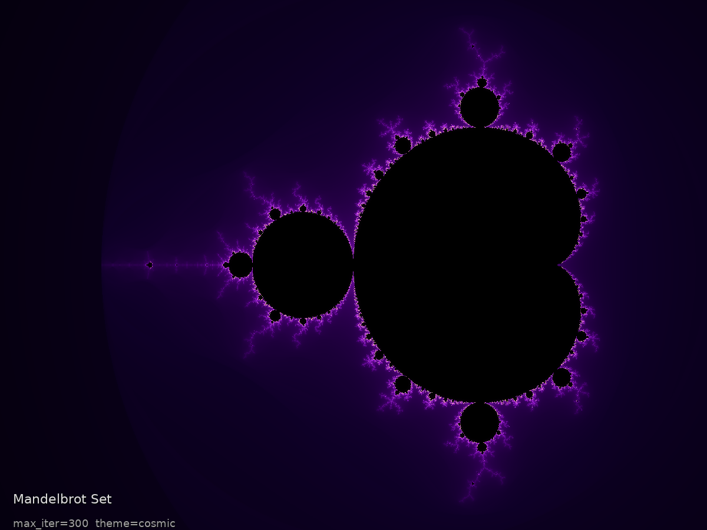
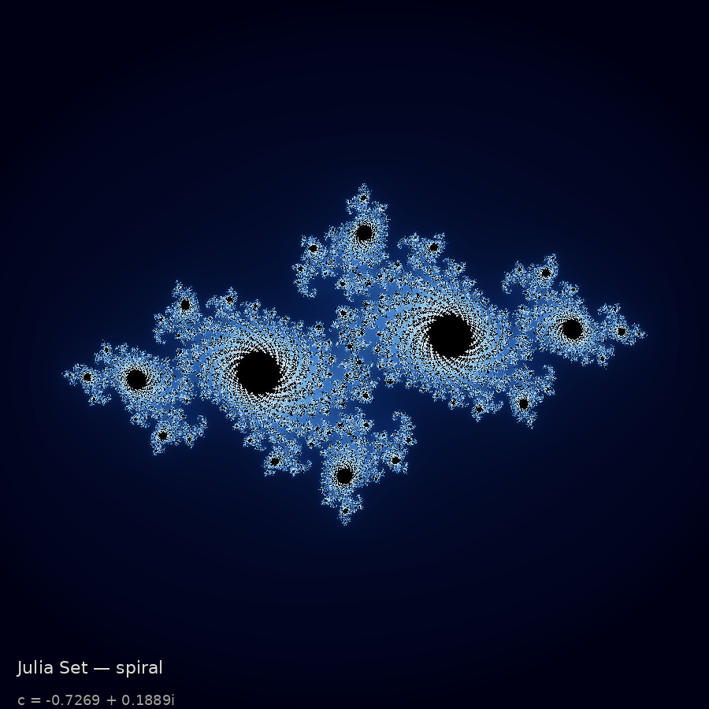
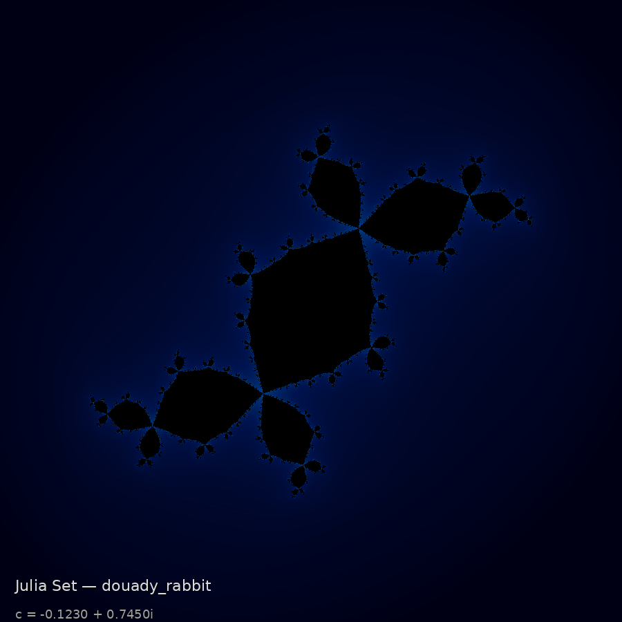
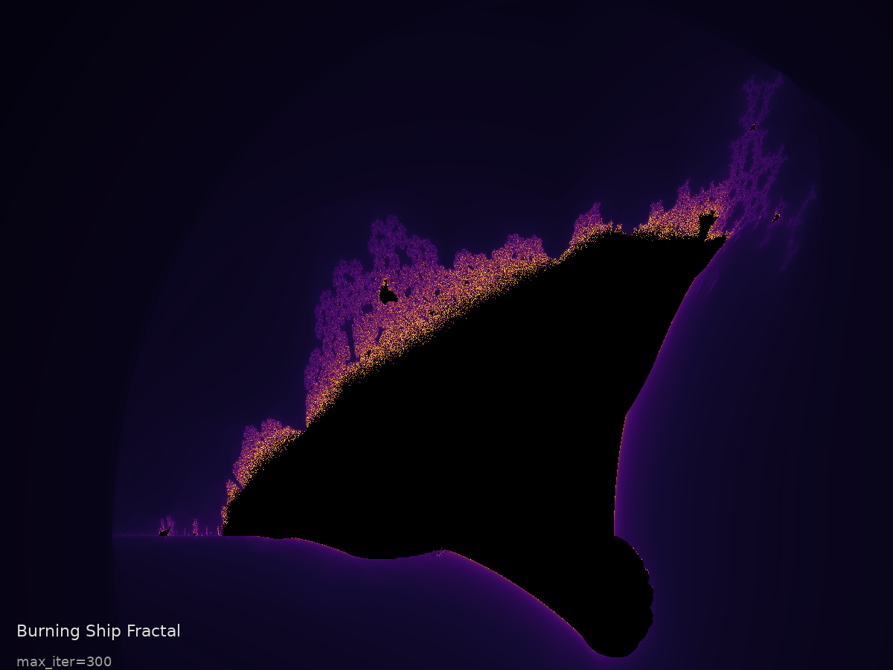
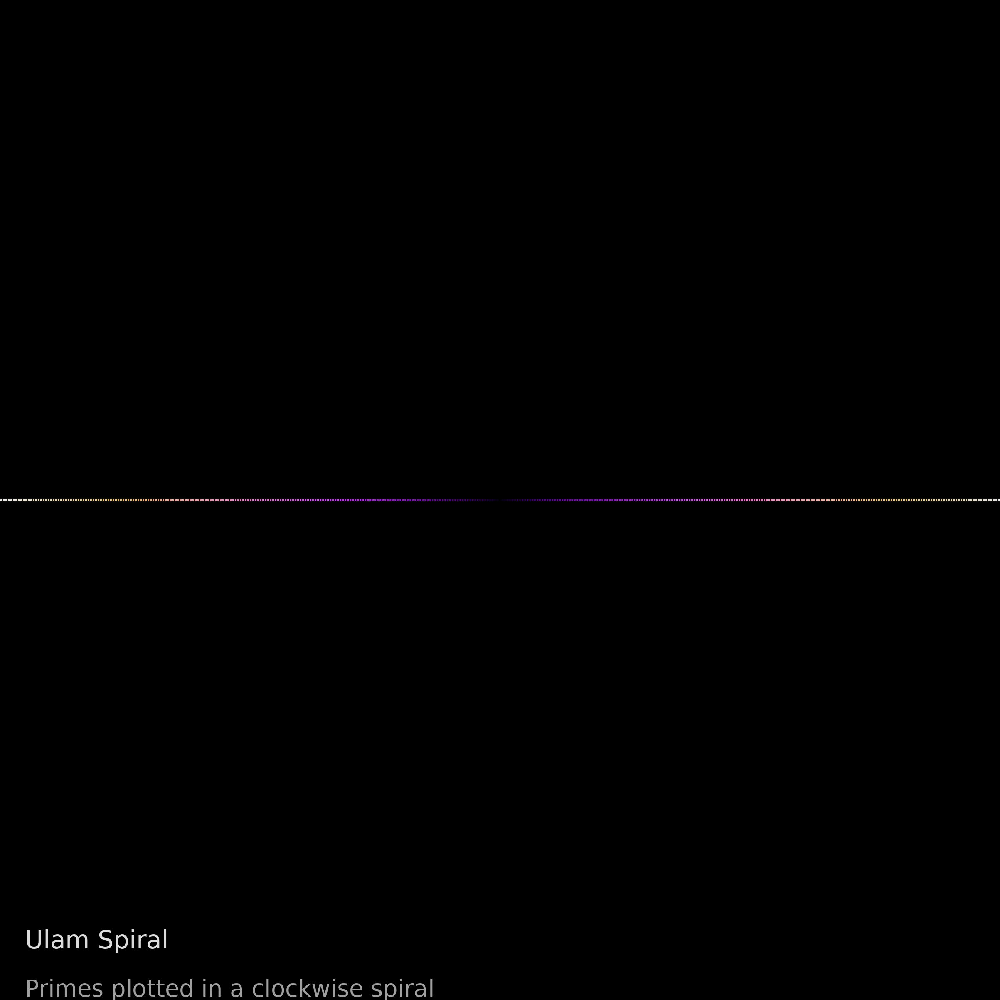
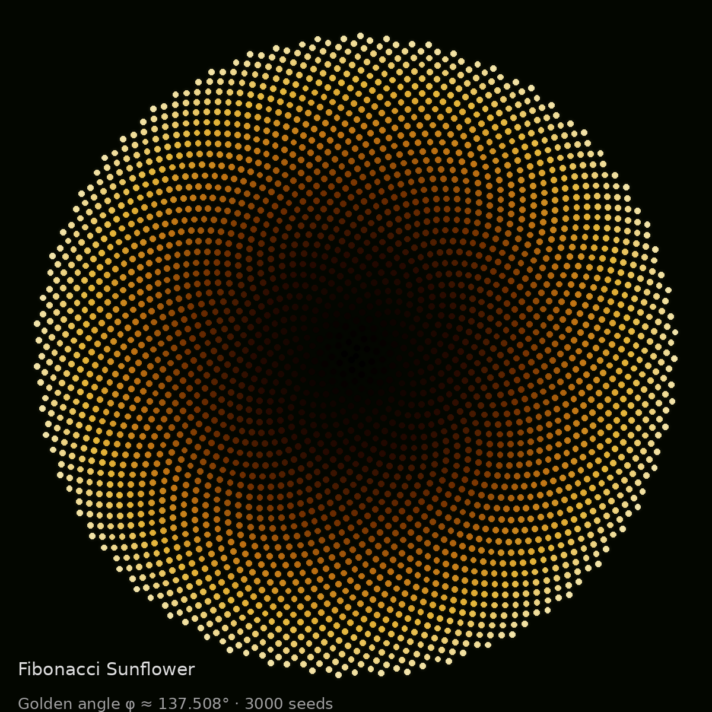
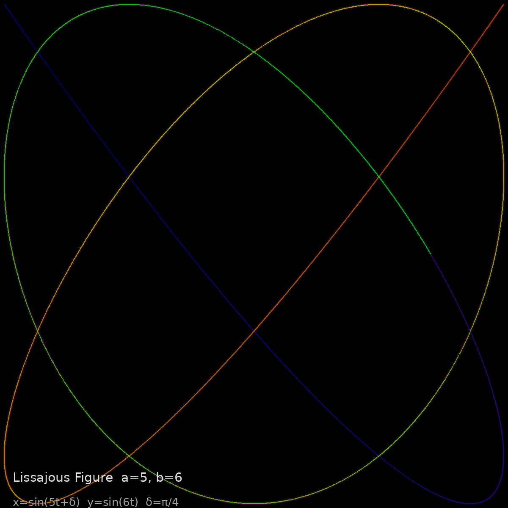
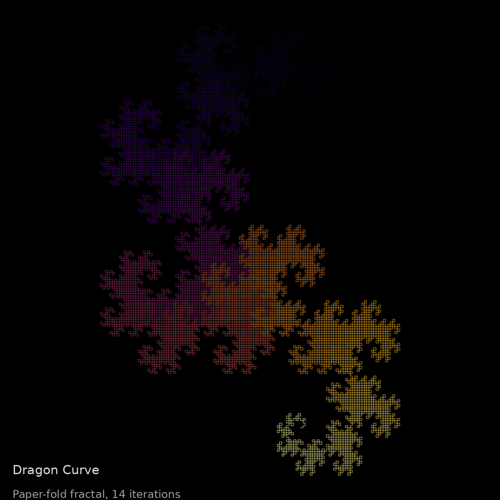

# Cosmograph

> **Mathematical Art Generator** — stunning visualizations of fractals, prime spirals, and nature's own geometry.

```
   ██████╗ ██████╗ ███████╗███╗   ███╗ ██████╗  ██████╗ ██████╗  █████╗ ██████╗ ██╗  ██╗
  ██╔════╝██╔═══██╗██╔════╝████╗ ████║██╔═══██╗██╔════╝ ██╔══██╗██╔══██╗██╔══██╗██║  ██║
  ██║     ██║   ██║███████╗██╔████╔██║██║   ██║██║  ███╗██████╔╝███████║██████╔╝███████║
  ██║     ██║   ██║╚════██║██║╚██╔╝██║██║   ██║██║   ██║██╔══██╗██╔══██║██╔═══╝ ██╔══██║
  ╚██████╗╚██████╔╝███████║██║ ╚═╝ ██║╚██████╔╝╚██████╔╝██║  ██║██║  ██║██║     ██║  ██║
   ╚═════╝ ╚═════╝ ╚══════╝╚═╝     ╚═╝ ╚═════╝  ╚═════╝ ╚═╝  ╚═╝╚═╝  ╚═╝╚═╝     ╚═╝  ╚═╝
```


---

## What is Cosmograph?

Cosmograph is a command-line mathematical art generator that turns deep mathematical ideas into high-quality PNG images. Each pattern reveals something beautiful hiding in pure mathematics — from the infinite self-similarity of fractals to the secret structure of prime numbers to the golden geometry encoded in a sunflower.

**Seven distinct pattern algorithms. Seven color themes. One command to rule them all.**

---

## Gallery

### Mandelbrot Set
> *The most famous object in mathematics — infinite complexity from a simple rule: Zₙ₊₁ = Zₙ² + C*



---

### Julia Set — Spiral Variant
> *A companion to the Mandelbrot set, each parameter c yields an entirely different universe of spirals and tendrils*



---

### Julia Set — Douady's Rabbit
> *Named for mathematician Adrien Douady, this variant features three interlocking spiral arms*



---

### Burning Ship Fractal
> *A fiery cousin of the Mandelbrot set: Zₙ₊₁ = (|Re(Zₙ)| + i·|Im(Zₙ)|)² + C — the absolute values create jagged, ship-like forms*



---

### Ulam Spiral
> *Stan Ulam doodled this in a 1963 meeting: write integers in a clockwise spiral, mark the primes. Mysterious diagonal lines appear — a structure nobody fully understands*



---

### Fibonacci Sunflower
> *Nature's packing algorithm: place each seed at the golden angle φ ≈ 137.508° from the last. This produces Fibonacci numbers of clockwise and counterclockwise spirals — always adjacent Fibonacci numbers*



---

### Lissajous Figure
> *The interference pattern of two perpendicular sinusoidal oscillations — once used by physicists to measure frequency ratios before oscilloscopes existed*



---

### Dragon Curve
> *Fold a strip of paper in half 14 times, always in the same direction. Unfold it to 90°. This is what you get — a fractal that tiles the plane with no gaps or overlaps*



---

## Installation

```bash
git clone https://github.com/kareemrt/clauder.git
cd clauder/cosmograph
pip install -r requirements.txt
```

**Requirements:** Python 3.11+, numpy, Pillow, rich

---

## Usage

### Generate Everything

```bash
python cosmograph.py gallery
```

Renders all seven patterns with default settings and saves them to `examples/`.

---

### Individual Patterns

```bash
# Fractals
python cosmograph.py mandelbrot
python cosmograph.py julia
python cosmograph.py julia --preset spiral
python cosmograph.py julia --preset douady_rabbit
python cosmograph.py burning-ship

# Combinatorial / Number Theory
python cosmograph.py ulam --size 601

# Nature & Physics
python cosmograph.py sunflower --seeds 5000
python cosmograph.py lissajous --a 3 --b 4

# Recursion
python cosmograph.py dragon --iterations 16
```

---

### Global Options

| Flag | Default | Description |
|------|---------|-------------|
| `--width N` | 1200 | Image width in pixels |
| `--height N` | 900 | Image height in pixels |
| `--theme NAME` | *(per pattern)* | Color theme |
| `--output PATH` | `examples/<name>.png` | Output file path |
| `--iter N` | 300 | Max iterations (fractals) |
| `--no-preview` | off | Skip terminal preview |

---

## Color Themes

Each theme is a carefully crafted gradient from black (interior / zero) through rich midtones to a luminous highlight:

| Theme | Feel | Best For |
|-------|------|----------|
| `cosmic` | Deep purple → magenta → white | Mandelbrot, Julia |
| `inferno` | Black → red → yellow → cream | Burning Ship, Dragon |
| `ocean` | Midnight blue → cyan → white | Julia, Lissajous |
| `forest` | Deep black → emerald → lime | Ulam, Mandelbrot |
| `gold` | Black → amber → cream | Sunflower |
| `ice` | Midnight → electric blue → white | Julia spiral, Mandelbrot |
| `neon` | Cycling hues, saturated | Lissajous |

**Try mixing themes:**

```bash
python cosmograph.py --theme inferno mandelbrot
python cosmograph.py --theme ocean ulam
python cosmograph.py --theme cosmic sunflower --seeds 8000
```

---

## Pattern Reference

### Fractals

#### Mandelbrot Set
The Mandelbrot set is the set of complex numbers *c* for which the sequence `Z₀=0, Zₙ₊₁ = Zₙ² + c` remains bounded. Points are colored by how quickly they escape to infinity — yielding infinitely detailed boundary filaments.

**Smooth coloring:** Uses the formula `n + 1 - log₂(log₂|Zₙ|)` for continuous, band-free gradients.

#### Julia Sets
For each *c*, a Julia set is the set of starting points *Z₀* for which the iteration `Zₙ₊₁ = Zₙ² + c` stays bounded. The Mandelbrot set acts as a map: pick any point inside it, and the corresponding Julia set is connected; pick a point outside, and the Julia set is a Cantor dust.

**Presets:**

| Preset | c value | Character |
|--------|---------|-----------|
| `classic` | −0.7 + 0.27i | Flowing dendrites |
| `spiral` | −0.7269 + 0.1889i | Tight double spiral |
| `douady_rabbit` | −0.123 + 0.745i | Three-armed rabbit |
| `san_marco` | −0.75 + 0i | San Marco basilica |
| `siegel_disk` | −0.3905 + 0.5868i | Siegel disk rotation |
| `lightning` | 0.285 + 0.01i | Lightning bolts |
| `dendrite` | 0 + 1i | Pure dendrite crystal |

#### Burning Ship
Replace each step with `(|Re(Z)| + i·|Im(Z)|)² + c` — the absolute values flip the imaginary axis every iteration, creating jagged ship-like protrusions along the real axis.

---

### Number Theory

#### Ulam Spiral
Write the positive integers in a counterclockwise square spiral starting from 1, then highlight the prime numbers. Mysterious diagonal lines appear — thought to be related to prime-generating quadratic polynomials like `n² + n + 41`.

---

### Nature & Physics

#### Fibonacci Sunflower
Place seed *i* at angle `i × φ` where `φ = π(3 − √5) ≈ 137.508°` (the golden angle) and radius `√i`. The Fibonacci numbers of spirals arise because the golden ratio is the "most irrational" number — seeds pack maximally efficiently.

#### Lissajous Figures
`x = sin(at + δ), y = sin(bt)` — the pattern traced by a point undergoing two perpendicular simple harmonic motions. When *a:b* is rational, the curve closes; when irrational, it densely fills a rectangle. Used historically to measure frequency ratios by ear.

---

### Recursion

#### Dragon Curve
Fold a strip of paper in half *n* times (always the same direction), then unfold each crease to 90°. After 14 iterations: 16,384 segments, zero self-intersections, and a fractal dimension of exactly 2. Multiple Dragon Curves tile the plane perfectly.

---

## Project Structure

```
cosmograph/
├── cosmograph.py      # CLI entry point & command dispatch
├── patterns.py        # Mathematical algorithms (pure numpy)
├── themes.py          # Color palette functions
├── renderer.py        # PNG & terminal rendering (Pillow + rich)
├── requirements.txt
├── examples/          # Pre-generated gallery images
│   ├── mandelbrot.png
│   ├── julia.png
│   ├── julia_spiral.png
│   ├── julia_rabbit.png
│   ├── burning_ship.png
│   ├── ulam_spiral.png
│   ├── fibonacci_sunflower.png
│   ├── lissajous.png
│   └── dragon_curve.png
└── README.md
```

---

## How It Works

```
┌─────────────────────────────────────────────────────────────┐
│                       CLI (cosmograph.py)                    │
│   parse args → dispatch → build numpy computation → render  │
└───────────────┬─────────────────────────┬───────────────────┘
                │                         │
         ┌──────▼──────┐           ┌──────▼──────┐
         │ patterns.py  │           │  themes.py   │
         │  Pure numpy  │           │  Color maps  │
         │  algorithms  │           │  fn: t→RGB   │
         └──────┬──────┘           └──────┬──────┘
                │                         │
         ┌──────▼─────────────────────────▼──────┐
         │              renderer.py               │
         │   apply_theme() → Pillow Image → PNG   │
         │   terminal_preview() → rich half-block │
         └────────────────────────────────────────┘
```

**Key algorithmic choices:**

- **Smooth iteration count** — standard escape-count coloring creates ugly bands; we use `n + 1 − log₂(log₂|Z|)` for smooth gradient transitions.
- **Histogram equalization** — most points escape quickly; we gamma-correct the normalized count to distribute color linearly by visual perception.
- **Glow effect** — a blended Gaussian blur pass adds a soft luminance halo, giving the images a photographic quality.
- **Half-block terminal preview** — Unicode `▀` with foreground/background colors gives 2× vertical resolution in the terminal.

---

## License

MIT — do anything you want with the code or the images.

---

*Built with Python, numpy, Pillow, and a deep appreciation for the unreasonable effectiveness of mathematics.*
