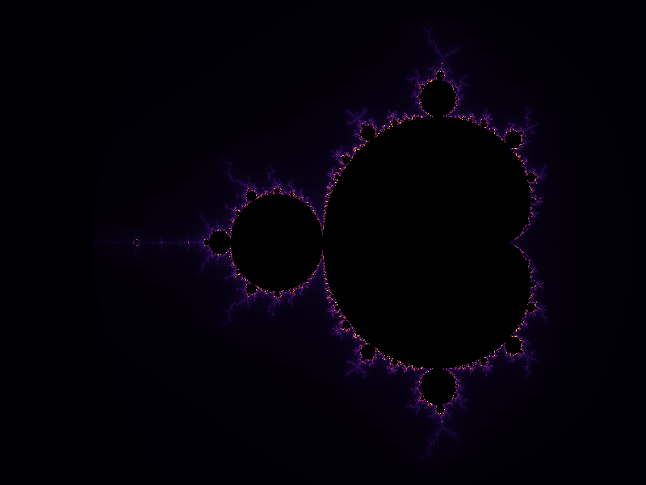
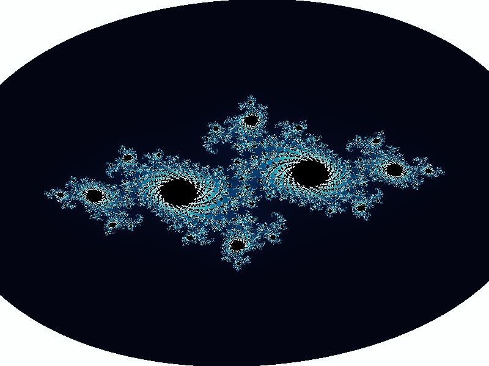
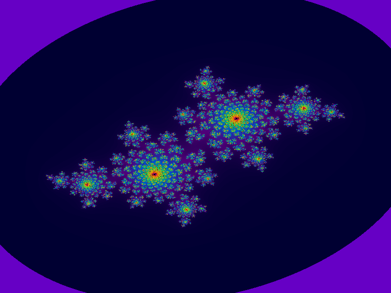
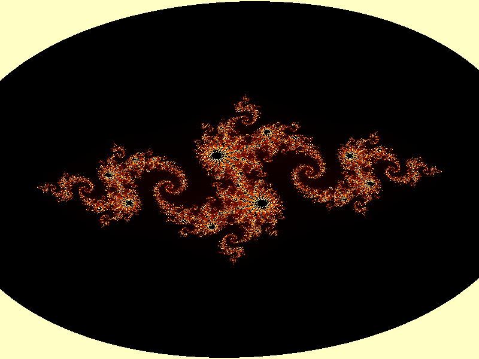
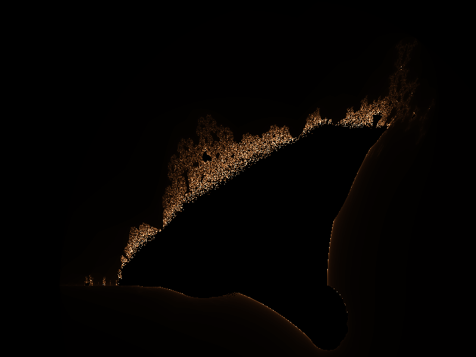
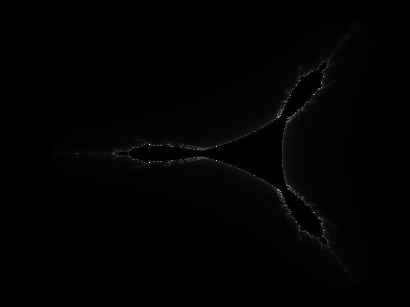

# FractalForge

```
  ███████╗██████╗  █████╗  ██████╗████████╗ █████╗ ██╗
  ██╔════╝██╔══██╗██╔══██╗██╔════╝╚══██╔══╝██╔══██╗██║
  █████╗  ██████╔╝███████║██║        ██║   ███████║██║
  ██╔══╝  ██╔══██╗██╔══██║██║        ██║   ██╔══██║██║
  ██║     ██║  ██║██║  ██║╚██████╗   ██║   ██║  ██║███████╗
  ╚═╝     ╚═╝  ╚═╝╚═╝  ╚═╝ ╚═════╝   ╚═╝   ╚═╝  ╚═╝╚══════╝

  ███████╗ ██████╗ ██████╗  ██████╗ ███████╗
  ██╔════╝██╔═══██╗██╔══██╗██╔════╝ ██╔════╝
  █████╗  ██║   ██║██████╔╝██║  ███╗█████╗
  ██╔══╝  ██║   ██║██╔══██╗██║   ██║██╔══╝
  ██║     ╚██████╔╝██║  ██║╚██████╔╝███████╗
  ╚═╝      ╚═════╝ ╚═╝  ╚═╝ ╚═════╝ ╚══════╝

  Infinite complexity, rendered in your terminal.
```

**FractalForge** is a Python CLI tool for generating stunning fractal art — directly in your terminal with full 24-bit ANSI color, or exported as high-resolution PNG images with a palette of your choice.

---

## Gallery

| Mandelbrot Set | Julia Dragon |
|:---:|:---:|
|  |  |
| *Inferno palette · 256 iterations* | *Ocean palette · c = −0.7269 + 0.1889i* |

| Julia Snowflake | Julia Lightning |
|:---:|:---:|
|  |  |
| *Psychedelic palette · c = −0.4 + 0.6i* | *Fire palette · c = −0.8 + 0.156i* |

| Burning Ship | Tricorn |
|:---:|:---:|
|  |  |
| *Copper palette · A gothic masterpiece* | *Grayscale palette · The Mandelbar set* |

---

## Features

- **4 Fractal Types** — Mandelbrot, Julia (with 6 presets), Burning Ship, Tricorn
- **6 Color Palettes** — Inferno, Ocean, Fire, Psychedelic, Copper, Grayscale
- **3 Terminal Render Modes** — Full-color blocks, colored ASCII, plain ASCII
- **PNG Export** — Save at any resolution with configurable upscale
- **Zoom Sequences** — Generate frame sequences for animated zooms into fractal detail
- **Smooth Coloring** — Fractional escape-time algorithm for gradient-smooth renders
- **Vectorized Engine** — NumPy-powered for fast computation (no C extensions needed)
- **24-bit ANSI Color** — Rich terminal output using true-color escape codes

---

## Installation

```bash
git clone https://github.com/kareemrt/clauder.git
cd clauder/fractalforge
pip install -r requirements.txt
```

---

## Quick Start

```bash
# Render the Mandelbrot set in your terminal
python -m fractalforge.cli render mandelbrot

# Julia set with the 'dragon' preset and ocean palette
python -m fractalforge.cli render julia --preset dragon --palette ocean

# Save a high-res PNG
python -m fractalforge.cli render burning_ship --save burning_ship.png --width 1920 --height 1080

# See the full gallery of all fractals/palettes
python -m fractalforge.cli gallery
```

---

## Commands

```
fractalforge <command> [options]

Commands:
  render          Render a fractal in the terminal (optionally save PNG)
  zoom            Generate a PNG zoom sequence into a point
  gallery         Render all fractal/palette combinations to PNGs
  list-palettes   Preview all color palettes with color bars
  info            Show fractal descriptions and Julia presets
```

### `render`

```
fractalforge render <fractal> [options]

Fractals: mandelbrot  julia  burning_ship  tricorn

Options:
  --width INT         Terminal columns         (default: 100)
  --height INT        Terminal rows            (default: 40)
  --max-iter INT      Maximum iterations       (default: 256)
  --palette NAME      Color palette            (default: inferno)
  --mode MODE         block | ascii | color_ascii (default: color_ascii)
  --save FILE         Save PNG to path
  --scale INT         PNG upscale factor       (default: 2)
  --preset NAME       Julia preset (dragon|snowflake|spiral|lightning|nebula|galaxy)
  --cx FLOAT          Julia real component     (custom)
  --cy FLOAT          Julia imaginary component (custom)
  --zoom FLOAT        Zoom level               (default: 1.0)
  --center-x FLOAT    View center X            (default: 0.0)
  --center-y FLOAT    View center Y            (default: 0.0)
```

### `zoom`

Generate a sequence of PNG frames zooming into a fractal, perfect for making animations with ffmpeg.

```
fractalforge zoom mandelbrot --cx -0.7436 --cy 0.1318 --end-zoom 1000 --frames 60

# Then stitch with ffmpeg:
ffmpeg -r 24 -i zoom_frames/frame_%04d.png -c:v libx264 zoom.mp4
```

---

## Color Palettes

| Name | Character |
|------|-----------|
| `inferno` | Deep purple → orange → yellow |
| `ocean` | Midnight blue → turquoise → white |
| `fire` | Black → red → gold |
| `psychedelic` | Cycling rainbow hues |
| `copper` | Black → warm bronze → cream |
| `grayscale` | Black → white |

Preview all palettes:
```bash
fractalforge list-palettes
```

---

## The Mathematics

### Escape-Time Algorithm

All four fractals use the **escape-time algorithm**: iterate a recurrence relation starting from a point in the complex plane, counting how many iterations before the magnitude exceeds 2 (the "escape radius"). Points that never escape belong to the set.

### Smooth Coloring

Raw iteration counts produce harsh color bands. FractalForge uses the **fractional escape count** (also called the normalized iteration count):

```
smooth_count = n + 1 − log₂(log₂(|Zₙ|))
```

This produces a continuous value that maps smoothly to palette colors, eliminating banding entirely.

### The Four Fractals

| Fractal | Recurrence | Notes |
|---------|-----------|-------|
| **Mandelbrot** | `Zₙ₊₁ = Zₙ² + C` (C varies, Z₀=0) | The canonical fractal |
| **Julia** | `Zₙ₊₁ = Zₙ² + c` (c fixed, Z varies) | Each c value = different shape |
| **Burning Ship** | `Zₙ₊₁ = (|Re(Z)| + i·|Im(Z)|)² + C` | Absolute values before squaring |
| **Tricorn** | `Zₙ₊₁ = conj(Zₙ)² + C` | Complex conjugate — 3-fold symmetry |

---

## Julia Presets

```
dragon      c = −0.7269 + 0.1889i   Classic filled Julia
snowflake   c = −0.4000 + 0.6000i   Fractal ice crystal
spiral      c =  0.2850 + 0.0100i   Curling spirals
lightning   c = −0.8000 + 0.1560i   Electric branching
nebula      c = −0.7000 + 0.2702i   Cloud-like forms
galaxy      c =  0.3700 + 0.1000i   Swirling structure
```

---

## Project Structure

```
fractalforge/
├── fractalforge/
│   ├── __init__.py       Package entry point
│   ├── cli.py            Command-line interface (argparse)
│   ├── core.py           Vectorized fractal computation (NumPy)
│   ├── colormap.py       Palette definitions and ANSI color rendering
│   └── renderer.py       Terminal rendering and PNG export
├── tests/
│   ├── test_core.py      Tests for fractal algorithms
│   └── test_colormap.py  Tests for colormap and palette functions
├── gallery/              Pre-generated example images
├── requirements.txt
├── setup.py
└── README.md
```

---

## Running Tests

```bash
pip install pytest
python -m pytest tests/ -v
```

**24 tests** covering fractal computation correctness, smooth coloring, palette interpolation, ANSI encoding, and zoom region mathematics.

---

## Examples

### Terminal Art (color_ascii mode)
```bash
python -m fractalforge.cli render julia --preset lightning --palette fire --width 120 --height 50 --mode color_ascii
```

### High-Resolution Export
```bash
python -m fractalforge.cli render mandelbrot --width 3840 --height 2160 --max-iter 1024 --palette inferno --save mandelbrot_4k.png
```

### Deep Zoom
```bash
# Zoom into the Seahorse Valley of the Mandelbrot set
python -m fractalforge.cli zoom mandelbrot \
  --cx -0.7436 --cy 0.1318 \
  --start-zoom 1 --end-zoom 50000 \
  --frames 120 --max-iter 2048 --palette ocean
```

### Custom Julia Set
```bash
python -m fractalforge.cli render julia --cx -0.6251 --cy 0.4 --palette psychedelic --save custom_julia.png
```

---

## Requirements

- Python 3.8+
- `numpy >= 1.21`
- `Pillow >= 9.0`
- A terminal with 24-bit color support (most modern terminals)

---

## License

MIT License — use it, remix it, render infinitely.

---

> *"Bottomless wonders spring from simple rules, which are repeated without end."*
> — Benoit Mandelbrot
