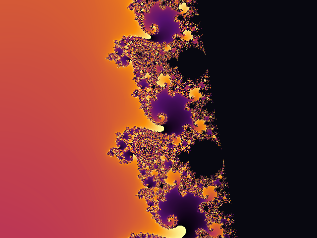
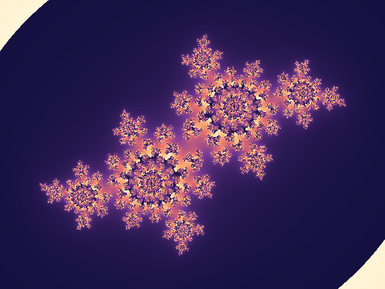
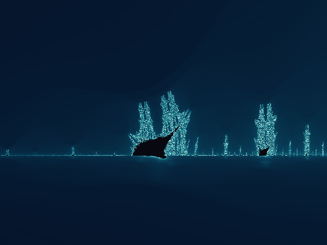
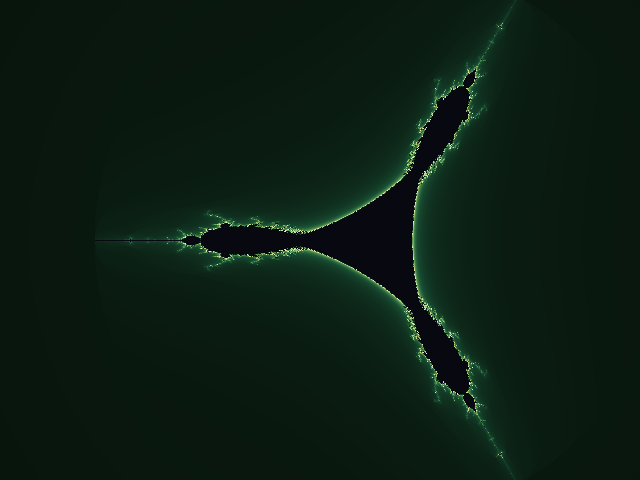

# FractalForge

**A zero-dependency fractal renderer that writes straight to PNG.**

No NumPy. No Pillow. No matplotlib. FractalForge computes escape-time
fractals (Mandelbrot, Julia, Burning Ship, Tricorn) with plain Python
`complex` arithmetic and encodes the result as a PNG using nothing but
`zlib` and `struct` from the standard library — including a hand-rolled
PNG encoder. Point it at a region of the complex plane, pick a palette,
and it writes an image.

```
$ python -m fractalforge mandelbrot -o out.png --center=-0.7453,0.1127 --scale 0.01 --max-iter 600
Rendering mandelbrot -> out.png (800x600, max-iter=600, palette=inferno)
Done in 14.7s
```

## Gallery

| | |
|---|---|
|  <br> Mandelbrot — `--center=-0.5,0 --scale 1.4` |  <br> Mandelbrot, zoomed — `--center=-0.7453,0.1127 --scale 0.01` |
|  <br> Julia — `--julia-c=-0.4,0.6`, `dawn` palette |  <br> Burning Ship — `--center=-1.75,-0.04 --scale 0.15`, `ocean` palette |
|  <br> Tricorn — `--center=-0.4,0 --scale 1.7`, `forest` palette | |

All images above were generated by the commands shown — see [Recreate the
gallery](#recreate-the-gallery) to render them yourself.

## How it works

```
            complex plane                    escape-time iteration             colour
   ┌───────────────────────────┐      ┌───────────────────────────────┐   ┌───────────────┐
   │   Viewport (centre+scale) │ ──►  │  z ← f(z, c), repeat until     │──►│ smooth count  │
   │   maps each pixel (x, y)  │      │  |z| > 2  or  max_iter reached │   │ → palette     │
   │   to a point in ℂ         │      │  (Mandelbrot/Julia/Ship/Tricorn)│   │   gradient    │
   └───────────────────────────┘      └───────────────────────────────┘   └───────┬───────┘
                                                                                   │
                                                                                   ▼
                                                                     ┌─────────────────────────┐
                                                                     │   hand-rolled PNG writer │
                                                                     │  (zlib + struct only)    │
                                                                     └─────────────────────────┘
```

1. **`Viewport`** ([`fractals.py`](fractalforge/fractals.py)) maps each
   pixel to a point in the complex plane, given a centre and a scale
   (half-height of the view, so smaller = more zoomed in).
2. **Escape-time iteration** repeatedly applies the fractal's update
   rule (`z² + c`, its absolute-value variant for the Burning Ship, or
   its conjugate variant for the Tricorn) and records how many steps it
   takes for `|z|` to cross the escape radius. Points that never escape
   are considered part of the set. A *renormalised* (smooth) iteration
   count is derived from the escape step so colour bands blend instead
   of forming hard rings.
3. **Palettes** ([`palettes.py`](fractalforge/palettes.py)) linearly
   interpolate between named colour stops to map each smooth count to an
   RGB triple.
4. **The PNG encoder** ([`png.py`](fractalforge/png.py)) assembles the
   pixel grid into an uncompressed RGB scanline buffer, `zlib`-compresses
   it, and wraps it in PNG's signature/IHDR/IDAT/IEND chunk structure
   with CRC32 checksums — by hand, in about 40 lines.

## Project structure

```
fractalforge/
├── fractalforge/
│   ├── __main__.py     entry point for `python -m fractalforge`
│   ├── cli.py          argument parsing and the render driver
│   ├── fractals.py     Viewport + escape-time math for all four families
│   ├── palettes.py     named colour gradients and interpolation
│   ├── png.py          dependency-free PNG encoder (zlib + struct)
│   └── render.py       glues fractal math + palette + PNG writer together
├── gallery/            sample renders embedded above
├── tests/              unittest suite (15 tests, pure stdlib)
└── README.md
```

## Usage

```
python -m fractalforge <fractal> [options]
```

| Option | Default | Description |
|---|---|---|
| `fractal` | — | One of `mandelbrot`, `julia`, `burningship`, `tricorn` |
| `-o, --output` | `fractal.png` | Output PNG path |
| `--width`, `--height` | `800`, `600` | Image dimensions in pixels |
| `--center RE,IM` | `-0.5,0` | Centre of the view in the complex plane |
| `--scale` | `1.5` | Half-height of the view; smaller = more zoomed in |
| `--max-iter` | `200` | Iteration cap before a point counts as "inside" |
| `--palette` | `inferno` | One of `inferno`, `ocean`, `dawn`, `forest` |
| `--julia-c RE,IM` | `-0.7,0.27015` | The constant `c` for Julia sets |

### Recreate the gallery

```bash
python -m fractalforge mandelbrot   -o gallery/mandelbrot_inferno.png      --center=-0.5,0          --scale 1.4  --max-iter 250 --palette inferno
python -m fractalforge mandelbrot   -o gallery/mandelbrot_zoom_inferno.png --center=-0.7453,0.1127  --scale 0.01 --max-iter 600 --palette inferno
python -m fractalforge julia        -o gallery/julia_dawn.png              --center=0,0             --scale 1.3  --max-iter 300 --palette dawn --julia-c=-0.4,0.6
python -m fractalforge burningship  -o gallery/burningship_ocean.png       --center=-1.75,-0.04     --scale 0.15 --max-iter 300 --palette ocean
python -m fractalforge tricorn      -o gallery/tricorn_forest.png          --center=-0.4,0          --scale 1.7  --max-iter 250 --palette forest
```

Larger `--max-iter` and smaller `--scale` reveal finer detail at the cost
of render time — everything here runs on pure-Python loops, so a deep
zoom at high resolution can take a minute or two.

## Running the tests

```bash
python -m unittest discover -s tests -v
```

15 tests cover viewport-to-plane mapping, escape-time correctness for
every fractal family, palette interpolation, grid rendering, and a
round-trip check that the hand-written PNG bytes are valid (chunk
structure, CRC, and zlib-decodable scanlines).
