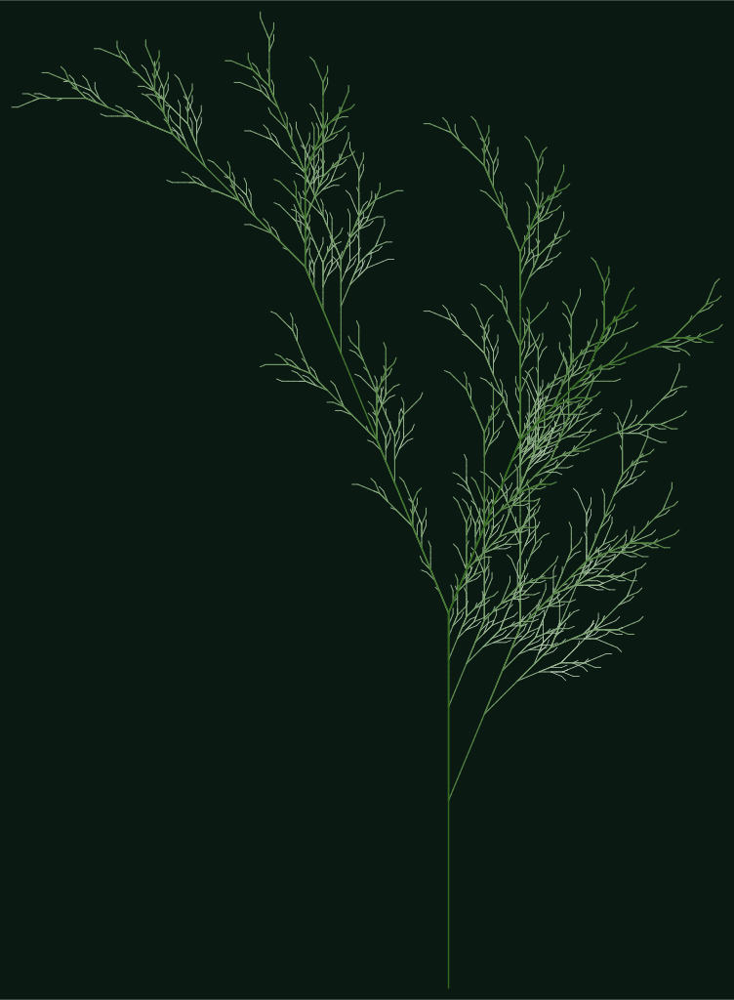
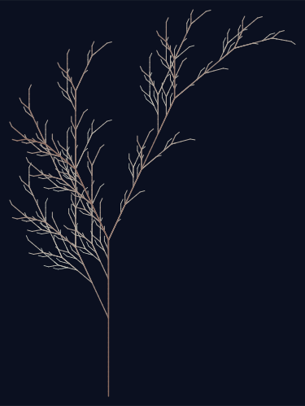
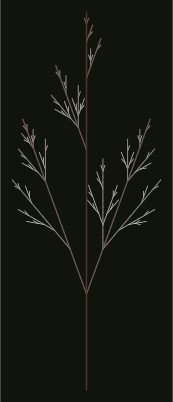
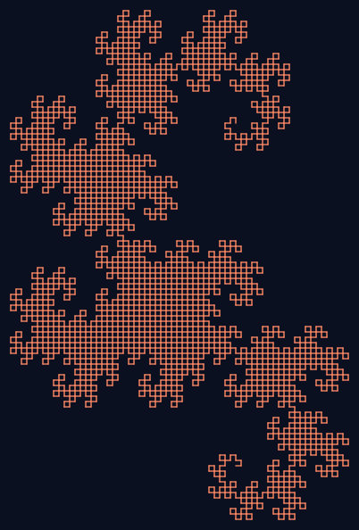
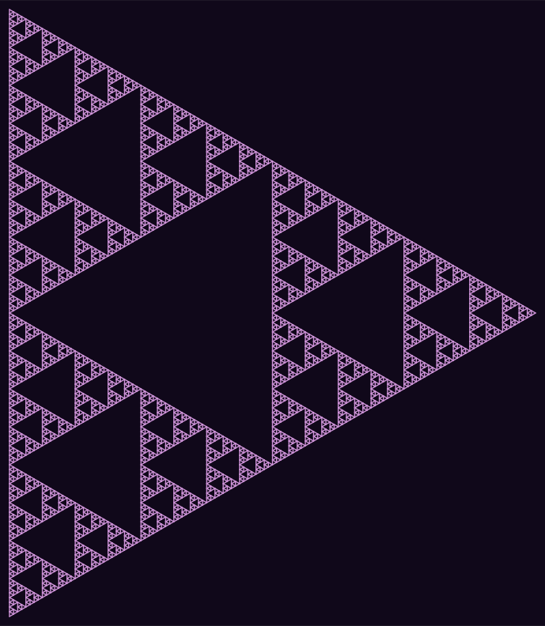
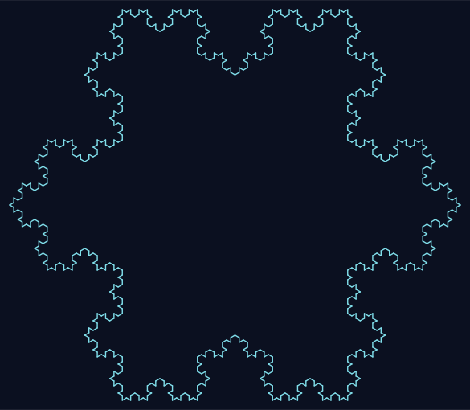
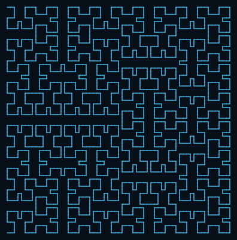
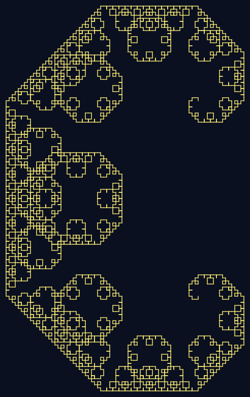

# 🌿 L-System Garden

**Grow fractal plants and curves from a few lines of grammar.**

L-System Garden is a small, dependency-free Python toolkit that turns
[Lindenmayer systems](https://en.wikipedia.org/wiki/L-system) — the same
string-rewriting grammars Aristid Lindenmayer devised in 1968 to model how
algae and plants grow — into crisp SVG artwork. Feed it an axiom and a
handful of rewrite rules, and a turtle-graphics interpreter walks the
expanded string into branching trees, snowflakes, dragons, and
space-filling curves.

Every image below was generated by the CLI in this repo — nothing was
hand-drawn or post-processed.

| | | |
|---|---|---|
|  |  |  |
| `fern` — stochastic Barnsley-style fronds | `fractal-plant` — classic Lindenmayer branching | `bush` — dense, randomized shrub |
|  |  |  |
| `dragon-curve` — Heighway dragon | `sierpinski` — arrowhead-curve triangle | `koch-snowflake` — infinite perimeter, finite area |
|  |  | |
| `hilbert-curve` — space-filling curve | `levy-curve` — self-similar zigzag | |

## How it works

An L-system rewrites a starting string (the **axiom**) by repeatedly
substituting each symbol according to **production rules**. For example,
starting from `F` with the rule `F → F+F-F` and applying it twice:

```
generation 0:  F
generation 1:  F+F-F
generation 2:  F+F-F+F+F-F-F+F-F
```

A **turtle** then walks the final string left to right, treating each
symbol as a drawing instruction:

| Symbol | Meaning |
|---|---|
| `F` `G` `A` `B` | Move forward, drawing a line |
| `f` | Move forward without drawing |
| `+` / `-` | Turn left / right by the system's angle |
| `[` / `]` | Push / pop position & heading (enables branching) |
| `\|` | Reverse direction (turn 180°) |
| `+(N)` / `-(N)` | Turn `N` times the base angle |

Three short modules implement the whole pipeline:

```
lsystem_garden/
├── core.py      # string-rewriting engine (deterministic + stochastic rules)
├── turtle.py    # interprets a string as turtle-graphics line segments
├── render.py    # draws segments to a self-contained SVG with depth-based color/width
├── presets.py   # a small museum of classic grammars (fern, dragon curve, ...)
└── cli.py       # `lsystem-garden` command-line tool
```

Branch **depth** (how deeply nested in `[...]` brackets a segment is) drives
both color and stroke width: shallow trunk segments are thick and colored
with the "trunk" hue, while deep twigs taper and fade toward the "tip" hue —
the same visual cue real plants give us about their own structure.

Stochastic presets (`fern`, `bush`) attach *weighted alternatives* to a rule,
so each generation's replacement is chosen at random — every render is a
distinct, organically irregular specimen, but reproducible if you pass `--seed`.

## Installation

Requires Python 3.9+. No third-party dependencies — SVG output is plain XML.

```bash
git clone <this-repo>
cd lsystem_garden
pip install -e .
```

This installs the `lsystem-garden` command. (Prefer not to install? Run it
in place with `python -m lsystem_garden.cli ...`.)

## Usage

List the available presets:

```bash
$ lsystem-garden list
preset            angle  description
----------------------------------------------------------------------
bush              20.0°  Dense, stochastic shrub — every render is a little different.
dragon-curve      90.0°  Heighway dragon — folded paper made infinitely thin.
fern              22.5°  Barnsley-style asymmetric fern with stochastic fronds.
fractal-plant     25.0°  Classic Lindenmayer branching plant (deterministic).
hilbert-curve     90.0°  Hilbert space-filling curve, beloved of locality-preserving indexes.
koch-snowflake    60.0°  Koch snowflake — a curve of infinite length around a finite area.
levy-curve        45.0°  Lévy C curve — a self-similar zigzag with a fractal boundary.
sierpinski       120.0°  Sierpinski triangle drawn as a single space-filling arrowhead curve.
```

Grow one and render it to SVG:

```bash
$ lsystem-garden grow fern -i 6 --seed 7 -o fern.svg
grew 'fern' for 6 iteration(s): 25,159 symbols, 6,048 line segments drawn
wrote fern.svg
```

Useful flags for `grow`:

```
-i, --iterations N      number of grammar rewrite passes (more = more detail/cost)
-o, --output PATH       output SVG file (default: <preset>.svg)
    --angle DEG         override the system's default turning angle
    --step N            length of one forward move (default: 6)
    --start-heading DEG initial heading; 90 = up, 0 = right (default: 90)
    --seed N            random seed, for reproducible stochastic presets
    --background COLOR  canvas background (any CSS color)
    --trunk-color COLOR color of depth-0 (trunk) segments
    --tip-color COLOR   color of the deepest-branch segments
    --stroke-width N    base line width (default: 1.4)
    --no-taper          draw every segment at the same width
```

### Growing your own grammar

You aren't limited to the presets — describe any L-system on the command line:

```bash
# A Koch-like square curve, drawn from scratch:
lsystem-garden grow \
  --axiom F+F+F+F \
  --rule "F=F+F-F-FF+F+F-F" \
  --angle 90 \
  --iterations 3 \
  -o my-curve.svg
```

`--rule` may be repeated for grammars with multiple symbols (e.g.
`--rule F=... --rule X=...`).

## Running the tests

```bash
pip install -e ".[dev]"   # or: pip install pytest
pytest
```

The suite (34 tests) covers the rewriting engine — including stochastic
reproducibility under a fixed seed — the turtle's geometry (turns, branching,
scaled angles, bounds), SVG structure and color gradients, and a
parametrized check that every preset grows and renders without error.

## Why L-systems?

They sit at a delightful crossroads: a one-line grammar like
`X → F+[[X]-X]-F[-FX]+X` is *simple enough to type by hand*, yet the strings
it produces after a few generations encode thousands of branch points whose
turtle-walk traces out something that looks unmistakably like a fern frond.
The same rewriting trick — with different alphabets and angles — also
generates space-filling curves (Hilbert), curves of infinite length bounding
finite area (Koch), and self-similar "monsters" that were once considered
mathematical pathologies and are now considered art.

## License

MIT
